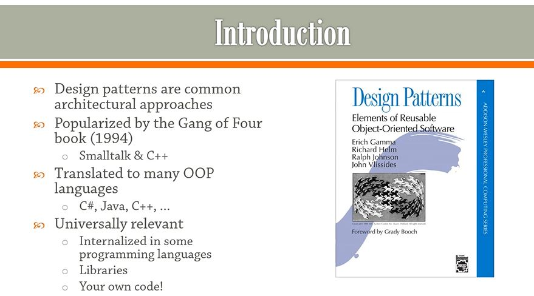

## Section 1: Introduction.

Introduction.

# What I Learned.

# 1. Introduction.

- Patterns were generalized by **Design Patters** book.

- These are good since we are living **OOP** world.

- We will be covering **Creational** **Structural** and **Behavioral** Patterns.

- [Gang Of Four](https://en.wikipedia.org/wiki/Design_Patterns).