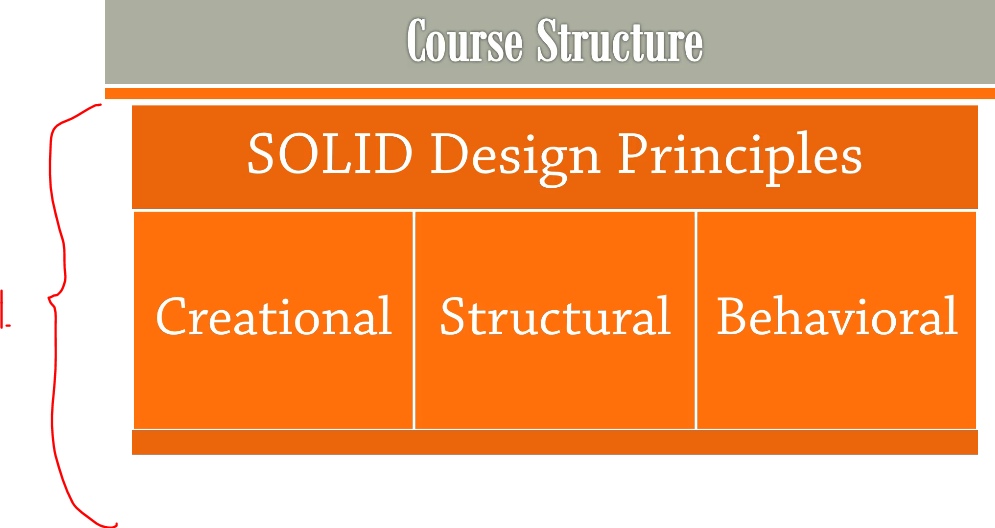
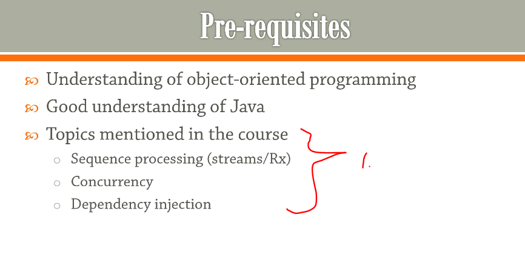

## Section 1: Introduction.

Introduction.

# What I Learned.

# Introduction.

- Patterns were generalized by **Design Patters** book.
    - [Gang Of Four](https://en.wikipedia.org/wiki/Design_Patterns).

- These are good since we are living **OOP** world.
 
 

    
 

 

1. These are the topics;   
    - Then we will go through gamma categorization:
        - **Creational** **Structural** and **Behavioral** Patterns.

- The patterns that we will be covering.

    

 

    

 

1. Ones should try to implement the patterns itself.

    

 

1. These are illustrated in context of **Design patters**, how these behave with these.

    

> [!IMPORTANT]  
> Lets go!

