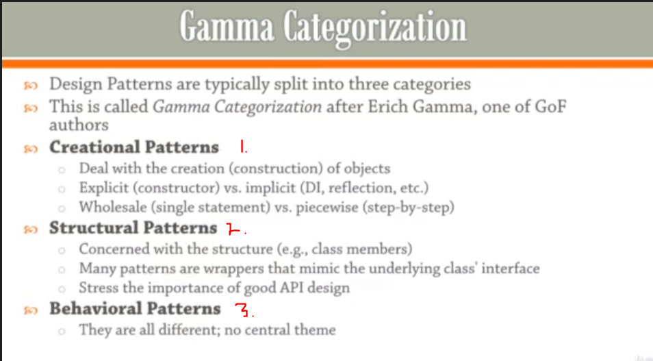
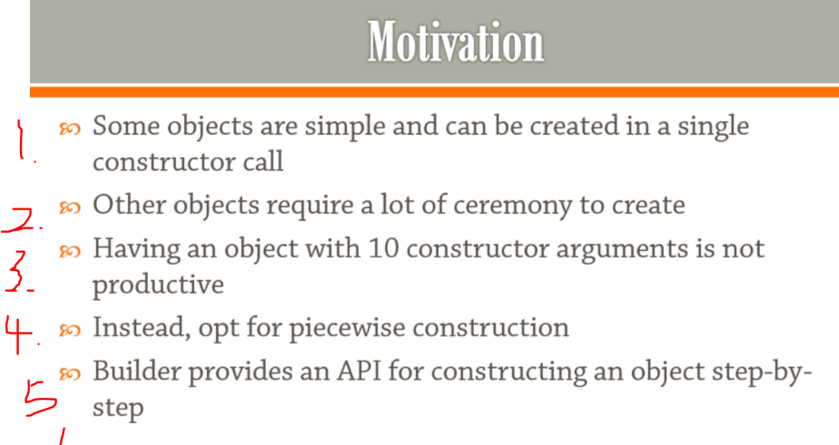
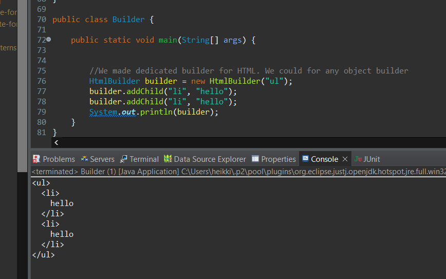

## Section 3: Builders.

Builder patterns.

# What I Learned.



- We are splitting **Design patterns** into three categories
    - This called **Gamma Categorization**
1. **Creational Patterns** 
- They are dealing construction of object!
- Case of creation of object they are done implicitly, behind scenes 
- They are different processes to initialize object, in small steps or in one big

2. **Structural Patters**
    - Concerns with structures
    - you will see a lot of wrappers
    - Puts extra weight on good API design

3. **Behavioral Patterns**
    - Solves problem in their unique way



1. For simple object you should call single constructor call
2. In other way, like making **"string"** this way can be tedious 
3. Too many arguments, people make mistakes
4. Should focus to make **piecewise** construction
5. Good API should be provided

- This is what builder patter is all about 

<br>


- When piecewise object construction is complicated, you provide an API for doing it more efficiently 


- We are making use of builder to simplify following printing case

```
package BUILDER_11;

public class Builder {

	
	public static void main(String[] args) {
		String hello = "hello"; // String inside paragraph
		System.out.println("<p>" + hello + "</p>");
		
		
		
		
		//Here is how we are going to make concation when we are printing
		String [] words = {"hello", "world"};
		
		System.out.println(
		"<ul>\n" + "<li>" + words[0] // and in the ends we could be using streams
		);
		
		// How to simplify this, BY USING BUILDERS!!
	}
}

```


- `StringBuilder sb = new StringBuilder();` Difference between other builder and **StringBuilder**, in string builder, building happens in picewise(bit by bit)

- This one using StringBuilder

```
package BUILDER_11;

import java.util.Iterator;

public class Builder {

	
	public static void main(String[] args) {
		String hello = "hello"; // String inside paragraph
		System.out.println("<p>" + hello + "</p>");
		
		
		
		String [] words = {"hello", "world"};
		
//		Here is how we are going to make concation when we are printing
//		
//		System.out.println(
//		"<ul>\n" + "<li>" + words[0] // and in the ends we could be using streams
//		);
// 		How to simplify this, BY USING BUILDERS!!

		
		
		
		//This one, using StringBuilder 
		StringBuilder sb = new StringBuilder(); // Difference between other builder and string builder, in string builder, building happens in picewise(bit by bit) 
		sb.append("<ul>\n");
		for (String word : words)
		{
			sb.append(String.format(" <li>%s</li>\n", word));
		}
		sb.append("</ul>");
		System.out.println(sb);
}
}
```

- You can also use **StringBuilder** for building your own **domain object**

- Now this previous is not following OOP for printing **html**. 

- Making our own **HTML element builder**

```
package BUILDER_OOP_12;

import java.util.ArrayList;
import java.util.Collections;

class HtmlElement // Class for element, more OOP way
{
	public String name, text;
	public ArrayList<HtmlElement> elements = new ArrayList<>();
	private final int indentSize = 2; // How many character is indented by
	private final String newLine = System.lineSeparator(); // Newline character

	public HtmlElement() {
	}

	public HtmlElement(String name, String text) {
		this.name = name;
		this.text = text;
	}

	private String toStringImpl(int indent) {
		StringBuilder sb = new StringBuilder();
		// We are processing indentation
		String i = String.join("", Collections.nCopies(indent * indentSize, " "));
		sb.append(String.format("%s<%s>%s", i, name, newLine));
		if (text != null && !text.isEmpty()) {
			sb.append(String.join("", Collections.nCopies(indentSize * (indent + 1), " "))).append(text)
					.append(newLine);
		}

		for (HtmlElement e : elements)
			sb.append(e.toStringImpl(indent + 1));

		sb.append(String.format("%s</%s>%s", i, name, newLine));
		return sb.toString();
	}

	@Override
	public String toString() {
		return toStringImpl(0);
	}
}

class HtmlBuilder {
	private String rootName;
	private HtmlElement root = new HtmlElement();

	public HtmlBuilder(String rootName) {
		this.rootName = rootName;
		root.name = rootName; // Assigning root name
	}

	public void addChild(String childName, String childText) {
		HtmlElement e = new HtmlElement(childName, childText);
		root.elements.add(e);
	}

	public void clear() {
		root = new HtmlElement();
		root.name = rootName;
	}

	@Override
	public String toString() {
		return root.toString();
	}

}

public class Builder {

	public static void main(String[] args) {

		
		//We made dedicated builder for HTML. We could for any object builder 
		HtmlBuilder builder = new HtmlBuilder("ul");
		builder.addChild("li", "hello");
		builder.addChild("li", "hello");
		System.out.println(builder);
	}
}
```

- We could make any **builder** for any domain object if wanted, but for this example HMTL was used




### Fluent Builder.

- We call this **Fluent Interface**, where append can append after append. Example **String Builder**
	- `sb.append("foo").append("bar");`
		

- [Fluent Interface](https://en.wikipedia.org/wiki/Fluent_interface)

- Example below making **Fluent Builder** from previous example

```
package FLUENT_BUILDER_13;

import java.util.ArrayList;
import java.util.Collections;

class HtmlElement // Class for element, more OOP way
{
	public String name, text;
	public ArrayList<HtmlElement> elements = new ArrayList<>();
	private final int indentSize = 2; // How many character is indented by
	private final String newLine = System.lineSeparator(); // Newline character

	public HtmlElement() {
	}

	public HtmlElement(String name, String text) {
		this.name = name;
		this.text = text;
	}

	private String toStringImpl(int indent) {
		StringBuilder sb = new StringBuilder();
		// We are processing indentation
		String i = String.join("", Collections.nCopies(indent * indentSize, " "));
		sb.append(String.format("%s<%s>%s", i, name, newLine));
		if (text != null && !text.isEmpty()) {
			sb.append(String.join("", Collections.nCopies(indentSize * (indent + 1), " "))).append(text)
					.append(newLine);
		}

		for (HtmlElement e : elements)
			sb.append(e.toStringImpl(indent + 1));

		sb.append(String.format("%s</%s>%s", i, name, newLine));
		return sb.toString();
	}

	@Override
	public String toString() {
		return toStringImpl(0);
	}
}

class HtmlBuilder {
	private String rootName;
	private HtmlElement root = new HtmlElement();

	public HtmlBuilder(String rootName) {
		this.rootName = rootName;
		root.name = rootName; // Assigning root name
	}

	public HtmlBuilder addChild(String childName, String childText) {
		HtmlElement e = new HtmlElement(childName, childText);
		root.elements.add(e);
		return this;
	}

	public void clear() {
		root = new HtmlElement();
		root.name = rootName;
	}

	@Override
	public String toString() {
		return root.toString();
	}

}

public class FluentBuilder {

	public static void main(String[] args) {

		StringBuilder sb = new StringBuilder();
		
		//We call this fluent interface, where append can append after append
		//sb.append("foo").append("bar");
		
		
		
		//We made dedicated builder for HTML. We could for any object builder 
		HtmlBuilder builder = new HtmlBuilder("ul");
		builder
			.addChild("li", "hello")
			.addChild("li", "hello");
		System.out.println(builder);
	}
}

```

### Fluent Builder Inheritance with Recursive Generics.

- How to keep fluency of builder, when making builder inherit more and more

- We have person or class, which we are implanting builder, and inside this class we have two more builders.

- Look at following, you cannot call `.worksAt()`. At the moment `.withName("Dimitri")` returns **PersonBuilder**, not **EmployeeBuilder**

```
package FLUENT_BUILDER_INHERITANCE_14;

public class Person {
	
	public String name;
	public String postions;
	
	
	@Override
	public String toString() {
		return "Person [name=" + name + ", postions=" + postions + "]";
	}
}


class PersonBuilder
{
	protected Person person = new Person();
	
	public PersonBuilder withName(String name)
	{
		person.name = name;
		return this;
	}
	
	public Person build()
	{
		return person;
	}
}

class EmployeeBuilder extends PersonBuilder
{
	public EmployeeBuilder worksAt(String position)
	{
		person.postions = position;
		return this;
	}
}

class Demo
{
	public static void main(String[] args) {
		
		EmployeeBuilder pb = new EmployeeBuilder();
		Person dimitri = pb
		.withName("Dimitri")
		.worksAt()  //Even if you have EmployeeBuilder, you still cannot call worksAt
		.build();
		// Now we wan't also include Employee in our builder
	}
}
```

- `.withName()` should have Java Generics

- todo pala tähän