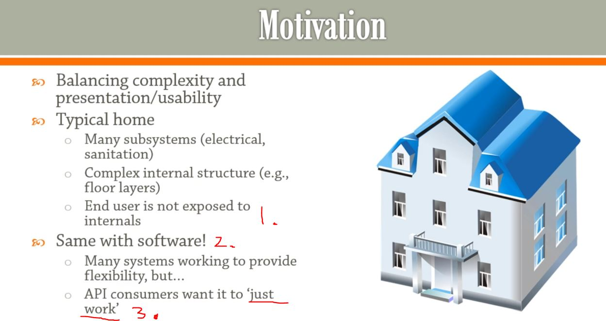
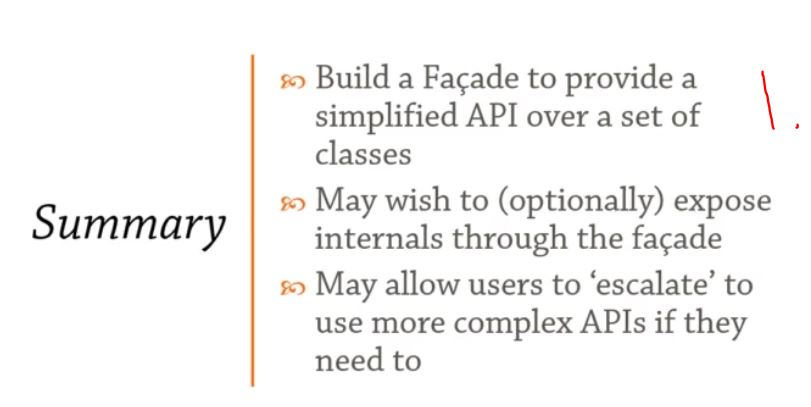

## Section 11: Façade.

Façade.

> Exposing several components through a single interface.

# What I Learned.

# Overview.

- Exposing several components' through a single interface. **Making convent for end user**.



1. Wiring inside wall is not exposed even if there is some weird cabling or bugs inside.
2. Same with software!
3. Console log has much different stuff, like buffer, memory allocation etc., but we can just call `System.out.println();` and not to worry about details.

### Façade.

> Provides a simple, easy to understand/user interface over a large
and sophisticated body of code.

# Façade.

## Façade in code.

```
import java.util.ArrayList;
import java.util.Iterator;
import java.util.List;

public class Facede {
	
	//Logs huge amount of data, example form stock market
	public static class Buffer
	{
		private char [] chracters;
		private int lineWidth;	 // Where line brakes are expected to be
		
		
		public Buffer(int lineHeight, int lineWidth) {
			this.lineWidth = lineWidth;
			this.chracters = new char[lineWidth * lineHeight]; //Data can be put
		}
		
		public char charAt(int x, int y) //Accessing buffer
		{
			return chracters[y*lineWidth+x];//Transform from 2d to 3d coordinates
		}
	}
	
	public static class Viewport
	{
		private final Buffer buffer;
		private final  int width;
		private final  int height;
		private final  int offsetX;
		private final  int offsetY;

		public Viewport(Buffer buffer, int width, int height, int offsetX, int offsetY )//Offset to buffer, which portion is wanted to present
		{
			this.buffer = buffer;
			this.width = width;
			this.height = height;
			this.offsetX = offsetX;
			this.offsetY = offsetY;
			
		}
		
		public char charAt(int x, int y)
		{
			return buffer.charAt(x+offsetX, y+offsetY);
		}
	}

	public static class Console
	{
		private List<Viewport> viewports = new ArrayList<>();
		int width, heigt;
		
		public Console(int width, int heigt) {
			this.width = width;
			this.heigt = heigt;
		}
		
		public void addViewport(Viewport viewport)
		{
			viewports.add(viewport);
			
		}
		
		public void render()// Printing buffer
		{
			for (int i = 0; i < heigt; ++i) {
				for (int j = 0; j < width; ++j) {
					for (Viewport vp : viewports) {
						System.out.println(vp.charAt(i, j));
					}
				}
			}
			System.out.println();
		}
	}
	
	class Demo
	{
		public static void main(String[] args) {
			Buffer buffer = new Buffer(30, 20);
			Viewport viewport = new Viewport(buffer, 30, 20, 0, 0);
			Console console = new Console(30,20);
			console.addViewport(viewport);
			console.render();
		}
	}
	
}

```

- User want's only initialize console, not worry about the buffers etc.

```

	class Demo
	{
		public static void main(String[] args) {
			Buffer buffer = new Buffer(30, 20);
			Viewport viewport = new Viewport(buffer, 30, 20, 0, 0);
			Console console = new Console(30,20);
			console.addViewport(viewport);
			console.render();
		}
	}

```

- User don't want to use following initialization, therefore we are using Façade pattern. **We just want call one subsystem**.

- Example below using **Façade**.

```

import java.util.ArrayList;
import java.util.Iterator;
import java.util.List;

public class Facade {
	
	//Logs huge amount of data, example form stock market
	public static class Buffer
	{
		private char [] chracters;
		private int lineWidth;	 // Where line brakes are expected to be
		
		
		public Buffer(int lineHeight, int lineWidth) {
			this.lineWidth = lineWidth;
			this.chracters = new char[lineWidth * lineHeight]; //Data can be put
		}
		
		public char charAt(int x, int y) //Accessing buffer
		{
			return chracters[y*lineWidth+x];//Transform from 2d to 3d coordinates
		}
	}
	
	public static class Viewport
	{
		private final Buffer buffer;
		private final  int width;
		private final  int height;
		private final  int offsetX;
		private final  int offsetY;

		public Viewport(Buffer buffer, int width, int height, int offsetX, int offsetY )//Offset to buffer, which portion is wanted to present
		{
			this.buffer = buffer;
			this.width = width;
			this.height = height;
			this.offsetX = offsetX;
			this.offsetY = offsetY;
			
		}
		
		public char charAt(int x, int y)
		{
			return buffer.charAt(x+offsetX, y+offsetY);
		}
	}

	public static class Console
	{
		private List<Viewport> viewports = new ArrayList<>();
		int width, heigt;
		
		public Console(int width, int heigt) {
			this.width = width;
			this.heigt = heigt;
		}
		
		public void addViewport(Viewport viewport)
		{
			viewports.add(viewport);
		}

		public static Console newConsole(int width, int height)
		{
			Buffer buffer = new Buffer(width, height);
			Viewport viewport = new Viewport(buffer, width, height, 0 ,0);
			Console console = new Console(width, height);
			console.addViewport(viewport);
			return console;
		}
		
		public void render()// Printing buffer
		{
			for (int i = 0; i < heigt; ++i) {
				for (int j = 0; j < width; ++j) {
					for (Viewport vp : viewports) {
						System.out.println(vp.charAt(i, j));
					}
				}
			}
			System.out.println();
		}
	}
	
	class Demo
	{
		public static void main(String[] args) {
			//User does not care about this
			Buffer buffer = new Buffer(30, 20);
			Viewport viewport = new Viewport(buffer, 30, 20, 0, 0);
			Console console = new Console(30,20);
			console.addViewport(viewport);
			console.render();
		
		
			
			//Using Facade
			Console console2 = Console.newConsole(30, 20);
			console2.render();
		}
	}
	
}

```

- Main point here, user can just call `Console console2 = Console.newConsole(30, 20)` to create console and **not** worry about subcomponents.

```
	
	class Demo
	{
		public static void main(String[] args) {
			//User does not care about this
			Buffer buffer = new Buffer(30, 20);
			Viewport viewport = new Viewport(buffer, 30, 20, 0, 0);
			Console console = new Console(30,20);
			console.addViewport(viewport);
			console.render();
		
		
			
			//Using Facade
			Console console2 = Console.newConsole(30, 20);
			console2.render();
		}
	}

```

# Summary.



1. Nice API to people to use for more complex class.