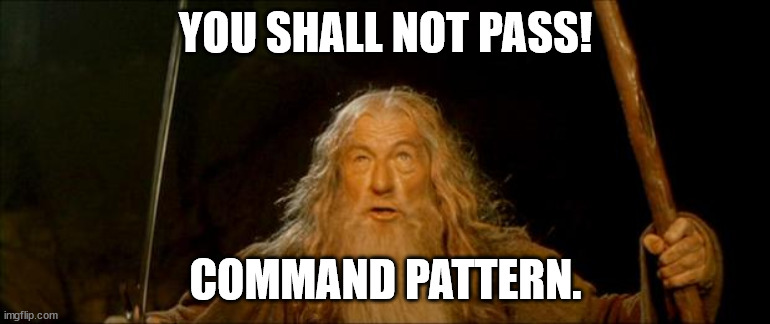
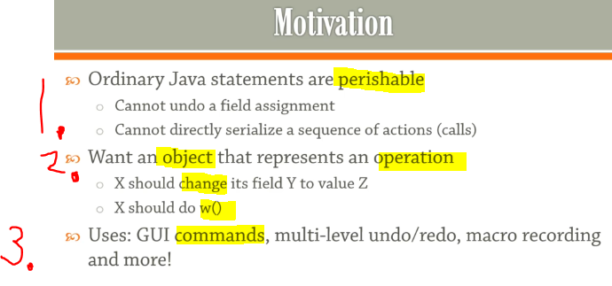
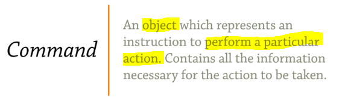
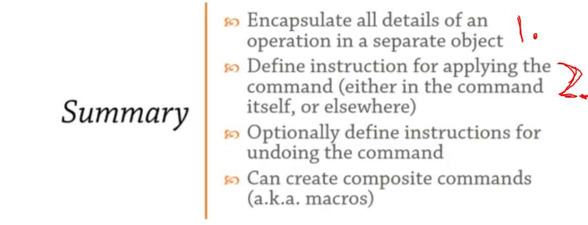

## Section 15: Command.

Command pattern.



# What I Learned.

# 74. Overview.  



1. In Java statements are **perishable**. Meaning once assignment or what ever operation is done, you **cannot** go back to original state.
2. We want **object** represent operation.
3. There is multiple uses for such **commands** such as GUI commands is sent to command processor. These commands can be stored or played reverse order.



# 75. Command.

 - Command pattern case, in context of **Bank Account**:

```
package command_75;

class BankAccount {
	private int balance;
	private int overdraftLimit = -500; // Limit for getting money out of bank.

	private void deposit(int amount) {
		balance += amount;
		System.out.println("Deposited " + amount + ", balance is now " + balance);
	}

	// Withdrawing money form BankAccount.
	private void withdraw(int amount) {

		if (balance - amount >= overdraftLimit) {
			balance -= amount;
			System.out.println("Withdrew " + amount + ", balance is now " + balance);
		}
	}

	@Override
	public String toString() {
		return "BankAccount{" + "balance=" + balance + "}";
	};
}

```
- We want to put some kind  of audit for this system.
    - We don't want to inject any kind of logging system here.
        - We want to process thing differently, we will use **Command** design pattern.  


- **Command Pattern in use**.

```
package command_75;

import java.util.List;

class BankAccount {
	private int balance;
	private int overdraftLimit = -500; // Limit for getting money out of bank.

	public void deposit(int amount) {
		balance += amount;
		System.out.println("Deposited " + amount + ", balance is now " + balance);
	}

	// Withdrawing money form BankAccount.
	public void withdraw(int amount) {

		if (balance - amount >= overdraftLimit) {
			balance -= amount;
			System.out.println("Withdrew " + amount + ", balance is now " + balance);
		}
	}

	@Override
	public String toString() {
		return "BankAccount{" + "balance=" + balance + "}";
	};
}


interface Command
{
	void call(); // Method for applying command to something.
}

class BankAccountCommand implements Command
{
	private BankAccount account;// What kind Bank Account command will be operated on.
	 
	 //What kind action on BankAccount. 
	 public enum Action
	 {
		 DEPOSIT, WITHDRAW;
	 }
	 
	 private Action action;
	 private int amount;

	 public BankAccountCommand(BankAccount account, Action action, int amount) {
			this.account = account;
			this.action = action;
			this.amount = amount;
		}

	@Override
	public void call() {
		switch (action) {
		case DEPOSIT: 
			account.deposit(amount);
			break;
		case WITHDRAW:
			account.withdraw(amount);
		}
	}
}

class Demo
{
	public static void main(String[] args) {
		BankAccount ba = new BankAccount();
		System.out.println(ba);
		
		
		// List of commands for Command processor. So list of objects which represents operations.
		List<BankAccountCommand> commands = List.of(
				new BankAccountCommand(ba, BankAccountCommand.Action.DEPOSIT, 100),
				new BankAccountCommand(ba, BankAccountCommand.Action.WITHDRAW, 1000)
				);
		
		for (BankAccountCommand bankAccountCommand : commands) {
			bankAccountCommand.call();
			System.out.println(ba);
		}
	}
}
```

# 76. Undo Operations.

- In this chapter we are using revering function from **IIRC Lists is from the Guava library**. Remember to import it, or use some other way. [Guava](https://mvnrepository.com/artifact/com.google.guava/guava/33.3.1-jre).

- Example with **Undo** operation.

```
package command_75;

import java.util.ArrayList;
import java.util.Collection;
import java.util.Collections;
import java.util.List;

import com.google.common.collect.Lists;

class BankAccount {
	private int balance;
	private int overdraftLimit = -500; // Limit for getting money out of bank.
	
	public void deposit(int amount) {
		balance += amount;
		System.out.println("Deposited " + amount + ", balance is now " + balance);
	}

	// Withdrawing money form BankAccount.
	public boolean withdraw(int amount) {

		if (balance - amount >= overdraftLimit) {
			balance -= amount;
			System.out.println("Withdrew " + amount + ", balance is now " + balance);
			return true;
		}
		return false;
	}

	@Override
	public String toString() {
		return "BankAccount{" + "balance=" + balance + "}";
	};
}

/*
 * Command is interface here because of the flexibility that it brings.
 */
interface Command {
	void call(); // Method for applying command to something.

	void undo();

}

class BankAccountCommand implements Command {
	private BankAccount account;// What kind Bank Account command will be operated on.

	// What kind action on BankAccount.
	public enum Action {
		DEPOSIT, WITHDRAW
	};

	private Action action;
	private int amount;
	private boolean succeeded; // Tells if transaction failed or not.
	
	public BankAccountCommand(BankAccount account, Action action, int amount) {
		this.account = account;
		this.action = action;
		this.amount = amount;
	}

	@Override
	public void call() {
		switch (action) {
		case DEPOSIT:
			succeeded = true;
			account.deposit(amount);
			break;
		case WITHDRAW:
			succeeded = account.withdraw(amount);
			// way of figuring if operation succeeded.
		}
	}

	@Override
	public void undo() {
		
		if (!succeeded) {
			return;
		}
		
		switch (action) {
		case DEPOSIT:
			account.withdraw(amount);
			break;
		case WITHDRAW:
			account.deposit(amount);
		}
	}

}

class Demo {
	public static void main(String[] args) {
		
		BankAccount ba = new BankAccount();
		System.out.println(ba);

		// List of commands for Command processor. So list of objects which represents operations.
		// List.of returns immutable list.
		List<BankAccountCommand> commands = List.of(new BankAccountCommand(ba, BankAccountCommand.Action.DEPOSIT, 100),
				new BankAccountCommand(ba, BankAccountCommand.Action.WITHDRAW, 1000));
		
		for (Command bankAccountCommand : commands) {
			bankAccountCommand.call();
			System.out.println(ba);
		}
		
		//We will use bit hacky way to reverse list, for sake of emulating undo().
		for (Command bankAccountCommand : Lists.reverse(commands)) {
			bankAccountCommand.undo();
			System.out.println(ba);
		}
	}
}
```


# Coding Exercise 12: Command Coding Exercise.

- My answer for exercise:

```
package coding_exercise_12;
// When returning test remember to remove package.

/*
 * 
 * Command Coding Exercise.
 * Implement the Account.process()  method to process different account commands. The rules are obvious:
 * 	- `success`  indicates whether the operation was successful
 * 	- You can only withdraw money if you have enough in your account.
 * 
 */


class Command {
	enum Action {
		DEPOSIT, WITHDRAW
	}

	public Action action;
	public int amount;
	public boolean success;

	public Command(Action action, int amount) {
		this.action = action;
		this.amount = amount;
	}
}

class Account {

	public int balance;

	public void process(Command command) {
		switch (command.action) {
		case DEPOSIT: {
			balance += command.amount;
			command.success = true;
			break;
		}
		case WITHDRAW: {
			command.success = balance >= command.amount;
			if (command.success) {
				balance -= command.amount;
			}
			break;
		}
		}
	}
}

class BankAccountCommand extends Command {

	private Account account;

	public BankAccountCommand(Action action, int amount) {
		super(action, amount);
		this.account = new Account();
	}
}
```

# 77. Summary.



1. Make operation with details into object.
	- You can store it, play with it. Much easier to play with.
2. **Command** is not enough, you need processor for it also!