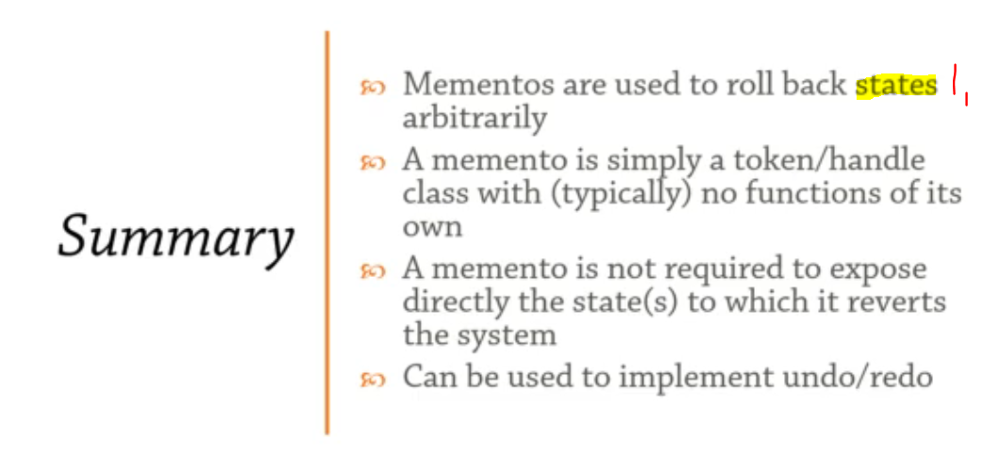

## Section 19: Memento.

Memento.

> Keep a memento of an object's state to return to that state.

# What I Learned.

# Overview.


1. You can save **snapshots** of state in **Memento** pattern.
2. In **Command** pattern set of changes were in form of **Commands**. 


- It is a **handle** / **token** to represent system state.

#  Memento.

- My implementation of **Memento** pattern. 
    - **Commander** and **Memento** are related, but still bit different!

```
package memento_92;

// Memento or token, you can call it what you like.
class Memento // Memento should keep as immutable as possible, so it should be closed as possible.
{	
	public int balance;

	public Memento(int balance) {
		this.balance = balance;
	}	
}

class BankAccount {
	
	public int balance;
	
	BankAccount(int balance)
	{
		this.balance = balance;
	}
	
	// Memento allows us to roll back the given action. 
	public Memento deposit(int ammount) {
		balance += ammount;
		return new Memento(balance);
	}

	public void restore(Memento m)
	{
		balance = m.balance;
	}
	
	@Override
	public String toString() {
		return "BankAccount{" + "balance=" + balance + "}";
	};
}


class Demo {
	
	public static void main(String[] args) {
		
		BankAccount ba = new BankAccount(100);
		var memento1 = ba.deposit(50); // 150
		var memento2 = ba.deposit(25); // 175
		System.out.println(ba);

		// restore to m1
		ba.restore(memento1);
		System.out.println("Memento 1 " + ba);
		
		// restore to m2
		ba.restore(memento2);
		System.out.println("Memento 2 " + ba);
	}
}
```

- With **Memento** state of system is being snapshotted of and if this state needs to be saved/persisted things can lead lot of memory usage.
    - In this case **Commander** patterns would be better option.
        - **Commander** lists changes rather than **states**, like in **Memento**.
        - Or just compress data and go with **Memento**, up to you!

# Memento for Interop.


1. Calling **function** form other language is relative easy, just setup **native interface** connection!
2. **Problem** comes if there is function is **inside class** in c/c++ program. One does not simply instantiate `Foo` class inside `Java/C#` application!   

- [Language_interoperability](https://en.wikipedia.org/wiki/Language_interoperability).
- [JsInterop](https://www.gwtproject.org/doc/latest/DevGuideCodingBasicsJsInterop.html). I personally used this one!


1. There is memory space inside **c/c++** world where we would use **Memento** which would take care of communication.
2. There is exposed some **top level functions** to communicate this object inside **c/c++**. You really cannot get **c/c++** object to Java world. We would get **Memento** which in turn would communicate to object inside **c/c++** and other way around. You would need to send **Memento** to **c/c++** Object which in regards would communicate to function inside an Object.

- So you can use **Memento** for **Interop** communication. 

# Coding Exercise 16: Memento Coding Exercise.

- My answer: 

```
package com.activemesa.behavioral.memento.exercise;

import java.util.ArrayList;
import java.util.List;
import java.util.stream.Collectors;

/*
 * 
	Memento Coding Exercise
	A TokenMachine  is in charge of keeping tokens. Each Token  is a reference type with a single numerical value. 
	The machine supports adding tokens and, when it does, it returns a memento representing the state of that system at that given time.

	You are asked to fill in the gaps and implement the Memento design pattern for this scenario. 
	Pay close attention to the situation where a token is fed in as a reference and its value is subsequently changed on that reference - you still need to return the correct system snapshot!
 * 
 */

class Token {
	public int value = 0;

	public Token(int value) {
		this.value = value;
	}
}

class Memento {
	public List<Token> tokens = new ArrayList<>();

}

class TokenMachine {
	public List<Token> tokens = new ArrayList<>();

	public Memento addToken(int value) {
		return addToken(new Token(value));
	}

	public Memento addToken(Token token) {

		
	    tokens.add(token);
	    Memento m = new Memento();
	    m.tokens = tokens.stream()
	      .map(t -> new Token(t.value))
	      .collect(Collectors.toList());
	    return m;
//		Works!!, but no?
//		this.tokens.add(token);
//		
//		Memento memento = new Memento();
//		memento.tokens = tokens.stream().map(
//				streamToken -> new Token(streamToken.value)).toList();
//		return memento;
	}

	public void revert(Memento m) {

	    tokens = m.tokens.stream()
	    	      .map(t -> new Token(t.value))
	    	      .collect(Collectors.toList());
	}
}

```

# Summary.



1. **Memento** is snapshot in point in time.

# Additional.

- [ ] [Memento](https://refactoring.guru/design-patterns/memento).