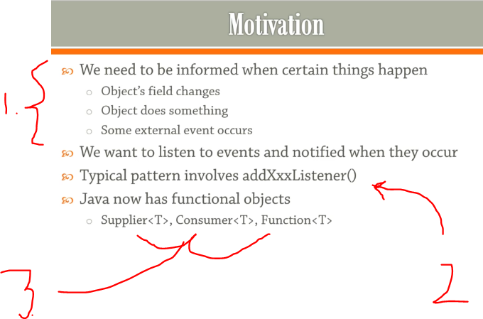
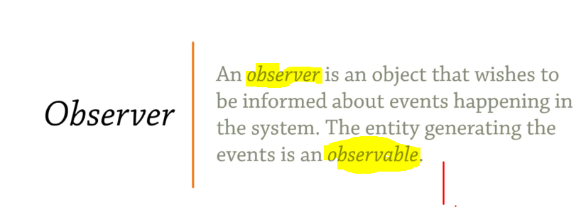
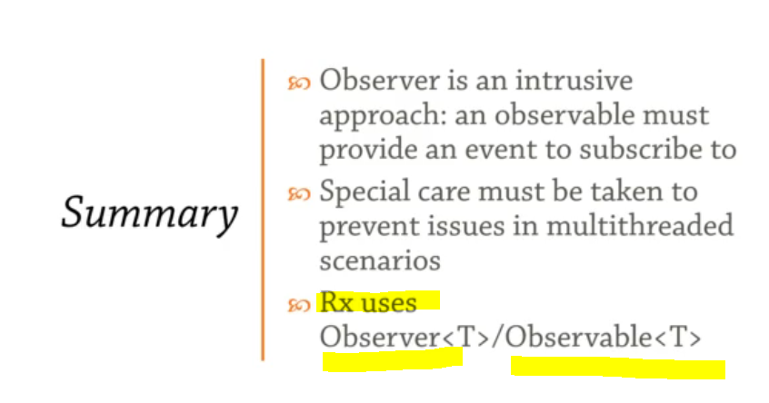

## Section 21: Observer.

Observer.

> I am watching you! 👀.

# What I Learned.
 
# Overview.



1. We want listen event when something happens.
2. Old way in Java was `addXxxListener()`.
3. Nowadays, you can use functional interface like `Supplier<T>`, `Consumer<T>`, `Function<T>` just wrap function into these.



1. Usually the one which we generate is called `observable`.

#  Observer and Observable.

```
package Observer_and_Observable_100;

import java.util.ArrayList;
import java.util.List;

class PropertyChangedEventArgs<T> // Contains same information about change of property.
{
	public T source; // Reference to source.
	public String propertyName; // Name of property which is changed.
	public Object newValue; // New value after change!

	public PropertyChangedEventArgs(T source, String propertyName, Object newValue) {
		this.source = source;
		this.propertyName = propertyName;
		this.newValue = newValue;
	}
}

//The thing which is looking at!
interface Observer<T> // If you want Observe type T, then you implement interface Observer<T> handle method.
{
	// You define own handle and when somebody performs some changes, you hope that handle will be fired!
	void handle(PropertyChangedEventArgs<T> args);
}

// The object which you can look at!
class Observable<T> {
	
	// All the observers that are watching particular thing!.
	private List<Observer<T>> observers = new ArrayList<>(); 

	// API for subscribing for the observables.
	public void subscribe(Observer<T> observer) {
		observers.add(observer);
	}

	// Notify Observers that something has happened!
	protected void propertyChanged(T source, String propertyName, Object newValue) {
		
		// Observable needs to fire notification to Observers that something has happened! 
		for (Observer<T> observer : observers) {
			observer.handle(new PropertyChangedEventArgs<T>(source, propertyName, newValue));
		}
	}
}

public class Person  extends Observable<Person> { // Person is Observable!
	
	//For testing
	public static void main(String[] args) {
		new Demo(); 
	}

	private int age;

	// Property age is C# kind of thing.
	public int getAge() {
		return age;
	}
	
	// We are interested in setter, for supporting idea of Notification of property changes.
	public void setAge(int age) {  
		if (this.age == age) {
			return;
		}
		this.age = age;
		// Notifying that something has changed.
		propertyChanged(this, "age", age);
	}
}


class Demo implements Observer<Person> //This class is watching Person. 
{

	public Demo() {
		Person person = new Person();
		person.subscribe(this);
		
		for (int i = 20; i < 24; ++i) {
			person.setAge(i);
		}
	}

	//Action in Observers side, when something has changed in Observables.
	@Override
	public void handle(PropertyChangedEventArgs<Person> args) {
		System.out.println("Person's " + args.propertyName
				+ " has changed to " + args.newValue);
	}
}
```

- This approach is **valid**, but bit rigid. Its bit **silly**, to implement any kind of interface if you wan't observe interface. We we build this idea around **events**.

# An Event Class.

- You can get away from this idea of thinking **Observer and Observables** with event class.

- We are using [Memento Pattern](https://refactoring.guru/design-patterns/memento) for some functionalities, like `Subscription` object for handling **subscriptions**.

- Example below of such.

```
//	We are using AutoCloseable so we can put it into try with resources.
	public class Subscription implements AutoCloseable
	{
		// reference which is part of.
		private Event<TArgs> event;
		private int id; // Will be index to the Map.
		
		public Subscription(Event<TArgs> event, int id) {
			this.event = event;
			this.id = id;
		}


		
		// We can close the subscription certain amount of time.
		@Override
		public void close() throws Exception {
			event.handlers.remove(id); // Removing from Map.
		}
```

- Full code for **Observer and Observable** below.

```
package WithEventClass_101;

import java.util.HashMap;
import java.util.Map;
import java.util.function.Consumer;

class Demo
{
	public static void main(String[] args) throws Exception {
		Person person = new Person();
		Event<PropertyChangedEventArgs>.Subscription sub = person.propertyChanged.addHandler(x -> {
			System.out.println("Person's "
					+ x.propertyName + " has changed");
		});
		
		person.setAge(17);
		person.setAge(18);
		sub.close();
		person.setAge(20);
	}
}


/*
 * What kind of event is happening and related fields to it.
 */
class PropertyChangedEventArgs
{
	public Object source;
	public String propertyName;
	
	public PropertyChangedEventArgs(Object source, String propertyName) {
		this.source = source;
		this.propertyName = propertyName;
	}
	
}

class Person
{
	public Event<PropertyChangedEventArgs>
	propertyChanged = new Event<>();
	/*
	 * This is just for implying that Person has Event that you can subscribe into it when something have happened.
	 */
	
	private int age;

	public int getAge() {
		return age;
	}

	public void setAge(int age) {
		
		if (this.age == age) {
			return;
		}
		this.age = age;
		// We inform about information.
		propertyChanged.fire( new PropertyChangedEventArgs(this, "age"));
	}
}


// Event will be encapsulating something happening. 
class Event<TArgs> {
	
	private int count = 0;
	
	// Not list of subscribers, but Map of subscribers.
	private Map<Integer, Consumer<TArgs>>
	handlers = new HashMap<>();

	
	// Memento will be "Subscription" returned since its can be used for disconnecting from this event!
	public Subscription addHandler(Consumer<TArgs> handler)
	{
		int i = count; // cache i for now.
		handlers.put(count++, handler);
		return new Subscription(this, i);
		
	}
	
	// Firing the events
	public void fire(TArgs args)
	{
		for (Consumer<TArgs> handler : handlers.values()) {
			handler.accept(args);
		}
		
	}
	
	
	
//	We are using AutoCloseable so we can put it into try with resources.
	public class Subscription implements AutoCloseable
	{
		// reference which is part of.
		private Event<TArgs> event;
		private int id; // Will be index to the Map.
		
		public Subscription(Event<TArgs> event, int id) {
			this.event = event;
			this.id = id;
		}


		
		// We can close the subscription certain amount of time.
		@Override
		public void close() throws Exception {
			event.handlers.remove(id); // Removing from Map.
		}
		
	}
}

```

- We can encapsulate an **Event** rather than forcing to implement **Observer** and **Observable**.
	- Event is just **container** of **subscriptions**.

# The Problem with Dependent Properties.

- If there would be more properties changing, this logic would be bigger and hard to scale up. 

```
	public void setAge(int age) {
		
		if (this.age == age) {
			return;
		}
		this.age = age;
		// We inform about information.
		propertyChanged.fire( new PropertyChangedEventArgs(this, "age"));
	}
```

# Coding Exercise 18: Observable Coding Exercise.

## Observable Coding Exercise.

- The task:

```
Imagine a game where one or more rats can attack a player. Each individual rat has an attack  value of 1. However, rats attack as a swarm, so each rat's attack  value is equal to the total number of rats in play.

Given that a rat enters play through the constructor and leaves play (dies) via its close()  method, please implement the Game and Rat classes so that, at any point in the game, the attack  value of a rat is always consistent.
```

- My answer:

```


package coding_exercise_18;


import java.io.Closeable;
import java.io.IOException;
import java.util.ArrayList;
import java.util.List;
import java.util.function.BiConsumer;

/*
    Observable Coding Exercise
	Imagine a game where one or more rats can attack a player. 
	Each individual rat has an attack  value of 1. However, rats attack as a swarm, so each rat's attack  value is equal to the total number of rats in play.

	Given that a rat enters play through the constructor and leaves play (dies) via its close()  method,
	please implement the Game and Rat classes so that, at any point in the game, the attack  value of a rat is always consistent.
 */

/* 
 * We are using such event for given system which in regards is applying Observer Design pattern with event system.
 */
class Event<T> {

	// adding to centralized event handler system
	private List<BiConsumer<Object, T>> consumers = new ArrayList<>();

	// takes consumer
	void subscribe(BiConsumer<Object, T> consumer) {
		consumers.add(consumer); 
	}

	public void invoke(Object sender, T arg) {
		for (BiConsumer<Object, T> consumer : consumers)
			consumer.accept(sender, arg);
	}

}

class Game {

	// Game has these events that we can subscribe into!
	public Event<Void> ratEnters = new Event<>();
	public Event<Void> ratDies = new Event<>();
	public Event<Rat> notifyRat = new Event<>();
}

class Rat implements Closeable
{
  private Game game;
  public int attack = 1;

  public Rat(Game game)
  {
    this.game = game;
    game.ratEnters.subscribe((sender, arg) -> {
      if (sender != this)
      {
        ++attack;
        game.notifyRat.invoke(this, (Rat) sender);
      }
    });
    game.notifyRat.subscribe((sender, rat) -> {
      if (rat == this) ++attack;
    });
    game.ratDies.subscribe((sender, arg) -> --attack);
    game.ratEnters.invoke(this, null);
  }

  @Override
  public void close() throws IOException
  {
    // rat dies ;(
    game.ratDies.invoke(this, null);
  }
}

```

# Summary.



- We don't have any dedicated API for **Observer** and **Observables**.