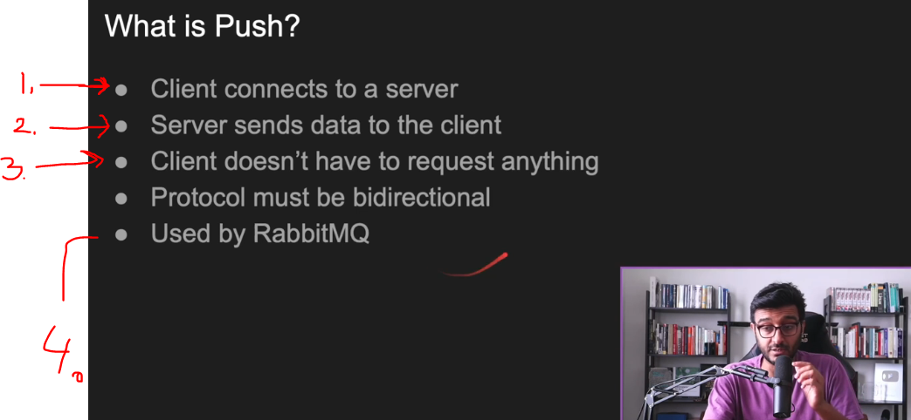
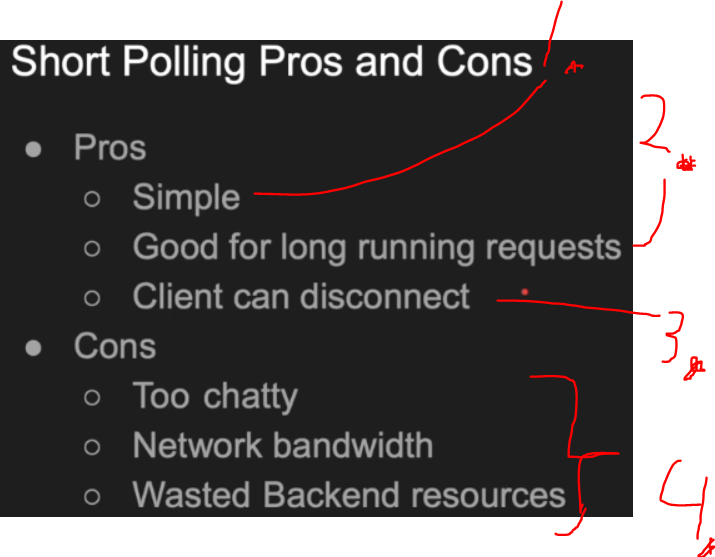

## Section 02: Backend Communication Design Patterns.

Backend Communication Design Patterns.

# What I Learned.

# Backend Communication Design Patterns Intro.  

- There is multiple different **be patterns**, **repeating** again and again. 

# Request Response.  

<div align="center">
    
</div>

1. The most famous and popular.
    - There is **request** and **response**!

<div align="center">
    
</div>

1. What is request? **Request** needs be **defined** by client.
2. **Server** needs to parse the **request**.
    - 💲**Cost**💲 of the parsing the **request** is no fun!
    - We are **understanding** the request here.
3. After **parsing** request, come **processing** of the request.
    - Here we are **processing** the request.
4. When ready, send the **Response**.
    - There needs to be boundaries for detecting the **end** and the **start** of response.
5. Client **parses** and **consumes** it.
6. Simple diagram for the **request** and the **response**.

> [!NOTE]
> Where does the **serialization** and **deserialization** come to place, in example of the **JSON**? <br>
    - In the **step**, `processing the request`. The `3` step!
        - 💲💲**EXPENSIVE**💲💲 of **deserialization**.
            - Example, the **XML** is heavy on processing!

<div align="center">
    
</div>

1. HTTP, DNS ... are **request and response** protocols.    
    - There is **no order**, when coming into communication and in **general** when dealing with **backend engineering**

<div align="center">
    
</div>

2. You run **code** in other place than in own computer.  
3. **SQL** is also, **request and response**. We send **SQL** and processes it and sends back.
4. `SOAP` is fine as long it works! 
    - Once you run into **defiances**, only then try to **optimize** things!
        - Try to **not** to **pre-optimize** things! 
- In **REST,** we are making the **lot** of requests!! This is one downside of **REST**.
    - The `GraphQL` tries, to solve this being **less** **chatty**.

<div align="center">
    
</div>

1. We have to **agree** for the **request** and **response** format.
    - This has been already **agreed** by the **libraries**.
2. Requests have boundaries.
3. Example of the **message format** where **JSON** is parsed into to the **C++** **class object**!
4. `HTTP` **request** looks like such:

```
Start Line
Headers
Blank Line
Body
```

- We have task to **build** upload image service!
    
> [!NOTE]
> What would be the best **patter** to implement here?

<div align="center">
    
</div>


1. **Simplest** would be to use **request and response** pattern! 
    - Is to send **whole** file and send it to server.
        - If the image will be ***big**.

2. Other way is to make this image into **smaller parts**.
    - Send **each** request, small chunk of the pic.

- **Remember** this is still the same **request and response** style, but we can dictate this.

<div align="center">
    
</div>

1. This style does not fit everywhere.
    - Example in **Notification service**. I want to get notification when somebody just **logged in** or **uploaded video**
        - This is **not**, request and response.
            - Only backend knows, but not the client.
    - Example in **Chatting application**.
        - Spamming the `did i get request`!
    - Example if the request is **very long**, there are better ways to deal with this.

> [!IMPORTANT]  
> All these can be solved by using some kind of design patter!


<div align="center">
    
</div>

1. From sending of the **request** to the **response**.
2. **Timeline**, so we can see how long it took for the **request** and **response**.
3. There is **cost** for processing the response.

- Example of the **curl** `curl -v --trace out.txt http://google.com`.

# Synchronous vs Asynchronous workloads.  

<div align="center">
    
</div>

- Async is the term is not in same wave length!

<div align="center">
    
</div>

1. Once call is made, this gets block.

- Todo continue this when needed.

# Push.  

<div align="center">
    
</div>

1. If you want to be fast as possible use, then you can think of using **PUSH**!
    - One of the famous ones!

<div align="center">
    
</div>

1. "Do I have event" → "No", "I have event" → "no" ... etc. With, **request** and **response** this is not ideal.
2. **Pushing** is good when in certain use cases. Example, when server knows to push something to the **client**.
    - Example would be **chatting application**.

<div align="center">
    
</div>

1. **Client** connects to a **server**. Only thing should happen is the **connection**!
2. **Server** sends data to the **client**!
3. **Client** does not have to request data!
4. **RabbitMQ** uses **PUSH**!
    - In **RabbitMQ**:
        - **Clients** consumes **queue**!
            - In **RabbitMQ** pushes messages **automatically** to the **clients** that are connected to it as soon as they’re available in **queue**!

<div align="center">
    
</div>

1. The connection is **established**!
2. Backend gets **message**.
    - This **message** is **PUSHED** to all connected the **clients**!

<div align="center">
    
</div>


1. **Push** is based on the **real time**. On the moment data come to the input, we are going to **PUSH** it to clients. 
    - This is the definition of the **PUSH**.

2. **Push** **requires** the **client** needs to be **online**!
3. We have no idea, what happened to the **pushed** data.
    - Server does not have knowledge what happened to the data!
        - We will **PUSH** data to the client, and they might **not** able to handle it.
        - For this reason **Kafka** changed into to the **long polling**!
4. **Polling** is preferred for the **light** clients.

- For this example we will test with **WebSocket** server and connecting:

<div align="center">
    
</div>


- Testing and connecting to the **WebSocket** we can test this by running in the terminal!
    - Run in cmd `let ws = new WebSocket("ws://localhost:8080");`.

- We write simple **WebSocket** server. This will demonstrate the **PUSH** concept.

<div align="center">
    
</div>


````
const http = require("http");
const WebSocketServer = require("websocket").server
let connections = [];

// Create a raw http server (this will help us create the TCP which will then pass to the websocket to do the job).
const httpserver = http.createServer()

 // Pass the httpserver object to the WebSocketServer library to do all the job, this class will override the req/res.
const websocket = new WebSocketServer({"httpServer": httpserver })
// Listen on the TCP socket.
httpserver.listen(8080, () => console.log("My server is listening on port 8080"))


// When a legit websocket request comes listen to it and get <the connection .. once you get a connection thats it! 
websocket.on("request", request=> {

    const connection = request.accept(null, request.origin)
    connection.on("message", message => {
        // Someone just sent a message tell everybody.
        connections.forEach (c=> c.send(`User${connection.socket.remotePort} says: ${message.utf8Data}`))
    }) 
    
    connections.push(connection)
    // Someone just connected, tell everybody!
    connections.forEach (c=> c.send(`User${connection.socket.remotePort} just connected.`))
  
})
 

// Client code. 
// let ws = new WebSocket("ws://localhost:8080");
// ws.onmessage = message => console.log(`Received: ${message.data}`);
// ws.send("Hello! I'm client")

````

- Let's brake it down:

````
const http = require("http");
const WebSocketServer = require("websocket").server
let connections = []; // These are our users.
````

- The **Connections** are representing the **users**!
    - Every time there is new user in the chat room, we will add the into the `connections` array.
        - When the server **receives** message, we will **PUSH** the message to every user in the `connections`!

````
// Create a raw http server (this will help us create the TCP which will then pass to the websocket to do the job).
const httpserver = http.createServer()

 // Pass the httpserver object to the WebSocketServer library to do all the job, this class will override the req/res 
const websocket = new WebSocketServer({"httpServer": httpserver })
// Listen on the TCP socket.
httpserver.listen(8080, () => console.log("My server is listening on port 8080"))
````

> [!NOTE]
> **Handshake** in general is to **establish a connection**, negotiate rules, and confirm both parties are ready for communication! 


- We will be initializing the server and start listening.
    - We need to pass the **HttpServer** to the **WebSocketServer** so it can establish the **WebSocket handshake**.

````
// When a legit websocket request comes listen to it and get the connection .. once you get a connection thats it! 
websocket.on("request", request=> {

    const connection = request.accept(null, request.origin)
    connection.on("message", message => {
        //someone just sent a message tell everybody
        connections.forEach (c=> c.send(`User${connection.socket.remotePort} says: ${message.utf8Data}`))
    }) 
    
    connections.push(connection)
    // Someone just connected, tell everybody.
    connections.forEach (c=> c.send(`User${connection.socket.remotePort} just connected.`))
  
})
````

- When a legit **WebSocket request** comes. 
    - `websocket.on("request", request=> { ... code here`
        - This will **trigger** only, if there is **WebSocket request** **connect** coming!

````
const connection = request.accept(null, request.origin)
````    

- We will **accept the that connection!**

- We can test this. Send **servers** the **WebSocket** request, we can use following inside **chrome dev tools**:

````
// Client code. 
// let ws = new WebSocket("ws://localhost:8080");
// ws.onmessage = message => console.log(`Received: ${message.data}`);
// ws.send("Hello! I'm client")
````

````
connection.on("message", message => {
    // Someone just sent a message tell everybody.
    connections.forEach (c=> c.send(`User${connection.socket.remotePort} says: ${message.utf8Data}`))
})
````

- If somebody sent the `message` to **this connection**!
    - We will send for **each user**, message that **this user** sent a message!
        - Trick is to use `connection.socket.remotePort`, for user that is connected.

- We will add the **user** to list of users, hence to the `connections` like following: `connections.push(connection)`.

````
connections.forEach (c=> c.send(`User${connection.socket.remotePort} just connected.`))
````

- We will tell that somebody has just connected!

- Finnish this one. The testing part.

# Polling.  

> **Short polling**, is going to make constant nagging **"is this job done"**, **"is this job done"**. This takes very **less** time to poll!

- **Polling** is good for service, where the progress takes **much time**.
    - Like uploading **YouTube** video. Upload takes time, but the service return the **handle** for the client. This is good for client to ask is this job done!

<div align="center">
    
</div>

1. The `request` and `response` is **not ideal**, when the **request** takes **too** much time to process. Example **uploading video** to the YouTube video!
2.  We would want to have event that something did happen in backend. **Push** or **Polling** very good for certain use cases!

<div align="center">
    
</div>

1. **Client** sends a **request**.
    - The **Server** responds immediately with a **handle**.
        - Backend can choose what to do with this **handle**.
            - Save it to **database**.
            - Save it to **memory**.
2. **Client** can use the `handle` for **POLL**:in the **status** from the server!

<div align="center">
    
</div>

1. **Client** makes request, the **Server immediately** answers with the **handle** to be requested.

2. **Client** can ask *is it ready?*, with many of mini requests!
3. The next **POLL**, will be with the **result/answer**!

> [!CAUTION]
> If the client disconnects, the response will be responded regardless is the client ready accept it or not!

<div align="center">
    
</div>

1. It is relatively **simple to implement**.
2. This is good for **long running requests**.
3. **Client** can disconnect, if the **handle** is persisted somewhere in server side. 
    - Be can configure how long to keep the job in database.

4. When scaled up, multiple request are made resources are wasted.
    - Memory. 
    - Network bandwidth.

<div align="center">
    
</div>

```
const app = require("express")();
const jobs = {}

app.post("/submit", (req, res) =>  {
    const jobId = `job:${Date.now()}`
    jobs[jobId] = 0;
    updateJob(jobId,0); 
    res.end("\n\n" + jobId + "\n\n");
})

app.get("/checkstatus", (req, res) => {
    console.log(jobs[req.query.jobId])
    res.end("\n\nJobStatus: " + jobs[req.query.jobId] + "%\n\n")

} )

app.listen(8080, () => console.log("listening on 8080"));

function updateJob(jobId, prg) {
    jobs[jobId] = prg;
    console.log(`updated ${jobId} to ${prg}`)
    if (prg == 100) return;
    this.setTimeout(()=> updateJob(jobId, prg + 10), 3000)
}
```

- `const jobs = {} // Dictionary of the jobs.` The `jobs` will be **dictionary**: 
    - **Key** Job ID.
    - **Value** Progress.
        - This will not just be, is it ready or not, it will be progress of the job.


````
app.post("/submit", (req, res) =>  {
    const jobId = `job:${Date.now()}`
    jobs[jobId] = 0;
    updateJob(jobId,0); 
    res.end("\n\n" + jobId + "\n\n");
})
````

- Someone submitting the job.
    - `JobId`, will be `job:${Date.now()}` at the given **time**.

- The `updateJob()`, will be updating the job progress.

```
function updateJob(jobId, prg) {
    jobs[jobId] = prg;
    console.log(`updated ${jobId} to ${prg}`)
    if (prg == 100) return;
    this.setTimeout(()=> updateJob(jobId, prg + 10), 3000)
}
```

- Just printing the `JobId` with the `progress`.

````
console.log(`updated ${jobId} to ${prg}`)
````

- Checking the **status** of the job!

````
app.get("/checkstatus", (req, res) => {
    console.log(jobs[req.query.jobId])
    res.end("\n\nJobStatus: " + jobs[req.query.jobId] + "%\n\n")

} )
````

- Update the job `progress`.

````
function updateJob(jobId, prg) {
    jobs[jobId] = prg;
    console.log(`updated ${jobId} to ${prg}`)
    if (prg == 100) return;
    this.setTimeout(()=> updateJob(jobId, prg + 10), 3000)
}
````

<div align="center">
    
</div>

1. We can **POLL** the status of the **job**, with the concept of **short polling**!

> [!IMPORTANT]  
> Only downside to this was the **netowrking** cost!

# Long Polling.  

# Server Sent Events.  

# Publish Subscribe (Pub/Sub).  

# Multiplexing vs Demultiplexing (h2 proxying vs Connection Pooling).  

# Stateful vs Stateless.  

# Sidecar Pattern.  
