# Section 03: Protocols.

Protocols.

# What I Learned.

# Protocols Intro.

<div align="center">
    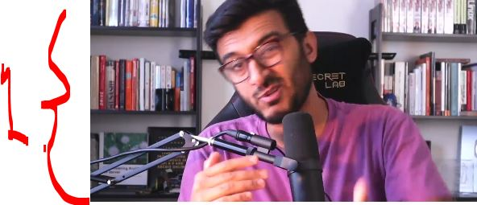
</div>

1. We will answer many questions like: 
    - What is protocol?
    - When design protocol, what you take into account?
    - **Popular protocols** are covered here: 

# Protocol Properties.

<div align="center">
    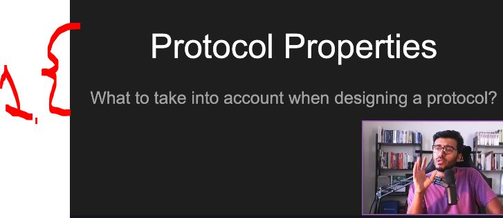
</div>

1. What needs to is needed to think, when designing the **protocol**!
    - Take these with grain of salt!

<div align="center">
    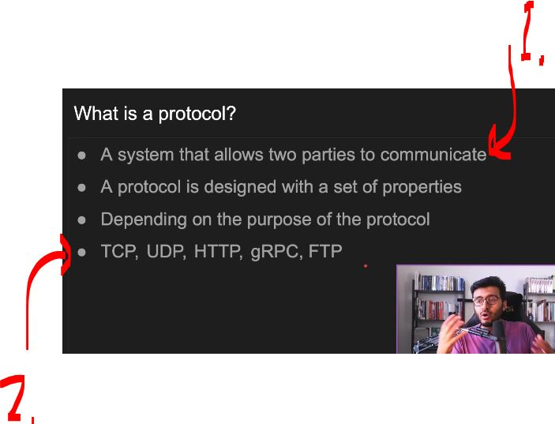
</div>

1. Protocol is set of **rules** for two parties to **communicate**!
2. Every protocol is to **solve problem**!
    - `TCP`, was designed to solve problem in **60's**!
        - Its getting old check: [TCP needs to be replaced](https://www.youtube.com/watch?v=nEFOni_87Yw)!
            - `TCP` was designed for low-bandwidth.
    - `UDP`.
    - `HTTP`.
    - `gRPC`.
    - `FTP`.

<div align="center">
    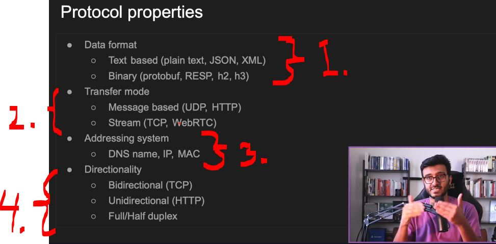
</div>

1. What is the **data format** of the protocol?
    - **Text Based**:
        - *Plain Text*.
        - *JSON*.
        - *XML*.
    - **Binary** (Compact, machine-readable):
        - This was designed to be read by machine, so it could be read **efficiently**!
            - *Protobuf*.
            - *RESP* (Redis protocol).
            - *h2* (HTTP/2).
            - *H3* (HTTP/3).
2. What is the **transfer mode** of the protocol?
    - **Message based**:
        - There is **start** and the **end**!
             - *UDP*.
             - *HTTP*.
    - **Stream**:
        - There is **continuous sequence** of bytes!
            - *TCP*.
            - *WebRTC*.
3. What is the **addressing system** of the protocol?
    - *DNS*.
    - *IP*.
    - *MAC*.
4. What is the **directionality** of the protocol?
    - *Bidirectional* (TCP).
    - *Unidirectional* (HTTP).
    - *Full/Half duplex*.
        - Wi-Fi is **half-duplex**.
            - In half duplex communication, both devices can:
                - Send data.
                - Receive data.
                    - …but not at the same time!

<div align="center">
    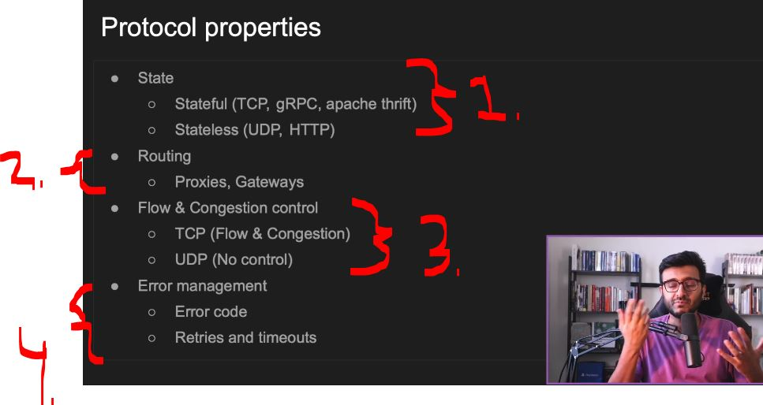
</div>

1. What is the **state** of the protocol?
    - **Stateful**:
        - *TCP*.
        - *gRPC*.
        - *Apache thrift*.
    - **Stateless**:
        - *UDP*.
        - *HTTP*.

2. How you protocol deals with **routing**!
    - There is **start** and the **end**!
        - *Proxies*, *Gateways*.
3. How you protocol deals with **flow control** and the **congestion control** ! 
    - **Flow control** how a fast sender doesn’t overwhelm a slow **receiver** and **Congestion control** prevent network overload.
            - *TCP* (flow and congestion control)
            - *UDP* Does not control!
4. How you protocol deals with **error management**!

# OSI Model.

<div align="center">
    
</div>

1. **One engineer** should understand the **OSI** model, when creating apps, which are touching **networking**! No need to master fully!

- There is **OSI layer**, where all these **protocols** are living in!

<div align="center">
    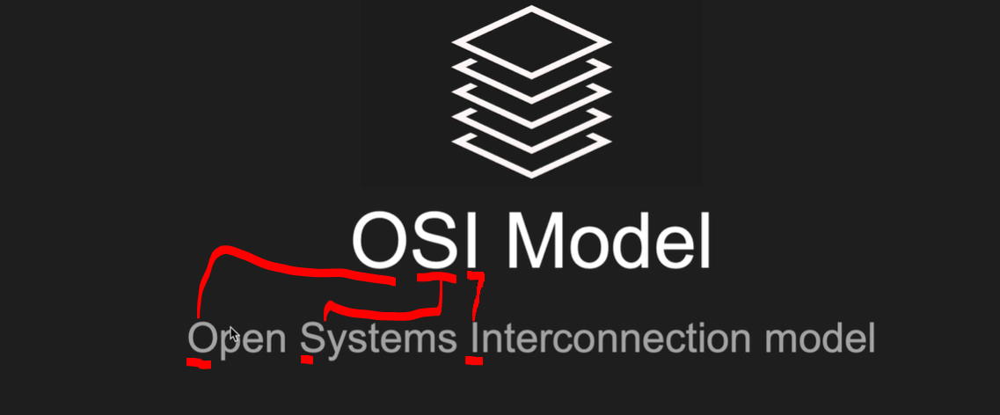
</div>

1. The **OSI** model (**O**pen **S**ystems **I**nterconnection model)! This needs to be **OPEN**!

<div align="center">
    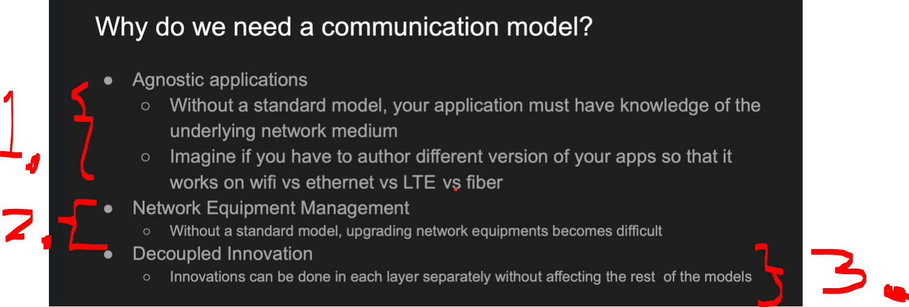
</div>

1. We need **OSI**, because that we can have the **agnostic** way of making applications!
    - Think of if we need the **different application** for every different of the medium for:
        - **Wi-Fi**!
        - **Ethernet**!
        - **Fiber**!
    - When we build `node.js` **app**, it can run in every **CPU**, or we can use many different way to send with the mediums!
        - There is **standard**!

2. Without standard communication model, **hardware manufacturers** (like **Cisco**, **Juniper**, or **Netgear**) would have to build their devices from **top** to **bottom** using their own proprietary rules.
    - We need to agree for example how **router** behave!
3. In this **OSI** model the **innovation** is decoupled!
    - If a better **transmission medium** than **fiber optics** were developed, it could replace fiber at the Physical Layer without requiring changes to higher-layer protocols, as long as it provides the same service to the layer above.

> [!NOTE]
> 📖 As **backend engineer** the **layer 4** and the **layer 7** is the only layers, which we are mostly working with! 📖

<div align="center">
    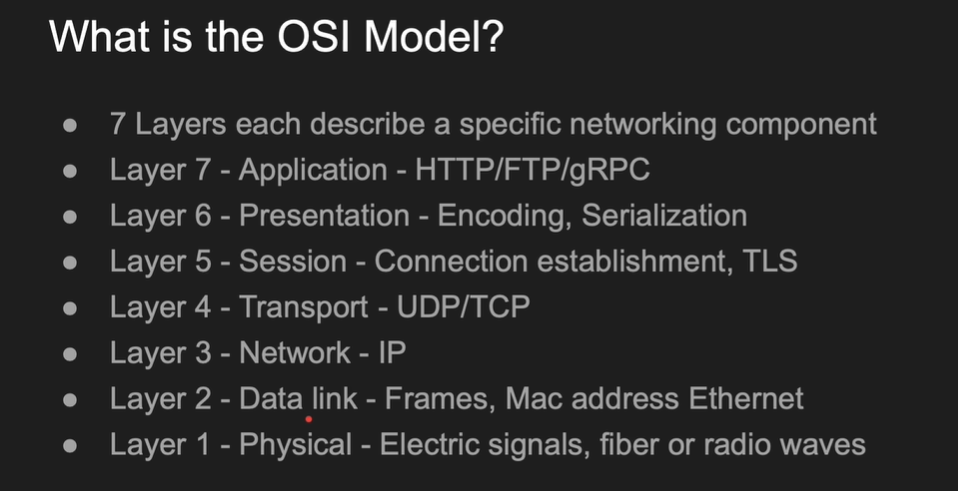
</div>

0. There is **Seven 07** different network layers!
1. **1 - 7** layers:
    - **Layer 7**: Application *(HTTP/FTP/gRPC)*.
        - **Backend engineer**, you write code that exposes "endpoints" using **Layer 7** protocols so clients (web apps, mobile apps, or other microservices) can interact with your server.
        - Example, when we write the code we are working in **Layer 7**:
        ```Js
        // This entire block of code is operating at Layer 7
        app.get('/api/users', (req, res) => {
            // 1. Layer 7 provides the HTTP Method (GET) and Path (/api/users)
            // 2. Layer 7 gives you access to Headers (e.g., Authorization tokens)
            const users = database.getUsers();
            // 3. You send back a Layer 7 response (Status 200 and a JSON payload)
            res.status(200).json(users); 
        });        
        ```
    - **Layer 6**: Presentation *(Encoding, Serialization)*.
        - When one sends **JSON** then **serialization** and **deserializes** it happens in this layer!
            - When **Application** level send the whole **object**, this layer will be responsible for the **serialization** and **deserializes** process! Let's look example `JSON.parse()`:
                - The **Task Being Done**: You are turning a flat string into a structured object. That specific job belongs to **Layer 6**.
                - The **Software Executing It**: The place where this job is happening is inside your **Layer 7**.

    - **Layer 5**: Session (Connection establishment, TLS).
        - The handshakes are happing in this layer.
            - **Starts a session** between two communicating applications.
                - Example: Establishing a **login** session between a **client** and a **server**.
                    - **HideMyAss** is the Anonymous Proxy (also known as a **Level 1 proxy**)! 
    - **Layer 4**: Transport (UDP/TCP).
        - Layer 4 is responsible for end-to-end communication between devices (process-to-process delivery).
            - HTTP is build of on the **layer 4**.
            - This layer knows the **port number**!
    - **Layer 3**: Network (IP).
        - This layer is not known the **ports**, it only knows the **address**, example **IP addresses**!
            - This brings the concept of routing!
    - **Layer 2**: Data Link (Frames, Mac address, Ethernet).
        - This layer is known for the **node-to-node delivery**, this is dealing with the mac addresses, example `00:1A:2B:3C:4D:5E`!
    - **Layer 1**: Physical (Electric signals, fiber or radio waves).
        - Is responsible for transmitting **raw bits** over a **physical medium**, example of the fiber optic **transforming into** the **light**!

- Let's send **POST request** in the **HTTPS** from perspective of the **sender**, and we will see how it goes thought **OSI model**!

<div align="center">
    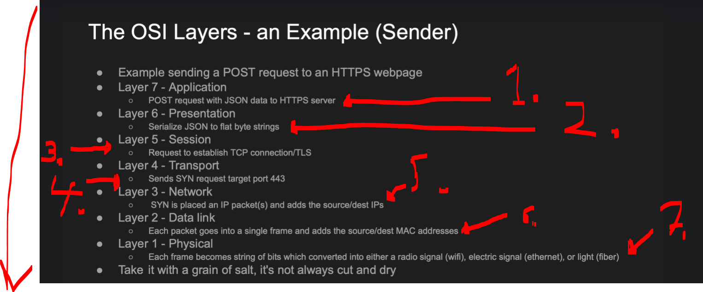
</div>

1. The **Layer 7**, **Application Layer** the primary job is to act as the window for applications to access network services!
   - When one sends **BLOB** of **JSON**, with **Axios** or something similar!
        - This task will send it!
2. The **Layer 6**, **Presentation Layer** the primary job
    - Takes the **JSON object** and **serializes** it to **flat byte strings** so it can be transmitted!
        - We need to **convert** into **bytes**!
3. The **Layer 5**, **Session Layer** the primary job
    - We need to establish **TCP** connection and **TLS** handshake! In our case we need to store state! 
4. The **Layer 4**, **Transport Layer** the primary job
    - We will be doing **SYN** 3-Way Handshake! Transport layer is using **ports**, for this reason we can use the `334`!
        - Here, we don't send data yet! 
5. The **Layer 3**, **Network Layer** the primary job
    - When we are sending the **SYN** 3-Way Handshake!
        - It will come to this layer, this will be adding the **IP-address** for **SYN** 3-Way Handshake!
            - For this layer we need **DNS** for IP!
6. The **Layer 2**, **Data Link Layer** the primary job
    - When we in this layer. We will be adding the **frames** and the **MAC** address!
        - For this layer we need **ARP** for MAC!
7. **Layer 1**, **Physical Layer** the primary job
    - This will make transformation to the light example!

> [!TIP]
> 💡 We can now receive and send these data/signals regardless of the medium! 💡
>   - Sending was done with the **fiber optics**!
>   - Receiving was done thought **Wi-Fi**!  

<div align="center">
    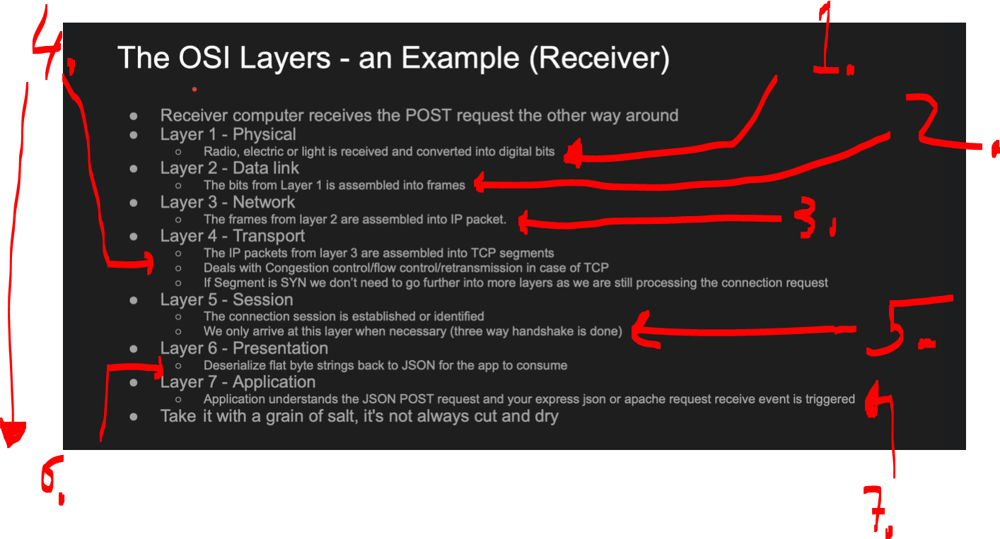
</div>

1. **Layer 1 - Physical**: Radio, electric or light is received and converted into digital bits.
    - This, translates those physical waves back into **raw binary**.
2. **Layer 2 - Data link**: The bits from Layer 1 is assembled into frames!
    - It also checks the hardware (**MAC**) **addresses** to ensure the data was actually meant for this specific device.
3. **Layer 3 - Network**: The frames from layer 2 are assembled into IP packet.
    - Every router will ask is the packet for me?
4. **Layer 4 - Transport**: The **IP** packets from layer 3 are assembled into TCP segments.
    - Deals with Congestion control/flow control/retransmission in case of TCP.
        - If Segment is **SYN** we don't need to go further into more layers as we are still processing the connection request.
            - > *When a server receives a pure **SYN** packet (the very first step of the **TCP three-way handshake**), it does not travel up to the Session, Presentation, or Application layers (Layers 5, 6, and 7)*!
5. **Layer 5 - Session**: The connection session is established or identified
    - Manages the **active connection session**. It keeps track of the ongoing dialogue between the client and the server!
    - We only arrive at this layer when necessary (**TCP three-way handshake** is done)!
6. **Layer 6 - Presentation**: Deserialize **flat byte strings** back to **JSON** for the app to consume!
7. **Layer 7 - Application**: Application understands the **JSON POST request** and your express `json` or `apache request` receive event is triggered.

<div align="center">
    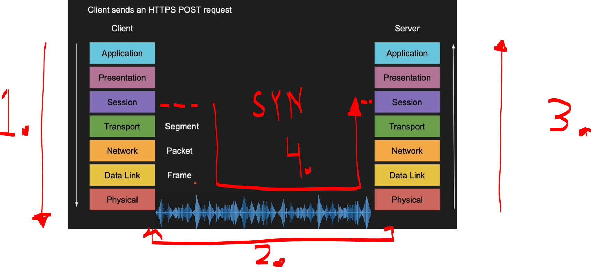
</div>

1. Up to down!
2. We chose the **waves** to transport as **physical** form. The **Physical layer** is responsible to transferring this!
3. Down to up!
4. There is **SYN** 3-Way Handshake, that will go from **Session** of the **client** to **Session** of the **server**!
    - Once the **Client** get the `ACK` message from the server, it will allow the transition to the next level, `Transport`!

<div align="center">
    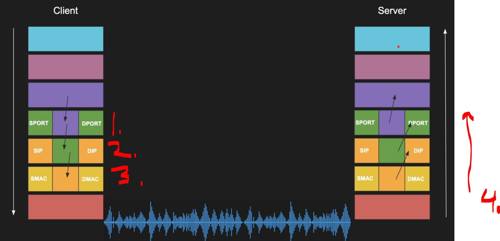
</div>

1. `sport` and `dport`. **Destination port** and the **Start port**.
2. `sip` and `dip`. **Source Internet Package** and the **Destination Internet Package**. This is then packed into the **IP package**.
3. This is **IP package** will be packed into the **Frame**.
4. This will be same flow, but other way around!

<div align="center">
    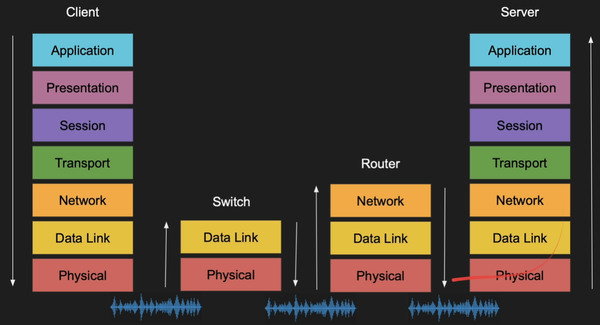
</div>

1. `Switch` and `Router` are also peeking into the packages, but in different levels!
    - This processing between the **server** and the **client** takes time! Processing takes also some time!
        - **Switch** it needs to open the **MAC address** to make the routing decision!
            - This is **level two** device! It needs to go to `Physical` and `Data Link` level!
        - **Router** it needs to open the **MAC address** to make the routing decision!
            - The **Router** needs to go to `Netork` level, to look at the IP-adress!
            - This is **level three** device! It needs to go to `Physical` and `Data Link` and `Netowrk` level!
2. The package goes from left to right!

> [!NOTE]  
> 📖 **Transparent** in general, is a device or service performs a function without requiring the communicating endpoints to be aware of it. 📖

- Let's explore the **Firewall** and the **Load Balancer**! These are transparent proxy and firewall!

<div align="center">
    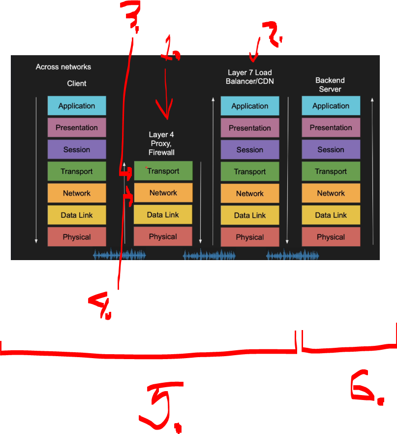
</div>

1. Here is the **Firewall**!
    - Role of the firewall → Blocks certain packets from coming to your networks. IT needs to go check the **ports** and **ip-adress**!
        - Some **firewall's** goes into **application** level!
2. Here is the **Load Balancer**!
    - **Layer 7 load balancer** are way slower than **firewall**!
        - Load balancer needs to get into **Application** level and **decrypt** and **cache it**.
3. **Transport** layer can be used for the forwarding based on port!
4. **VPN Tunnel** is **Layer 3** (sometimes **Layer 2**) IP packets!
    - Once the **ip-packet** comes to the **VPN server**, it is encapsulated at the VPN server!
5. One **session** here!  
    - From client perspective this is **end** destination!
6. One **session** here!

<div align="center">
    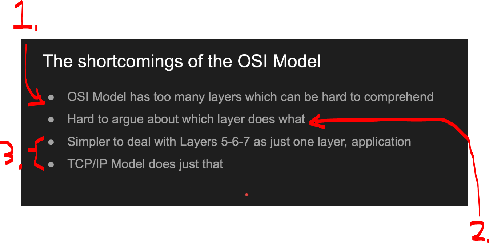
</div>

1. **Too complex**, too many layers! One needs practical understanding to have understanding!  Which layer should decrypt??? People still arguing about this!
2. OSI model is just model to talk about!
3. This is simpler to deal with, **layers 5-6-7** in one layer. **TCP/IP** model tries to do just this! 

<div align="center">
    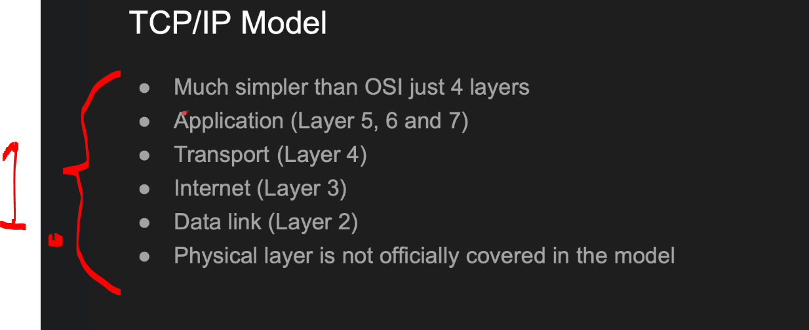
</div>

1. This is the hierarchy for OSI layers!
    - In this layer, avoid numbering! This is the **layer 5**!

- Order came:
    - So **TCP/IP** existed because the internet needed something that worked in practice. This is in **1970s** for ARPANET!
    - So **OSI** was created later (to explain networking clearly)! This was done in **1980s**!

<div align="center">
    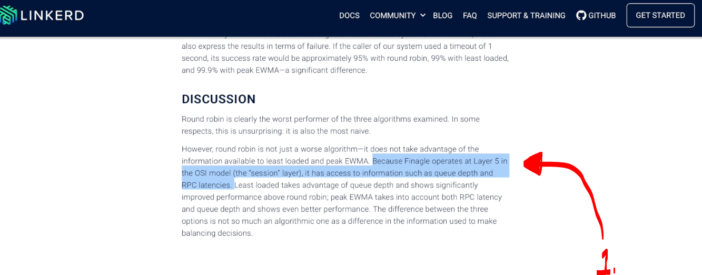
</div>

1. Example of the **Layer 5**, discussion!

<div align="center">
    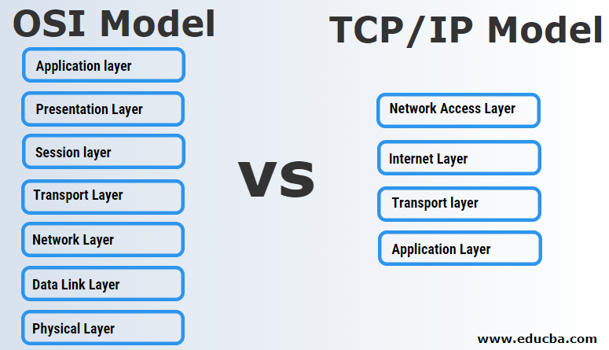
</div>

# Internet Protocol.

<div align="center">
    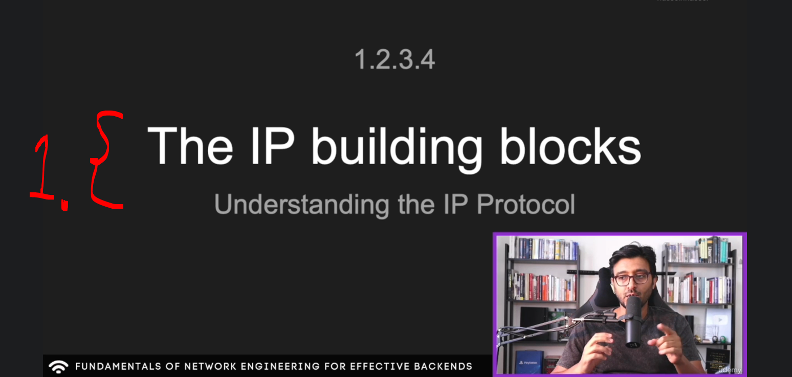
</div>

1. What operations the **IP** will be using!

<div align="center">
    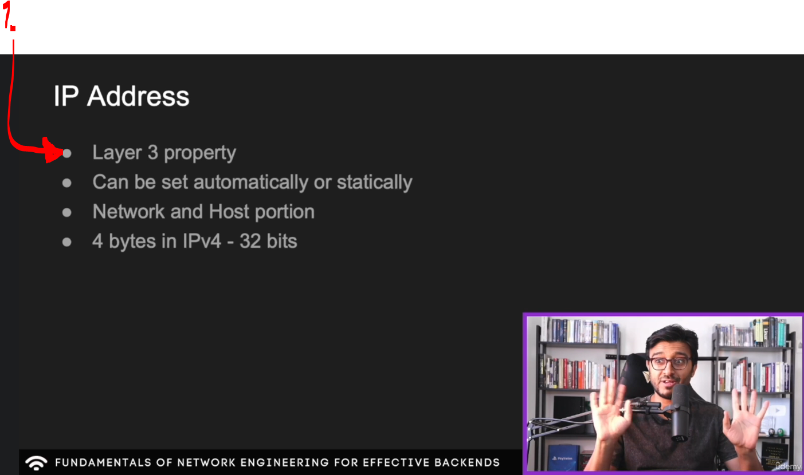
</div>

1. **IP address** is **layer 3** property!

<div align="center">
    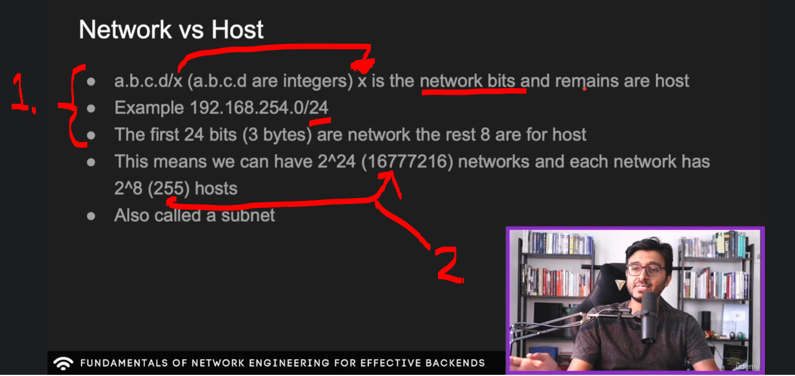
</div>

1. **/24** means:
    - 24 bits = network part!
    - 8 bits = host part!
2. This is **responsibility** of the **network engineer**! **Backend engineer** are thinking how **packets flows**!

<div align="center">
    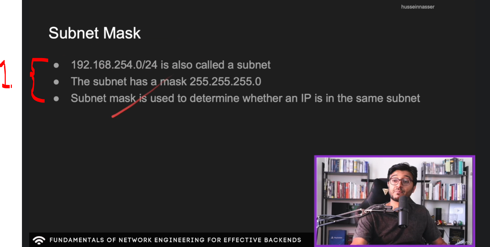
</div>

1. **Subnet mask** can be used to figure out if the **receiver** is in the **same network**!
    - If it is, then we can use **MAC address** to send it to receiver!
    - If it is not, we need to send IP-packet to other network!

<div align="center">
    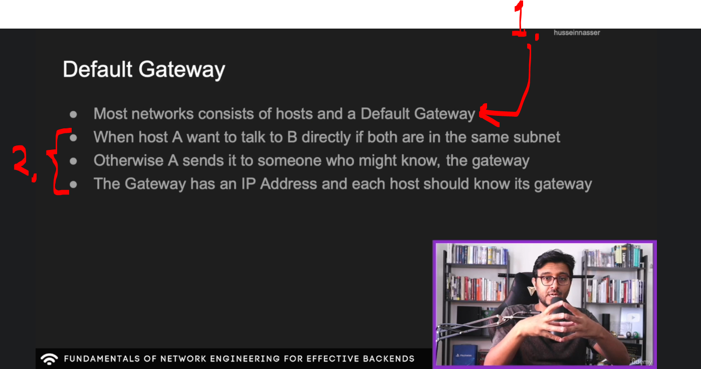
</div>

1. Most of the networks have **default gateway**! 
2. Gateway can be used for to talk with other networks!

<div align="center">
    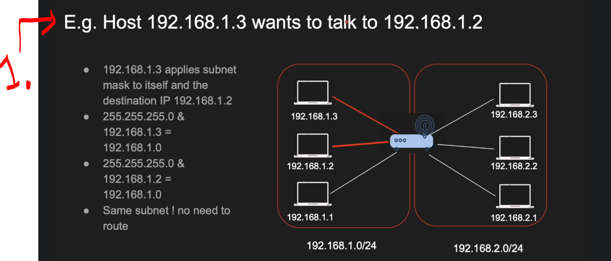
</div>

1.  Two host want to talk each other: `Host 192.168.1.3 wants to talk to 192.168.1.2`!
2. `255.255.255.0` as a stencil. The 255s lock the first three numbers in place, and the 0 ignores the last number.
    - **No need route**, they are in **same subnet**!

<div align="center">
    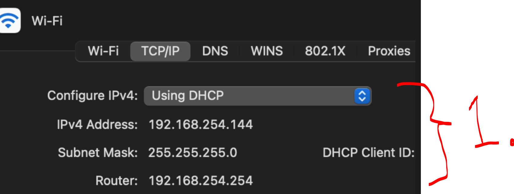
</div>

1. You need this information to figure out the addresses!

<div align="center">
    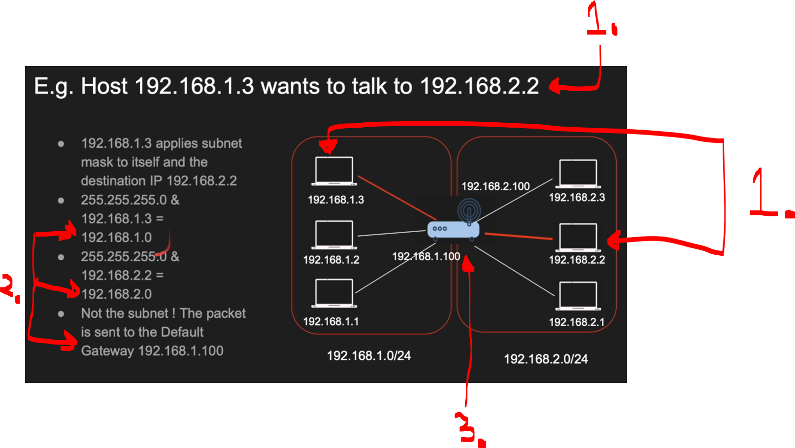
</div>

1.  Two host want to talk each other: `Host 192.168.1.3 wants to talk to 192.168.2.2`!
2. And operation for both:
    - `255.255.255.0 & 192.168.1.3` = `192.168.1.0`!
    - `255.255.255.0 & 192.168.2.2` = `192.168.2.0`!
        - Since they are not the **same the subnet**! The packet is sent to the **Default Gateway** `192.168.1.100`!
3. **Router** knows about **both networks** because it has one foot in each neighborhood.

<div align="center">
    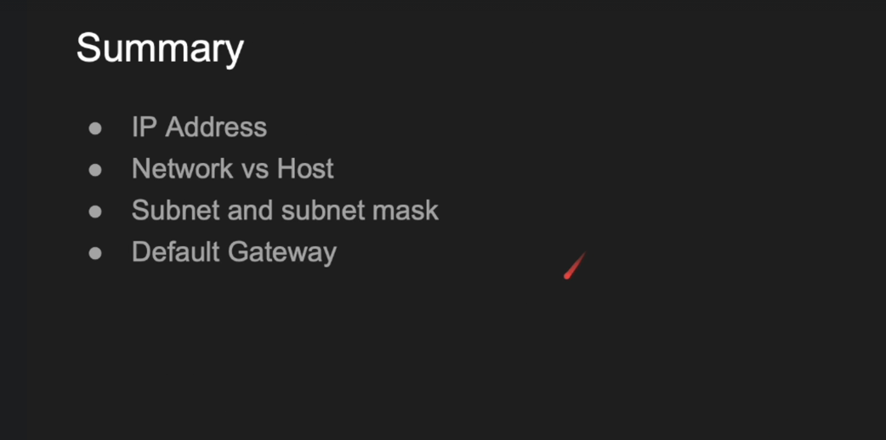
</div>

<div align="center">
    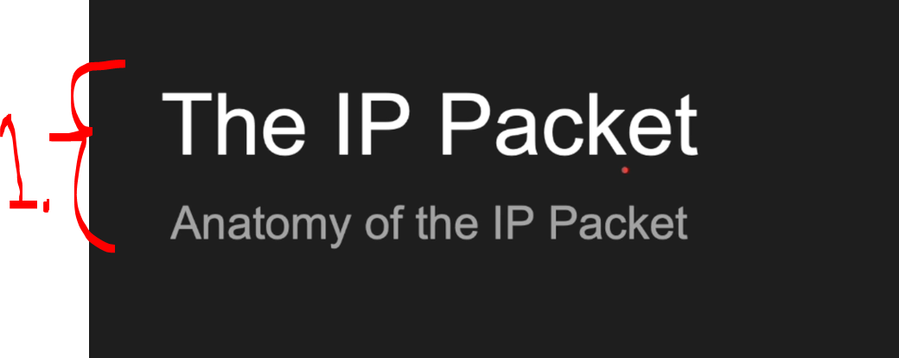
</div>

1. Anatomy of an **IP Packet**!

<div align="center">
    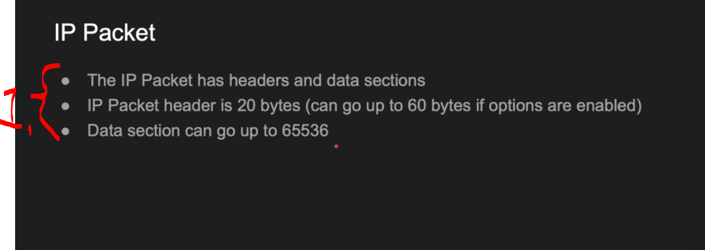
</div>

1. IP Packets can have more **header** information just for **making business**!

<div align="center">
    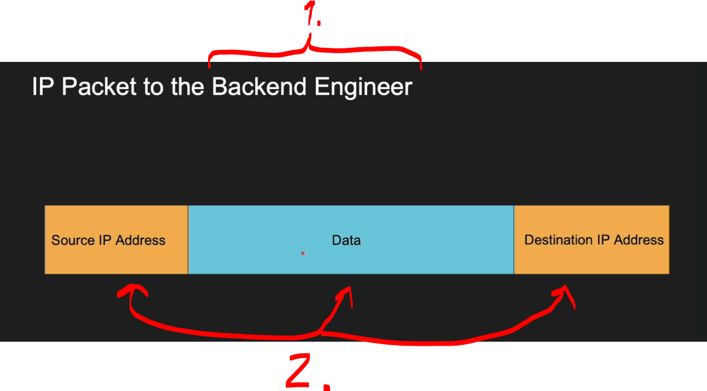
</div>

1. IP Packet from the perspective of the **backend engineer**!
2. There is **Source IP Address**, **Data** and **Destination IP Address**!

- Let's look the action IP packet in more detail!

<div align="center">
    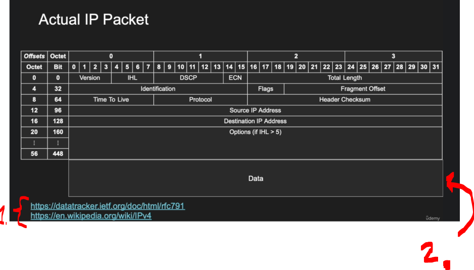
</div>

1. Links:
    - https://datatracker.ietf.org/doc/html/rfc7191
    - https://en.wikipedia.org/wiki/IPv4
2. Goes up to **64 kilobytes**!

<div align="center">
    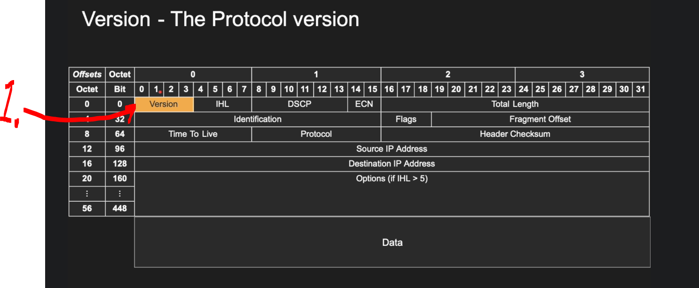
</div>

1. **Versions** - *The Version field identifies which version of the Internet Protocol is being used.*
    -  **4** bits for versions! A bit too much, no? Example below:
        ````Json
        0100 0101
        ^^^^
        Version = 4
        ````

<div align="center">
    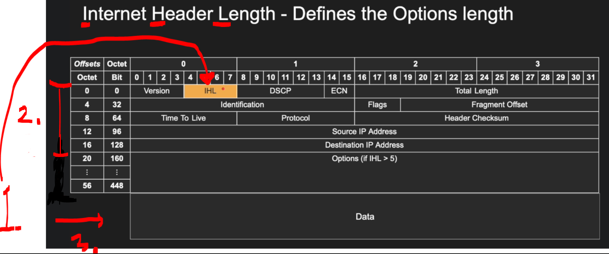
</div>

1. **Internet Header Length** - *The **IHL** field tells the receiver where the **IP header ends** and where the **data begins***.
2. This size will be known form the field!
3. We can also, deduce where the **Data** begins!

<div align="center">
    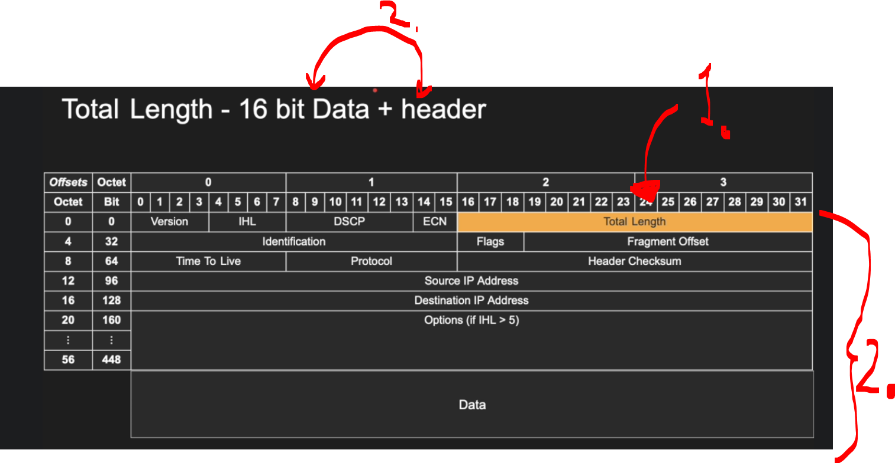
</div>

1. **Total Length** - *Measures header + payload together*. The total size described in `2.`.

- add here the fragement example

<div align="center">
    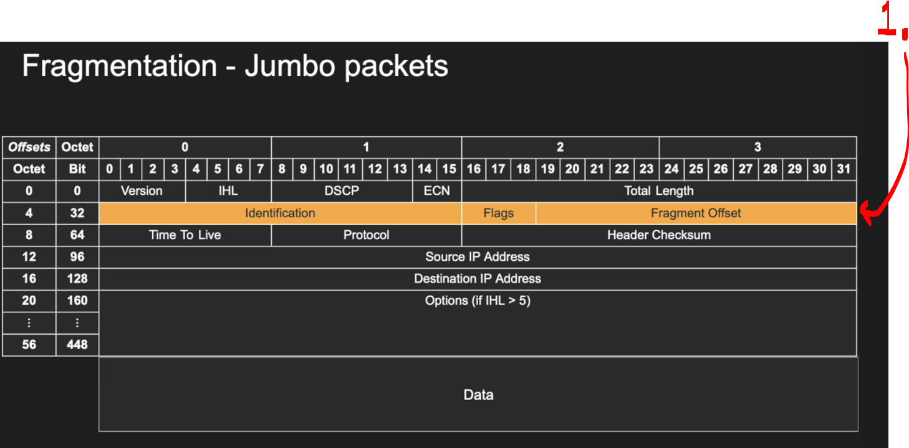
</div>

1. **Fragmentation** - *Is the **process of breaking** a large IP packet into smaller pieces (fragments) so it can pass through a network whose **MTU** (**M**aximum **T**ransmission **U**nit) is smaller than the packet size.*

- Why we need **TTL**?
    - Packet can go thought different routes, hence there is possibility go to **infinite loop**!

<div align="center">
    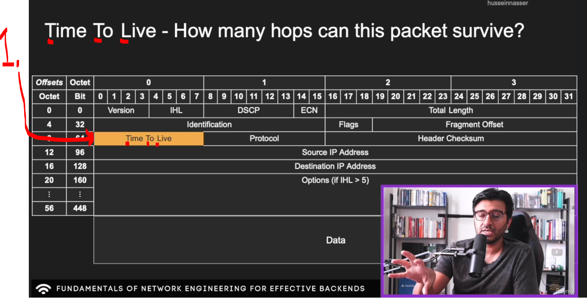
</div>

1. **TTL** - (**T**ime **T**o **L**ive) field limits how long an IP packet can stay in the network. It prevents packets from **looping forever** due to routing errors.
    - **Each router** that forwards the packet **decreases** **TTL** by **1**.
        - When **TTL** becomes **0**, the router drops the packet and usually sends an **ICMP** *"Time Exceeded"* message back to the sender.

> [!NOTE]  
> 📖 `tracert` will work as following: Sends packets with gradually **increasing TTL values** 📖:
>- **TTL** = 1 → first router replies!
>- **TTL** = 2 → second router replies!
>- **TTL** = 3 → third router replies!
>   - Continues until the destination is reached
>   - Each router where the **TTL** expires sends back an **ICMP** Time Exceeded message, allowing `tracert` to identify that hop.

<div align="center">
    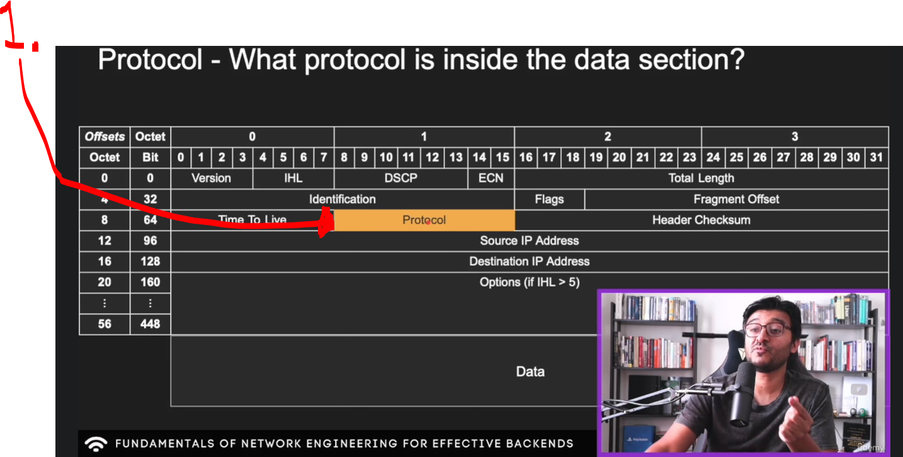
</div>

1. **Protocol** - *Identifies the next-layer protocol (TCP, UDP, ICMP, etc.)*
    - We could figure out the protocol from this one, rather than wasting time with the data parsing!

<div align="center">
    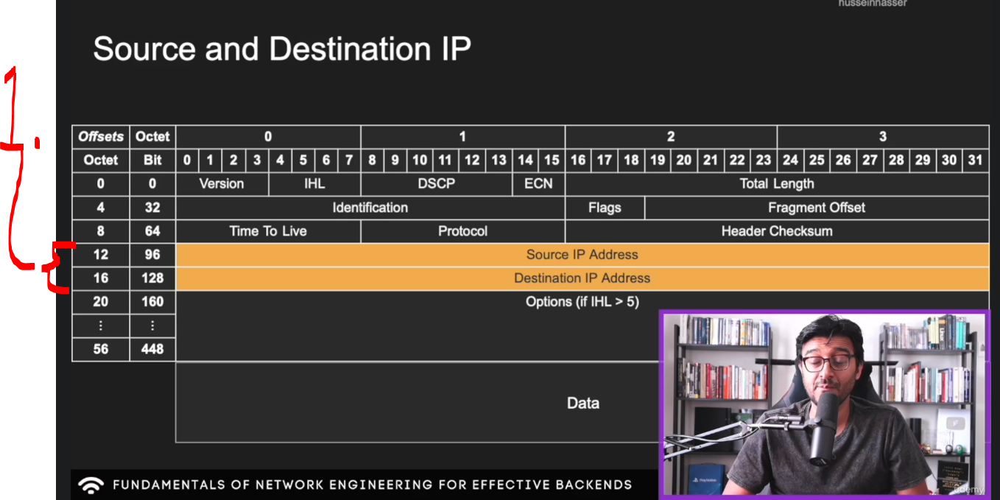
</div>

1. **Source and Destination IP** - *The Source Address and Destination Address fields identify the sender and receiver of an IP packet.*
    - One could hypnotically spoof the IP-address, but usually ISP will block this!

<div align="center">
    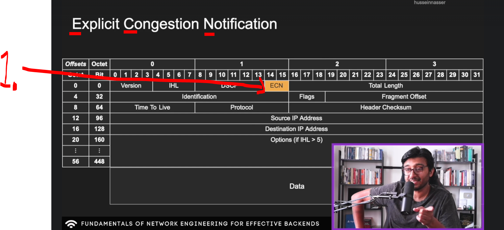
</div>

1. **ECN** - is a mechanism used in IP networks to indicate network congestion without immediately dropping packets.
    - This is set by the **router**.
        - If the **router buffer** is full, we need to drop packets!
            - Normally, when routers become **congested**, they **drop packets**, if this happened the client can assume that it's been dropped if!
        - There is prevention mechanism, when router **starts experiencing congestion** (queue buildup or overflow risk)!
            - A congested router changes the ECN bits to CE (11).
            - Receiver detects the CE mark.
            - Receiver notifies the sender (e.g., using TCP ECN).
             Sender slows down transmission.

> [!NOTE]  
> 📖 **ESN** is such beautiful engineering being! Elegant and small construction of a design! Nowadays, there huge amount of memory, no need such limits! 📖

<div align="center">
    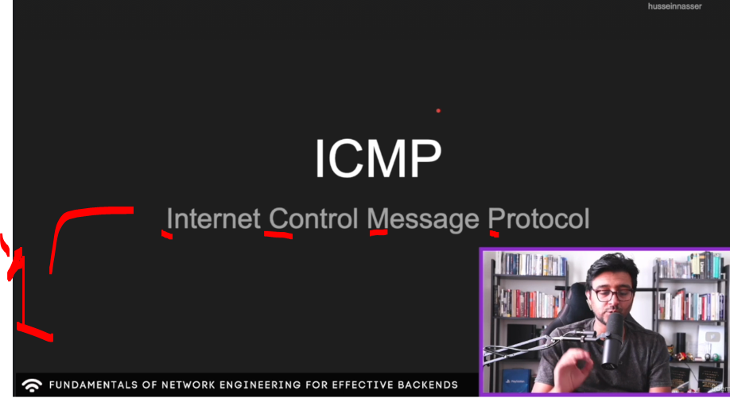
</div>

1. **ICMP** - **I**nternet **C**ontrol **M**essage **P**rotocol!

<div align="center">
    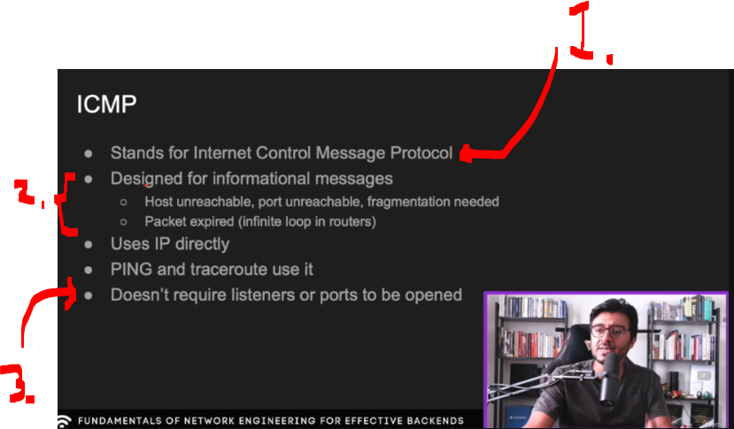
</div>

1. Stands for **I**nternet **C**ontrol **M**essage **P**rotocol! It means communication between **hosts**, there are **no concepts** of the **ports**, since it in the **layer 3**!
    <div align="center">
        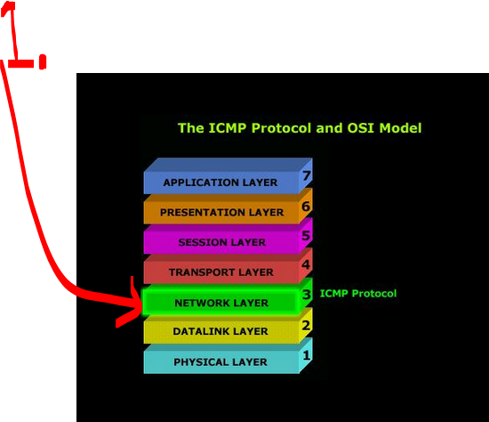
    </div>

    - `1.` <b>ICMP</b> protocol lives in the <b>network layer</b>, <b>layer 3</b>!  
2. This was designed for the **error messages** and **operational information**!
    - If the destination **port is unreachable**, the host sends an ICMP *“Port Unreachable” message.
3. There is no need for ports. The **ICMP** is only required to be enabled!

- The ICMP header:

<div align="center">
    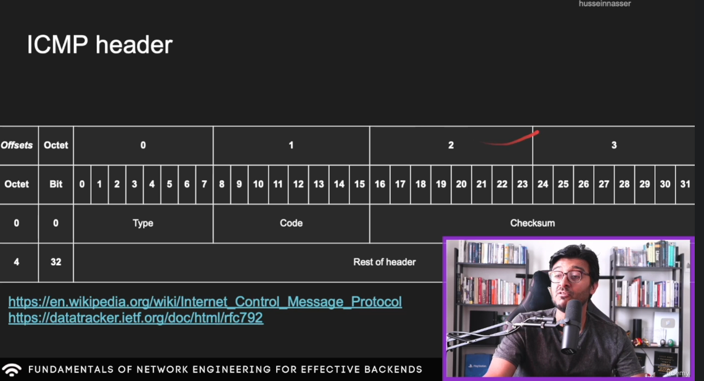 
</div>

<br>

<div align="center">
    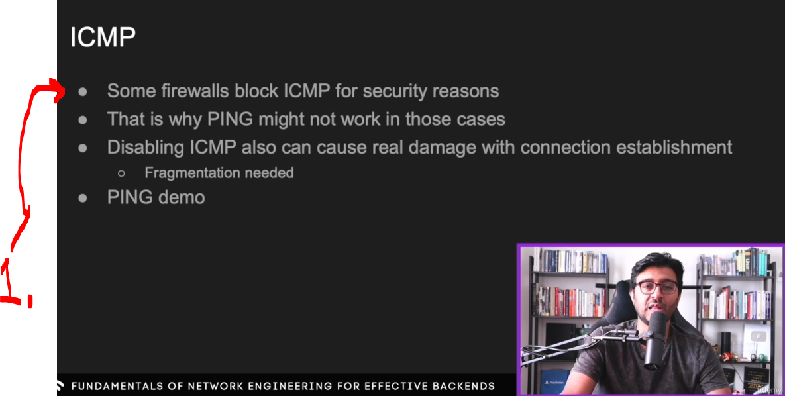 
</div>

1. Some firewalls will block/timeouts the **ICMP**
    - For this reason the **PING** case not to work!

- We will have **PING** demo. The **PING** will use following **ICMP** messages! **Ping** sends *ICMP Echo Requests* and waits for *ICMP Echo Replies*.
    | ICMP Type | Name         | Purpose                                 |
    | --------- | ------------ | --------------------------------------- |
    | **8**     | Echo Request | Sent by the sender ("Are you there?")   |
    | **0**     | Echo Reply   | Sent by the receiver ("Yes, I'm here.") |


<div align="center">
     
</div>

1. We can see the `icmp=seq`, if there is some missing! Example below:
    ````Bash
    64 bytes from 8.8.8.8: icmp_seq=1 time=12 ms
    64 bytes from 8.8.8.8: icmp_seq=2 time=11 ms
    64 bytes from 8.8.8.8: icmp_seq=4 time=13 ms
    ````

- continue ping

# UDP.

<div align="center">
    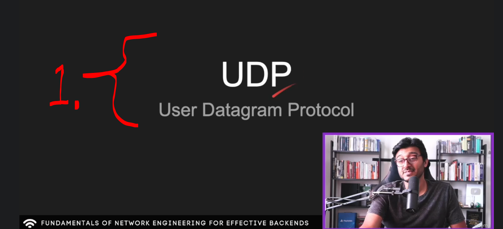 
</div>

1. **U**ser **D**atagram **P**rotocol!

- **TCP** is good for reliability!
- **UDP** is simplicity!
    - This can be handled in the **TCP** level!
    - The **reliability** is handled in the **application level**!

<div align="center">
    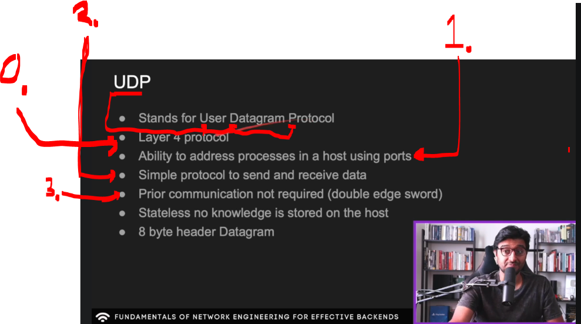
</div>

0. **UDP** is top of **IP** layer!
    <div align="center">
        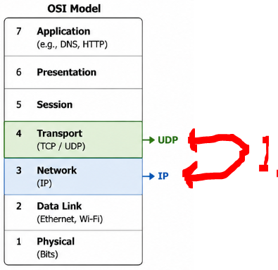
    </div>
    1. One can see that the <b>UDP</b> is to of the <b>IP</b>!
1. **Transport layer** adds the concepts of the ports. One can connect to multiple processes in one host!
2. **UDP** is simple!
3. Since **UDP** is **stateless** this can be troublesome!
    - **UDP** does **not maintain** connection state. Example UDP:
        - **TCP maintains state** for each connection!
            - **TCP** is **stateful**, it saves many things about the session!

<div align="center">
    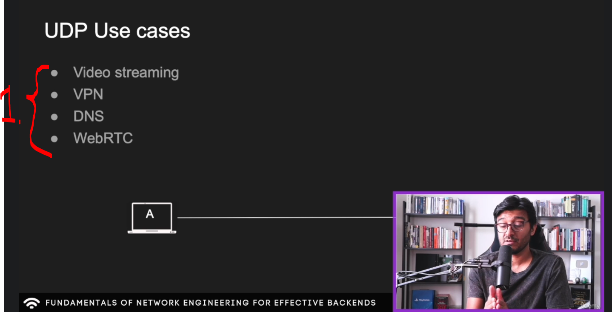
</div>

1. UDP usages:
    - Videos. Frames of the videos can be dropped!
    - VPN. TCP melt down can happen, if TCP is used for VPN!
    - DNS.
        - DNS **resolves hostnames** for the **IP** address!
    - WebRTC.
    - Games usually use UDP, they don't want to the overhead!

<div align="center">
    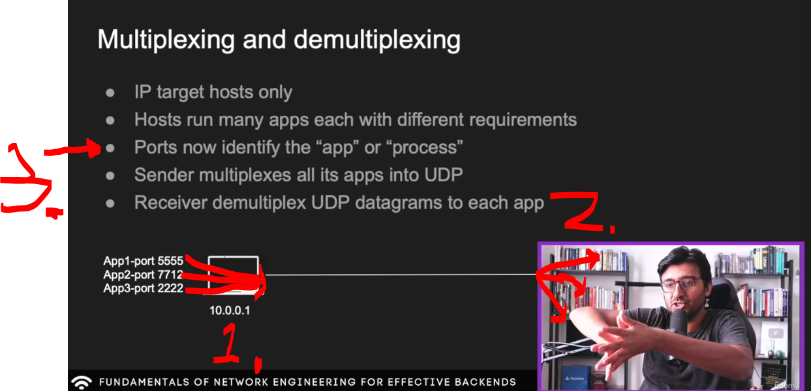
</div>

1. **Multiplexing** is combining data from multiple applications/sockets into a **single** transport/network connection for transmission.
2. **Demultiplexing** is separating received data and delivering it to the correct application based on information such as port numbers.
3. Ports identify the app, to which the data is designed to!

<div align="center">
    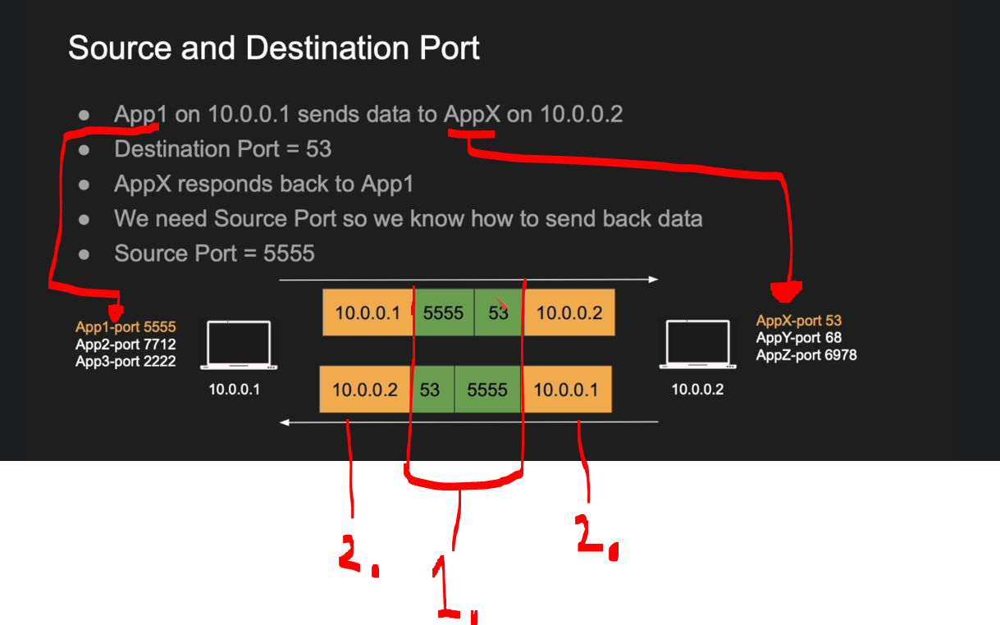
</div>

1. 🟩 Green = **Layer 4** (TCP or UDP / Transport Layer).
2. 🟧 Orange = **Layer 3** (IP / Network Layer).

<div align="center">
    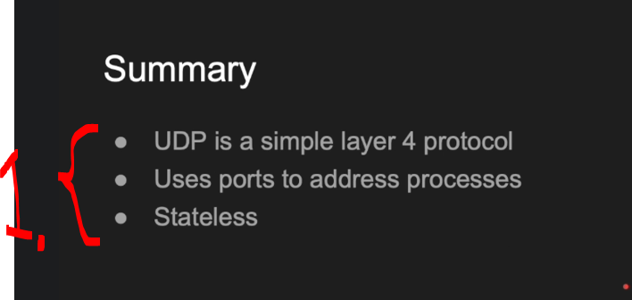
</div>

1. Very simple layer **4 protocol**!

<div align="center">
    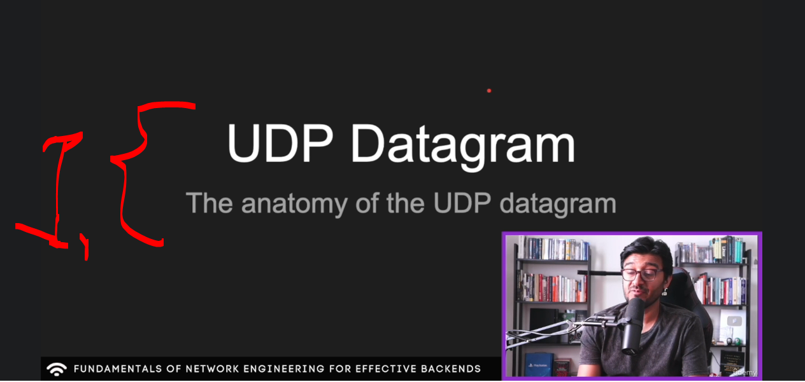
</div>

1. Picture of **UDP Datagram**!

<div align="center">
    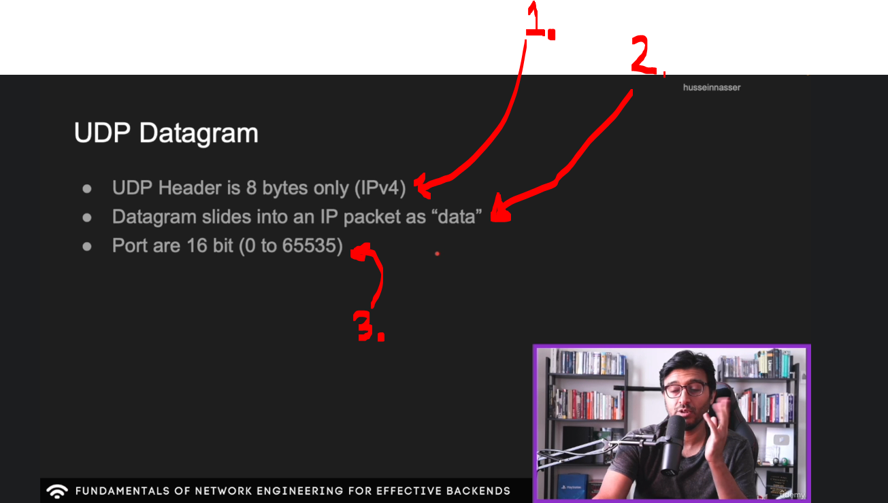
</div>

1. Picture of UDP Datagram!
2. The **datagram** is boxed inside IP headers! In the IP-packet there is `protocol` header that will be changed to **UDP**!
3. This many applications can be addressed!

<div align="center">
    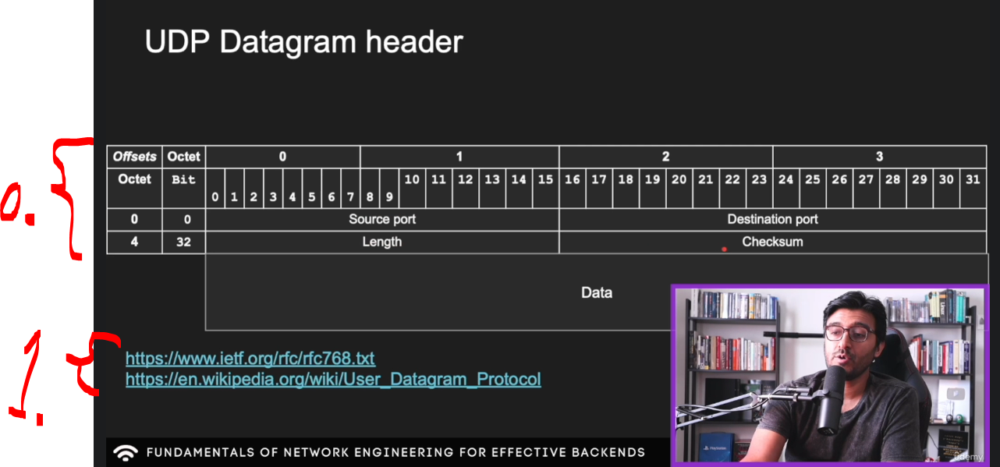
</div>

0. Mostly **8 bytes header**!
1. Links:
    - https://www.ietf.org/rfc/rfc768.txt
    - https://en.wikipedia.org/wiki/User_Datagram_Protocol

- Each **process** has **own** port!

<div align="center">
    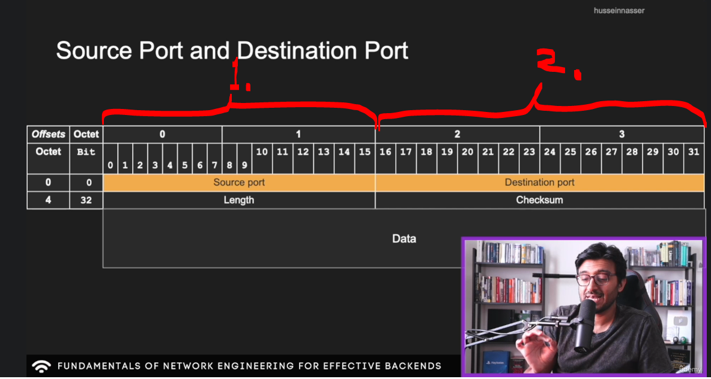
</div>

1. **Source Port**!
2. **Destination Port**!

<div align="center">
    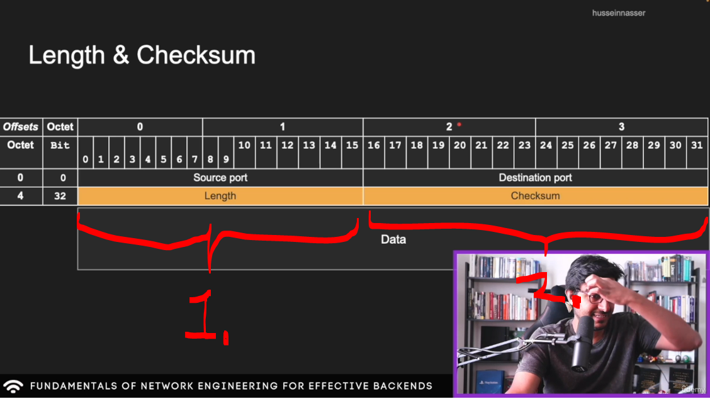
</div>

1. **Length**!
2. **Checksum**!

<div align="center">
    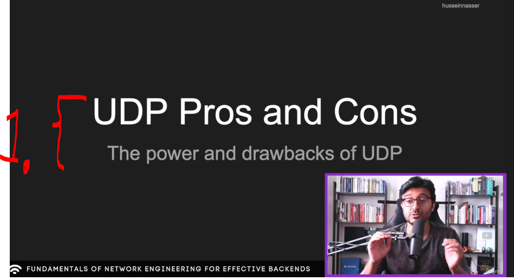
</div>

1. **-** and **+** of the **UPD**!

<div align="center">
    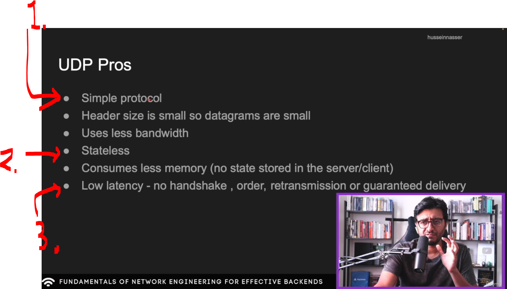
</div>

1. Its **simple protocol**, this is useful in gaming!
    - We can deal with the **small level** of corruption!
2. UDP is stateless, it scales easily!
3. There is no handshake etc..., you just send **datagrams**!

<div align="center">
    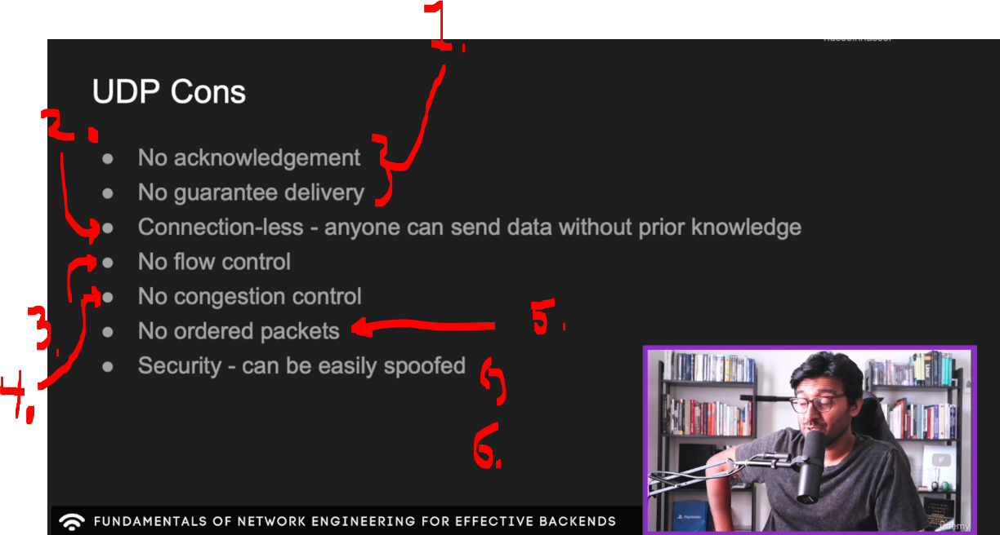
</div>

1. You don't know did your data gram arrive or not?
2. Parties are not required to authenticate!
    - There is UDP attacks! UDP flooding attack!
        - Since UDP does **not** know who is sender. All the **datagrams** gets processed! 
3. No flow control, one does not know what is the **receivers buffer** size! This is the receiver **server property**!
4. Congestion control, a network from being overloaded when too many packets are sent at once.
5. There is no order!
6. Anyone can send UDP **datagrams**!
    - TCP is needed to have handshake first. TCP does not have this!


- We will be using the [UDP client and server](https://github.com/nikhilroxtomar/UDP-Client-Server-implementation-in-C) as experiment:

- Next will look what is **UDP client** is doing:
    - First we will be creating the **UPD socket**:
        > [!TIP]
        > 💡 What is a **file descriptor**? 💡
        > In Unix/Linux, the operating system represents **open resources** (files, sockets, pipes, terminals, etc.) with small integer IDs called file descriptors.
        - We will declare **socket file descriptor**:
            ````C
            int sockfd;
            ````
        -  Structure that stores an **IPv4 address** and **port**.
            ````C
            struct sockaddr_in {
                sa_family_t    sin_family;   // Address family (IPv4).
                in_port_t      sin_port;     // Port number.
                struct in_addr sin_addr;     // IPv4 address.
            };
            ````
        - We allocate the buffer, this will be the **UDP payload** content!
            ````C
            char buffer[1024];
            ````
            <div align="center">
                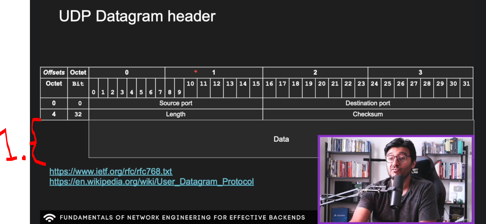
            </div>
            1. This will be the <b>UDP payload: 1024 bytes!</b>

        > [!TIP]
        > 💡 What is **socklen_t**? 💡
        > `socklen_t` is an integer type defined by the socket API. It is used to store the **size** (in bytes) of a socket address structure.
        -  We assign variable that holds size of the <b>UDP header 8 bytes!</b>
            ````C
            socklen_t addr_size;
            addr_size = sizeof(addr);
            ````
            <div align="center">
                    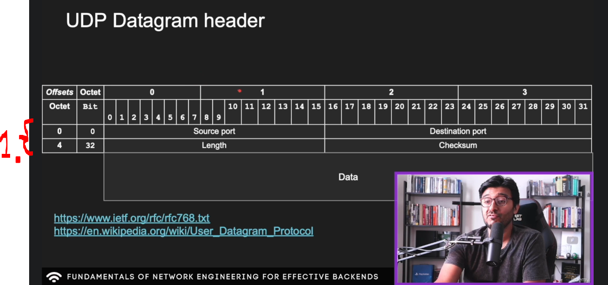
            </div>
            1. This will be the <b>UDP header 8 bytes</b>
            
        - We will be **creating the socket** in the operating system and returns a handle (the file descriptor) to it:
            ````C
            sockfd = socket(AF_INET, SOCK_DGRAM, 0);
            ````
            - `AF_INET` → `IPv4`!
            - `SOCK_DGRAM` → `UDP`!
            - `buffer` is used to receive data from **datagram**! It is not the UDP receive buffer maintained by the operating system.
        -  We will assign the addresses next:
            ````C
            memset(&addr, '\0', sizeof(addr));
            addr.sin_family = AF_INET;
            addr.sin_port = htons(port);
            addr.sin_addr.s_addr = inet_addr(ip);
            ````
        -  Next we will `bind` the socket. Associates the socket `sockfd` with the local address stored in `addr`.
            - We will waits for a **UDP packet** to arrive on `sockfd`, stores the data in `buffer`, and fills `addr` with the sender’s address.
            ````C
            bind(sockfd, (struct sockaddr *)&addr, sizeof(addr));
            addr_size = sizeof(addr);
            recvfrom(sockfd, buffer, 1024, 0, (struct sockaddr*)&addr, &addr_size);
            printf("[+]Data recv: %s\n", buffer);
            ````

<details>
<summary id="C_Client" open="false"> <b>C Client!</b> </summary>

#### client.c

````C
#include <stdio.h>
#include <stdlib.h>
#include <string.h>
#include <sys/socket.h>
#include <sys/types.h>
#include <netinet/in.h>
#include <arpa/inet.h>

int main(int argc, char **argv){

  if (argc != 2) {
    printf("Usage: %s <port>\n", argv[0]);
    exit(0);
  }

  char *ip = "127.0.0.1";
  int port = atoi(argv[1]);

  int sockfd;
  struct sockaddr_in addr;
  char buffer[1024];
  socklen_t addr_size;

  sockfd = socket(AF_INET, SOCK_DGRAM, 0);
  memset(&addr, '\0', sizeof(addr));
  addr.sin_family = AF_INET;
  addr.sin_port = htons(port);
  addr.sin_addr.s_addr = inet_addr(ip);
  
  // For sending a data!
  // bzero(buffer, 1024);
  // strcpy(buffer, "Hello, World!");
  // sendto(sockfd, buffer, 1024, 0, (struct sockaddr*)&addr, sizeof(addr));
  // printf("[+]Data send: %s\n", buffer);
  
  bind(sockfd, (struct sockaddr *)&addr, sizeof(addr));
  addr_size = sizeof(addr);
  recvfrom(sockfd, buffer, 1024, 0, (struct sockaddr*)&addr, &addr_size);
  printf("[+]Data recv: %s\n", buffer);

  return 0;
}
````
</details>

<br>

- Let's compile the client `gcc client.c -o client` and make the UDP client listen the port `5501`, with the `./client 5501`!
    - Then we will send **UPD** datagram using **Net Cat** `nc -u 127.0.0.1 5501`, after this we will write message `"hello UDP!"`.

<div align="center">
    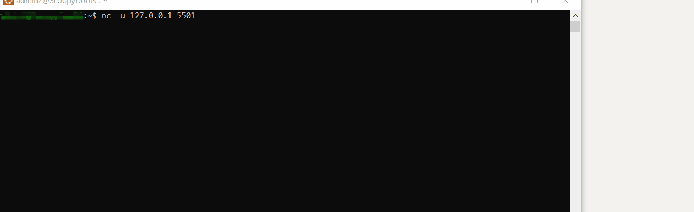
</div>

- We can see that UDP servers is receiving the message `Hello UDP!`.

- todo add here the UDP SERVER!


<details>
<summary id="NodeJS_Client" open="false"> <b>NodeJS Client or Server!</b> </summary>

#### add here node.js

````C
- add here the node.js code
````
</details>


# TCP.

<div align="center">
    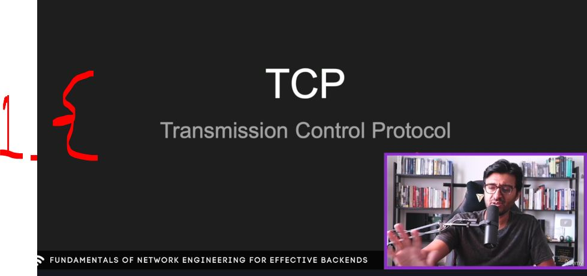
</div>

1. **T**ransport **C**ontrol **P**rotocol!
    - **TCP** = is about **reliable transport** of data between applications!

<div align="center">
    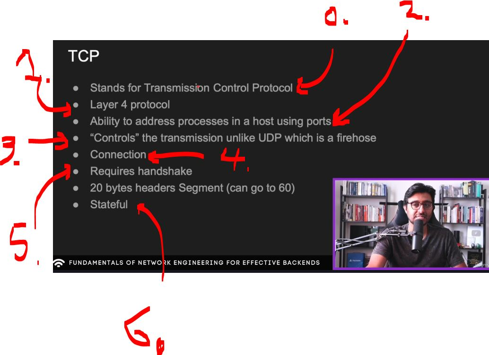
</div>

0. **TCP** stands for **T**ransmission **C**ontrol **P**rotocol!
    - **UDP** Does **not** control transmissions!
1. **Layer 4** proctor! Check from below: 
    ````Xml
    Layer 7: Application (HTTP, DNS)
    Layer 6: Presentation
    Layer 5: Session
    Layer 4: Transport   ← TCP, UDP
    Layer 3: Network     ← IP
    Layer 2: Data Link   ← Ethernet, Wi-Fi
    Layer 1: Physical    ← cables, radio waves
    ````
2. The operating system **manages ports**, and **TCP uses** those ports to deliver data to the correct application.
    - So, same **host** (same **IP address**) can receive package, but for **different ports**!
        - There can be different processes to receive different packages!
    - **TODO** Check this again after UDP!
3. UDP **Control's** the transmission!
    - Unlike the **UDP** packages are being shot out! For this reason the **firewall** sometimes block the **UDP** packages!
4. **TCP** is having connection, meaning both side **client** and the **server** are holding **information** about each other!
5. For having this **connection**, we need the **handshake**!
6. It's **stateful**!

<div align="center">
    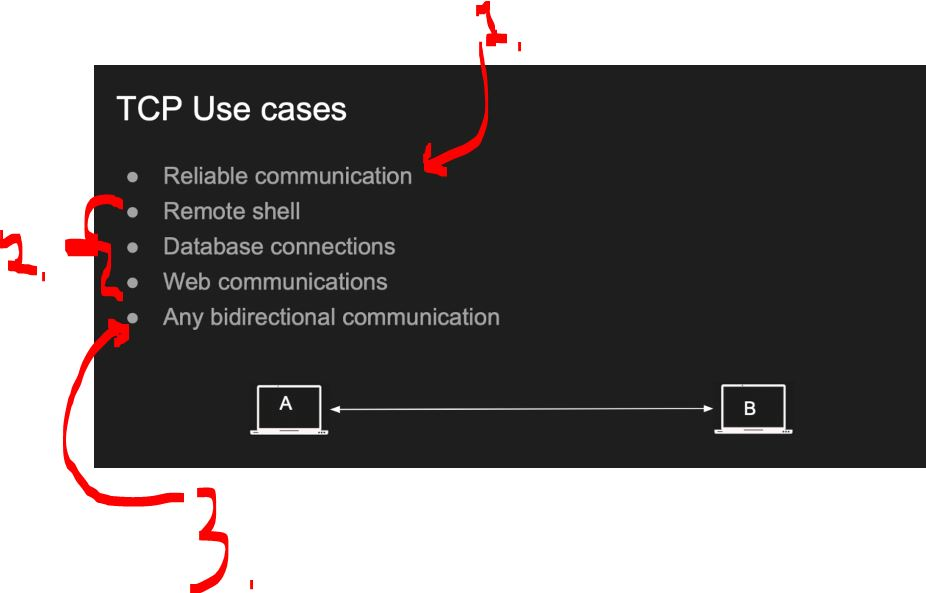
</div>

1. **Reliable communication**.
    - If we want something that needs to be **reliable**!
        - Such as **chat**!
2. These are made using **TCP**:
    - Remove shell: Check these one
    - Database connections:
    - Web Communications:
3. `A` can talk `B` and `B` can talk `A`!

- Todo jatka tästä.

> [!TIP]
> 💡 A **sequence number** in **TCP** is a core part of how the protocol ensures reliable and ordered data delivery. 💡

<div align="center">
    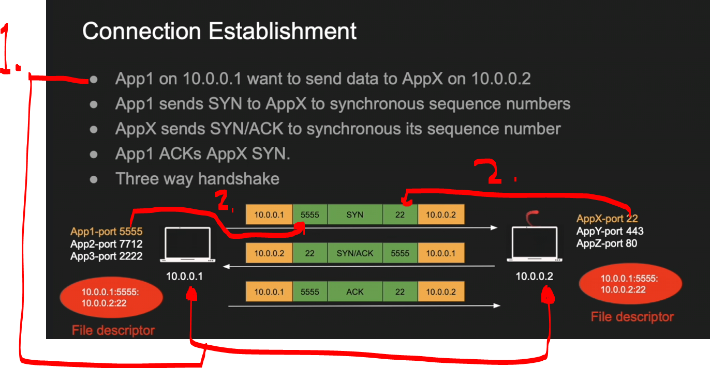
</div>

1. We need synchronize, we will first need `SYN` request where we need each other **sequence numbers** for reliable data transfer.
2. We will send from `5555` port to the `22`!

<div align="center">
    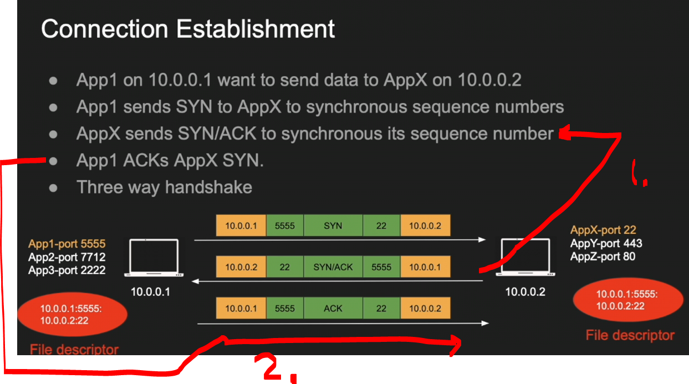
</div>

1. We send the `SYN/ACK` back!
2. We give file descriptor

todo hash

# TLS.

<div align="center">
    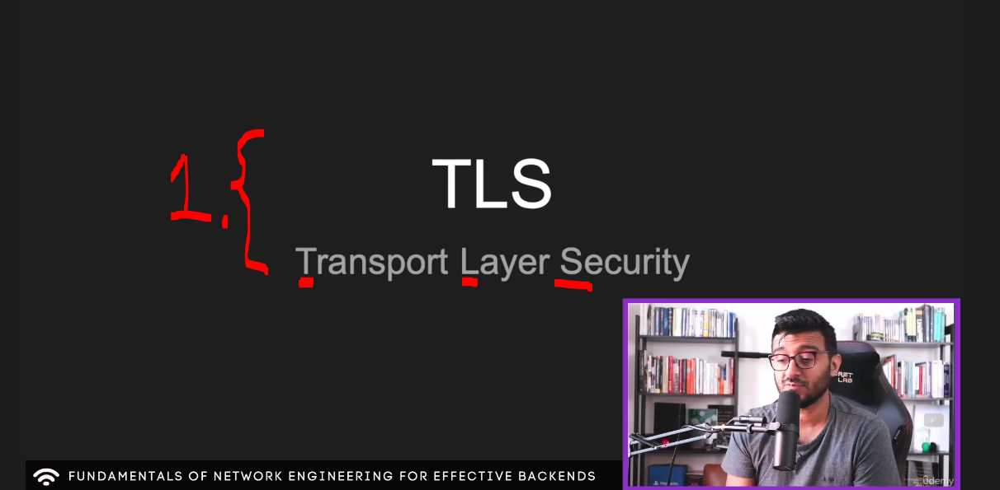
</div>

1.  **TLS** (**T**ransport **L**ayer **S**ecurity), we need standard for encryption!
    - **TLS** is a standardized protocol.

<div align="center">
    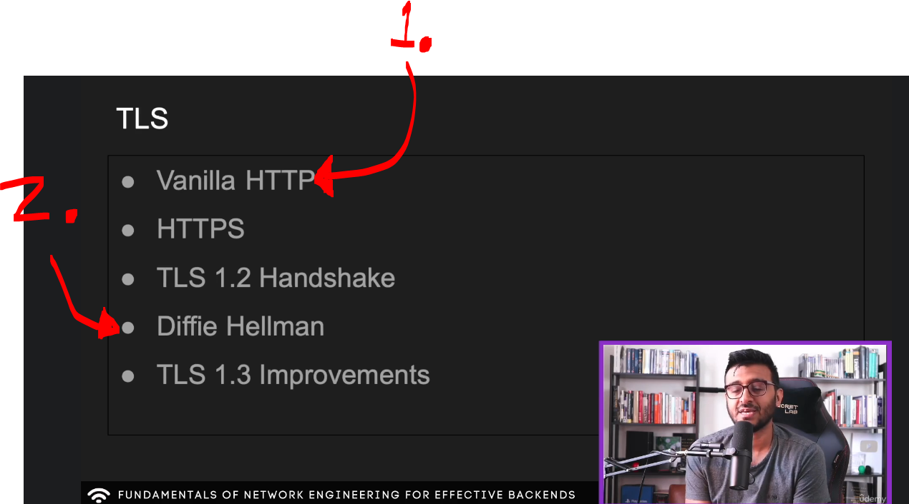
</div>

1. We can use **TLS** for many protocols, not all! This course will discuss **TLS HTTPS**! 
    - In OSI model where the TLS is on?
        - **Layer 6** (Presentation layer) → most common textbook answer.
        - **Layer 5** (Session layer).
2. **Diffie-Hellman** is exchange algorithm!

- TLS handshake, 

# HTTP/1.1.

<div align="center">
    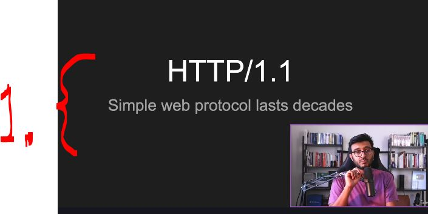
</div>

1. `HTTP/2` is still is having own **limitations**. People still using `HTTP/1.1`.

<div align="center">
    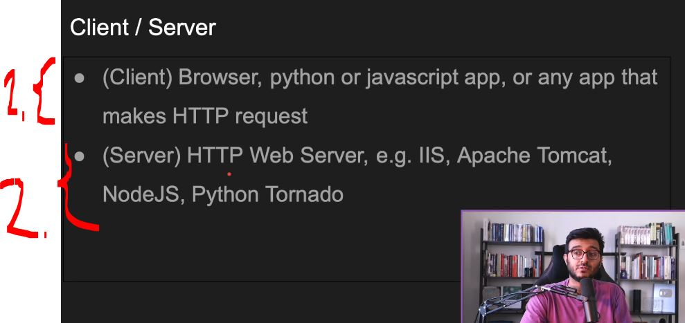
</div>

1. We can make **client** in many ways!
2. There are a lot of **server** implementations!

<div align="center">
    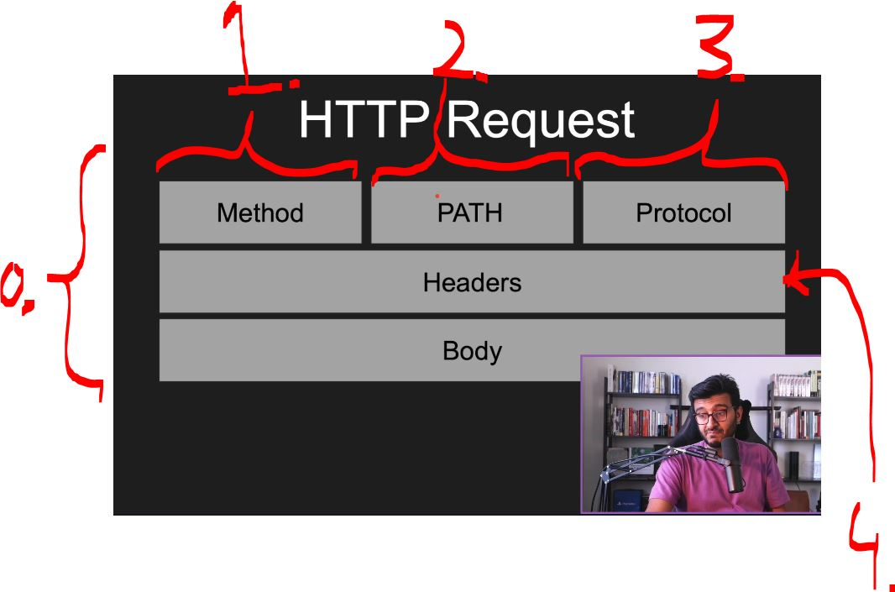
</div>

0. **HTTP request** looks like!
1. **Method** → What action you want to perform.
    - Examples: `GET`, `POST`, `PUT`, `DELETE`.
2. **Path** → The specific resource on the server
    - Example: `/users`,`/index.html`.
3. **Protocol** → The HTTP version being used.
    - Example: `HTTP/1.1`.
4. **Header** → Headers provide extra information about the request.
    - Example: They are **key-value pairs** like:
        ```XML
        HTTP/1.1 200 OK
        Set-Cookie: session=abc123
        Set-Cookie: theme=dark
        Accept: application/json
        Accept: text/plain
        ```
    - In **Java**, this is usually:
        ```Java
        Map<String, List<String>> header;
        ```
    - `List<String>` is used when a header can have **multiple values** for the **same key**.

- Below is the structure of the **HTTP request**:

<div align="center">
    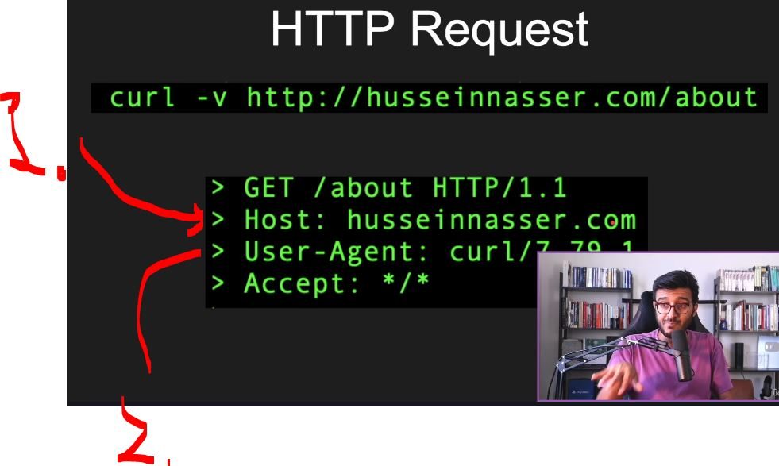
</div>

1. **IP-address** can could be here, but **one** address can host one site. We can host multiple **site** when using **URL**.
2. `User-Agent` is the client!

- Below is the structure of the **HTTP Response**:


<div align="center">
    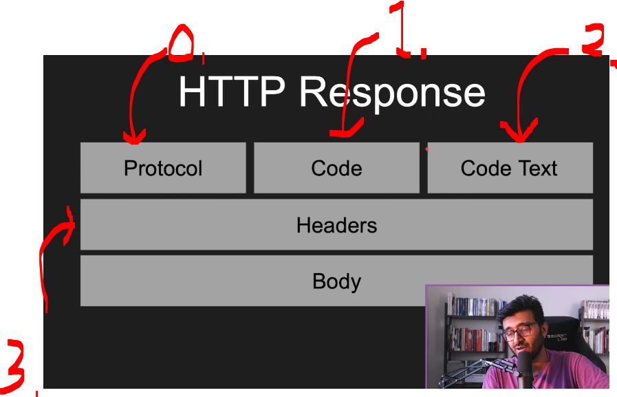
</div>

0. **Protocol** → Usually `HTTP/1.1` or `HTTP/2`.
1. **Code** → A numeric status code (e.g., 200, 404, 500).
2. **Code Text** → A short description (e.g., OK, Not Found, Internal Server Error).
3. Example of the **Header**:
    ````
    Content-Type: application/json
    Content-Length: 123
    Cache-Control: no-cache
    Set-Cookie: sessionId=abc123
    ````

- Below is the structure of the **HTTP Response** in the **HTTP/1.1**:

<div align="center">
    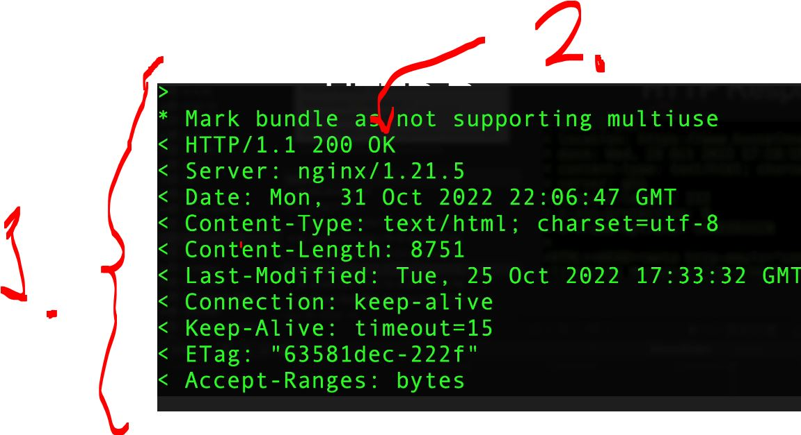
</div>

1. Example **response** of the **HTTP/1.1** response!
2. **Note** one can see the **OK** in the **Reason Phrase**. 
    - This is removed in **HTTP/2.0**!

- Below is the structure of the **HTTP Response** in the **HTTP/2.0**:

<div align="center">
    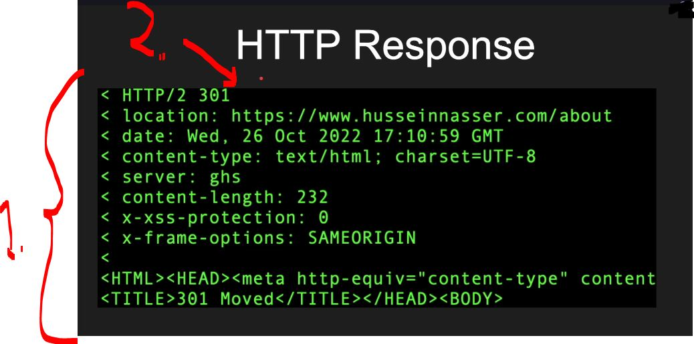
</div>

1. Example **response** of the **HTTP/2** response!
2. **Note** there is no **Reason Phrase**. 

> [!NOTE]  
> 📖 Remember: **HTTP** is build top of **TCP**. 📖

```Xml
+----------------------+
|        HTTP          |   ← Web requests (GET, POST, etc.)
+----------------------+
|        TCP           |   ← Reliable delivery, ordering
+----------------------+
|        IP            |   ← Routing across networks
+----------------------+
|  Wi-Fi / Ethernet    |   ← Physical network
+----------------------+
```

<div align="center">
    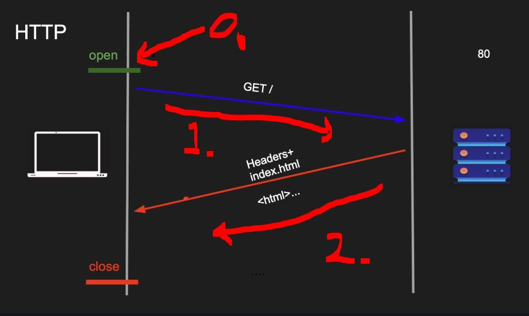
</div>

0. First happens **opening** the `TCP` **3-was handshake**!
    - `Client` → `Server`: `SYN`.
    - `Server` → `Client`: `SYN-ACK`.
    - `Client` → `Server`: `ACK`.
1. `GET` request in sent!
2. The `hmtl` **response** is returned!
3. Then **connection** its **closed**!

- Get back here after finishing the **TSL** and **TCP** chapter!

<div align="center">
    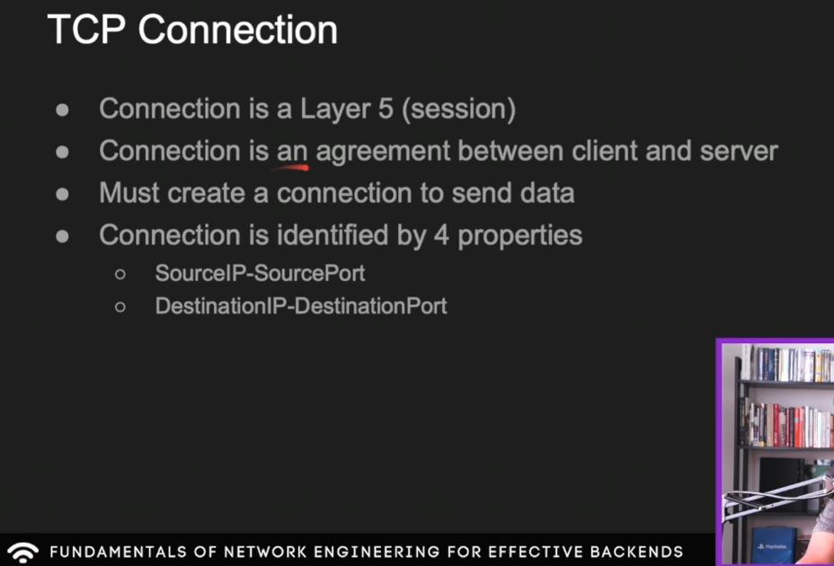
</div>


# HTTPS, TLS, Keys and Certificates.

# WebSockets.

- Other source to read for the [WebSocket](https://developer.mozilla.org/en-US/docs/Web/API/WebSockets_API/Writing_WebSocket_servers)!

# HTTP/2.

# HTTP/3.

# gRPC.

# WebRTC.