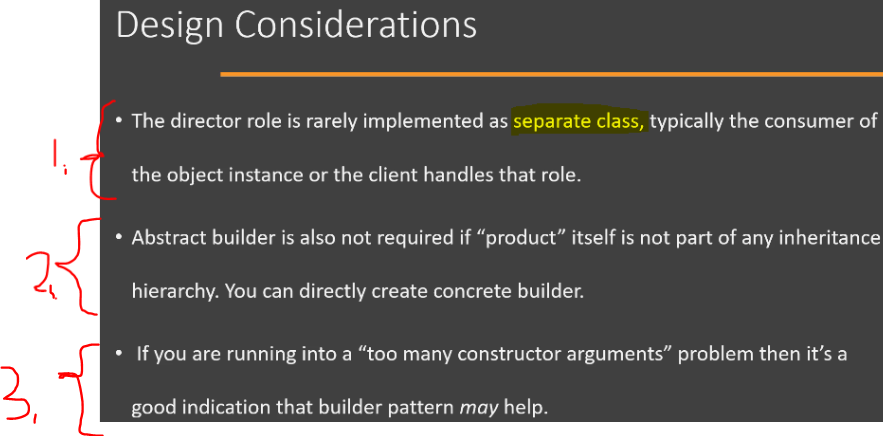

## Section 04: Builder.

# What I Learned.

# Builder - Introduction.

<div align="center">
    
</div>

1. This is one of **Creational Patterns**.

<div align="center">
    
</div>

- When there are **Immutable Objects**, this creation becomes much more trouble some!
    - Every time one wants to create **Object**, it needs to provide the **values** for **constructor**.

1. Example one does need to set **all** fields to satisfy the **Immutable Objects** criteria. This could be easy to solve with **Builder patters**.

<div align="center">
    
</div>

1. One can think using the **Builder Pattern**, when there is **dependencies**, when building the `User` Object.
    - To Build the `User` Object, one needs to resolve the `Address` and `List<Role>` first!

<div align="center">
    
</div>

1. We will be using **Builder pattern**, when we have **complex process** to **construct**!
2. We **abstract** the logic of creation in **Builder Pattern**. This is for sake of user to create objects.

<div align="center">
    
</div>

1. In **UML** we have **4** classes.

<div align="center">
    
</div>

1. **First** point is the **Product**. This is the **object** what we are trying **build**.

<div align="center">
    
</div>

1. **Second** point is the **Builder**. Will contains **methods** for building **parts** of our **Product**.
2. It also contains the method for **building** the **Product**!
3. It also contains the method for getting **already** builded **Product**!

<div align="center">
    
</div>

1. If you had interface for the Builder, this will be **concrete implementation** of that Builder interface.

<div align="center">
    
</div>

1. **Fourth** point is the **Director**. This **Director** knows, in which order the **Product** needs to be built.
	- This will be in **control** of the Build process.

# Builder Implementation Steps.

<div align="center">
    
</div>

1. We need to **identify** the parts, that need to be part of the builder!
    - There can be **steps** to create the final object.
2. We need the **method** for the building object!
3. We need method, to get **object** to **outside**!
4. Often times the **Client** is playing the role of the **Director**!

# Builder - Example UML.

<div align="center">
    
</div>

1. **UserWebDTO** will be our **Builded** object!
2. This will be **UserWebDTOBuilder** is the **concrete** builder implementation! 
3. **UserDTOBuilder** this will be **Abstract** builder. We will provide the methods here.
4. **Client** will play role of **Director**. 

# Builder - Implementation Part 1. 

- There are two **ways** to implement the **Builder**:
	- Builder **Inside** the Product Class (Inner Static Class).
	- Builder **Outside** the Product Class (Separate Class).

- This will be **Entity** class:

````
package org.java.builder;

import java.time.LocalDate;

//Class used to construct the product
public class User {

	private String firstName;
	private String lastName;
	private LocalDate birthday;
	private Address address;
	
	public String getFirstName() {
		return firstName;
	}
	
	public void setFirstName(String firstName) {
		this.firstName = firstName;
	}
	
	public String getLastName() {
		return lastName;
	}
	
	public void setLastName(String lastName) {
		this.lastName = lastName;
	}
	
	public LocalDate getBirthday() {
		return birthday;
	}
	public void setBirthday(LocalDate birthday) {
		this.birthday = birthday;
	}
	public Address getAddress() {
		return address;
	}
	public void setAddress(Address address) {
		this.address = address;
	}
	
}
````

- This will be **Value** class, this will be stored inside the **Entity**.

````
package org.java.builder;

public class Address {

	private String houseNumber;
	
	private String street;
	
	private String city;
	
	private String zipcode;
	
	private String state;
	
	public String getHouseNumber() {
		return houseNumber;
	}

	public void setHouseNumber(String houseNumber) {
		this.houseNumber = houseNumber;
	}

	public String getStreet() {
		return street;
	}

	public void setStreet(String street) {
		this.street = street;
	}

	public String getCity() {
		return city;
	}

	public void setCity(String city) {
		this.city = city;
	}

	public String getZipcode() {
		return zipcode;
	}

	public void setZipcode(String zipcode) {
		this.zipcode = zipcode;
	}

	public String getState() {
		return state;
	}

	public void setState(String state) {
		this.state = state;
	}
	
	
}
````


<div align="center">
    
</div>

- Below the **Product** implemented: 

````
package org.java.builder;

//A product in builder pattern
public class UserWebDTO implements UserDTO {

	private String name;
	
	private String address;
	
	private String age;

	public UserWebDTO(String name, String address, String age) {
		this.name = name;
		this.address = address;
		this.age = age;
	}
	
	public String getName() {
		return name;
	}

	public String getAddress() {
		return address;
	}

	public String getAge() {
		return age;
	}

	@Override
	public String toString() {
		return "name=" + name + "\nage=" + age + "\naddress=" + address ;
	}
	
	
}
````

<div align="center">
    
</div>

- Below the **Abstract builder** implemented: 

````
package org.java.builder;

import java.time.LocalDate;

//Abstract builder
public interface UserDTOBuilder {
	//methods to build "parts" of product at a time
	UserDTOBuilder withFirstName(String fname) ;

	UserDTOBuilder withLastName(String lname);

	UserDTOBuilder withBirthday(LocalDate date);

	UserDTOBuilder withAddress(Address address);
	//method to "assemble" final product
	UserDTO build();
	//(optional) method to fetch already built object
	UserDTO getUserDTO();
}
````

<div align="center">
    
</div>

- Below the **Concrete Builder** as implemented: 

````
package org.java.builder;

import java.time.LocalDate;
import java.time.Period;

//The concrete builder for UserWebDTO
public class UserWebDTOBuilder implements UserDTOBuilder {

    private String firstName;
    private String lastName;
    private String age; /// Age of our user.
    private String address; // We will store address here.

    private UserWebDTO dto;

    public UserWebDTOBuilder(String firstName, String lastName, String age) {
        this.firstName = firstName;
        this.lastName = lastName;
        this.age = age;
    }

    @Override
        public UserDTOBuilder withFirstName(String firstName) {
            this.firstName = firstName;
            return this;

        }

        @Override
        public UserDTOBuilder withLastName(String lastName) {
            this.lastName = lastName;
            return this;
        }

        @Override
        public UserDTOBuilder withBirthday(LocalDate date) {

            // Only years will be calculated.
            Period ageInYears = Period.between(date, LocalDate.now());
            age = Integer.toString(ageInYears.getYears());

            return this;
        }

        @Override
        public UserDTOBuilder withAddress(Address address) {
            // Build String Address from the Address Object!

            StringBuilder localAddress = new StringBuilder()
                    .append(address.getHouseNumber() + ", ")
                    .append(address.getStreet())
                    .append(System.lineSeparator())
                    .append(address.getCity())
                    .append(System.lineSeparator())
                    .append(address.getState() + " " )
                    .append(address.getZipcode());
            this.address =  localAddress.toString();

            return this;
        }

        @Override
        public UserDTO build() {
        // We are building the UserDTO Object!
            dto  = new UserWebDTO(firstName + " " + lastName, address, age);
            return dto;
        }

        @Override
        public UserDTO getUserDTO() {
            return dto;
        }
}

````

- We will be building following fields. This support method chaining.

````
    @Override
        public UserDTOBuilder withFirstName(String firstName) {
            this.firstName = firstName;
            return this;

        }

        @Override
        public UserDTOBuilder withLastName(String lastName) {
            this.lastName = lastName;
            return this;
        }

        @Override
        public UserDTOBuilder withBirthday(LocalDate date) {

            // Only years will be calculated.
            Period ageInYears = Period.between(date, LocalDate.now());
            age = Integer.toString(ageInYears.getYears());

            return this;
        }
````

- We will be building **Address** from the **Address object** in following: `public UserDTOBuilder withAddress(Address address)` method:

````
        @Override
        public UserDTOBuilder withAddress(Address address) {
            // Build String Address from the Address Object!

            StringBuilder localAddress = new StringBuilder()
                    .append(address.getHouseNumber() + ", ")
                    .append(address.getStreet())
                    .append(System.lineSeparator())
                    .append(address.getCity())
                    .append(System.lineSeparator())
                    .append(address.getState() + " " )
                    .append(address.getZipcode());
            this.address =  localAddress.toString();

            return this;
        }
````

- This will **Build** the **DTO** and return this also.

````
        @Override
        public UserDTO build() {
        // We are building the UserDTO Object!
            dto  = new UserWebDTO(firstName + " " + lastName, address, age);
            return dto;
        }
````

- This will return saved **DTO**.

````

        @Override
        public UserDTO getUserDTO() {
            return dto;
        }
````

<div align="center">
    
</div>


````
package org.java.builder;

import java.time.LocalDate;

// This is our client which also works as "director".
public class Client {

	public static void main(String[] args) {

		// This will come from persistence layer, like database!
		User user = createUser();
		UserWebDTOBuilder builder = new UserWebDTOBuilder();

		UserDTO dto = directBuild(builder, user);
		System.out.println(dto);
	}


	/**
	 * Director.
	 */
	private  static UserDTO directBuild(UserWebDTOBuilder builder, User user)
	{
		return builder.withFirstName(user.getFirstName())
				.withLastName(user.getLastName())
				.withAddress(user.getAddress())
				.withBirthday(user.getBirthday())
				.build();
	}

	/**
	 * Returns a sample user. 
	 */
	public static User createUser() {
		User user = new User();
		user.setBirthday(LocalDate.of(1960, 5, 6));
		user.setFirstName("Ron");
		user.setLastName("Swanson");
		Address address = new Address();
		address.setHouseNumber("100");
		address.setStreet("State Street");
		address.setCity("Pawnee");
		address.setState("Indiana");
		address.setZipcode("47998");
		user.setAddress(address);
		return user;
	}
}
````

- We can see the **Director** below is the examples.
	- We can see the method chaining here.

````
	/**
	 * Director.
	 */
	private  static UserDTO directBuild(UserWebDTOBuilder builder, User user)
	{
		return builder.withFirstName(user.getFirstName())
				.withLastName(user.getLastName())
				.withAddress(user.getAddress())
				.withBirthday(user.getBirthday())
				.build();
	}
````

- Furthermore, we will **build** by **pieces** and then call the `.build();`. 

- You can see the output:

````
name=Ron Swanson
age=65
address=100, State Street
Pawnee
Indiana 47998
````

# Builder - Implementation Part 2.

<div align="center">
    
</div>

- You can see the **Builder** embedded inside the **Prduct** class:

````
package org.java.builder.builder2;

import java.time.LocalDate;
import java.time.Period;
import java.time.temporal.ChronoUnit;

import com.cpc.dp.builder.Address;

//Product class
public class UserDTO {

	private String name;
	
	private String address;
	
	private String age;

	public String getName() {
		return name;
	}

	public String getAddress() {
		return address;
	}

	public String getAge() {
		return age;
	}
	
	private void setName(String name) {
		this.name = name;
	}

	private void setAddress(String address) {
		this.address = address;
	}

	private void setAge(String age) {
		this.age = age;
	}

	@Override
	public String toString() {
		return "name=" + name + "\nage=" + age + "\naddress=" + address ;
	}
	//Get builder instance
	public static UserDTOBuilder getBuilder() {
		return new UserDTOBuilder();
	}
	//Builder
	public static class UserDTOBuilder {
		
		private String firstName;
		
		private String lastName;
		
		private String age;
		
		private String address;
		
		private UserDTO userDTO;
		
		public UserDTOBuilder withFirstName(String fname) {
			this.firstName = fname;
			return this;
		}
		
		public UserDTOBuilder withLastName(String lname) {
			this.lastName = lname;
			return this;
		}
		
		public UserDTOBuilder withBirthday(LocalDate date) {
			age = Integer.toString(Period.between(date, LocalDate.now()).getYears());
			return this;
		}
		
		public UserDTOBuilder withAddress(Address address) {
			this.address = address.getHouseNumber() + " " +address.getStreet()
						+ "\n"+address.getCity()+", "+address.getState()+" "+address.getZipcode(); 

			return this;
		}
		
		public UserDTO build() {
			this.userDTO = new UserDTO();
			userDTO.setName(firstName+" " + lastName);
			userDTO.setAddress(address);
			userDTO.setAge(age);
			return this.userDTO;
		}
		
		public UserDTO getUserDTO() {
			return this.userDTO;
		}
	}
}

````

- You can see the **Methods** as private.

- Furthermore, you can see the **Builder** inside the class as following:
	- Since this is **inside**, this can access the private methods.

````
public static class UserDTOBuilder 
{
	...
	etc
}
````

- Also, there is construction inside as following, being settled as in separate fields:

````
		public UserDTO build() {
			this.userDTO = new UserDTO();
			userDTO.setName(firstName+" " + lastName);
			userDTO.setAddress(address);
			userDTO.setAge(age);
			return this.userDTO;
		}
````

- Also, there is one **static** method for the getting the builder.

````
//Get builder instance
	public static UserDTOBuilder getBuilder() {
		return new UserDTOBuilder();
	}
````

- We will be using this, **another** to use the **Builder**:

````
package org.java.builder.builder2;

import org.java.builder.builder.Address;
import org.java.builder.builder.User;

import java.time.LocalDate;


public class Client {

	public static void main(String[] args) {
		User user = createUser();
		// Client has to provide director with concrete builder
		UserDTO dto = directBuild(UserDTO.getBuilder(), user);
		System.out.println(dto);
	}

	/**
	 * This method serves the role of director in builder pattern.
	 */
	private static UserDTO directBuild(UserDTO.UserDTOBuilder builder, User user) {
		return builder.withFirstName(user.getFirstName()).withLastName(user.getLastName())
				.withBirthday(user.getBirthday()).withAddress(user.getAddress()).build();
	}

	/**
	 * Returns a sample user.
	 */
	public static User createUser() {
		User user = new User();
		user.setBirthday(LocalDate.of(1960, 5, 6));
		user.setFirstName("Ron");
		user.setLastName("Swanson");
		Address address = new Address();
		address.setHouseNumber("100");
		address.setStreet("State Street");
		address.setCity("Pawnee");
		address.setState("Indiana");
		address.setZipcode("47998");
		user.setAddress(address);
		return user;
	}

}
````

- You can get the **Builder** using the **Static method**:

````
	public static void main(String[] args) {
		User user = createUser();
		// Client has to provide director with concrete builder
		UserDTO dto = directBuild(UserDTO.getBuilder(), user);
		System.out.println(dto);
	}
````

# Builder - Implementation & Design Considerations.

<div align="center">
    
</div>

1. One of better ways to implement the **Builder** is as **inner static class** inside the **Product** class.
	- You **always** know where the **Builder** resides in you codebase.

<div align="center">
    
</div>

1. **Director** is rarely implement In **real-world** as separate class.
	- Since the steps to build Object stays the same.
2. **Abstract Builder** is not **often implemented**.
	- This is usually **optional**. There is not often cases, where the **builder** has **inheritance** in place.
3. Too many **constructor arguments**, is one of indicators that you could be implementing, a **Builder Pattern**. 

# Builder - Examples.

<div align="center">
    
</div>

1. **String Builder** satisfies the example of **Builder Pattern**.
	- For this example is fine, but It's not fully satisfying the **GoF** criteria for build pattern.

<div align="center">
    
</div>

1. **Other** example is from **Java 8**, `java.util.Calendar.Builder` class, which has **Builder Pattern** inside it.

2. There are methods, to build **parts** of the **Build Patters**.

# Builder - Comparison with Prototype.

- Learn prototype pattern and come back!

# Builder - Pitfalls.

- There are no **pitfalls** in **Builder Patter**, if this implemented and used **correctly**. 

<div align="center">
    
</div>

1. When doing **method chaining**, it can be confusing.
2. There can be state where **Object** can be **partially initialized**.

# Builder - Summary.

# Quiz 3: Quiz - Builder Design.
