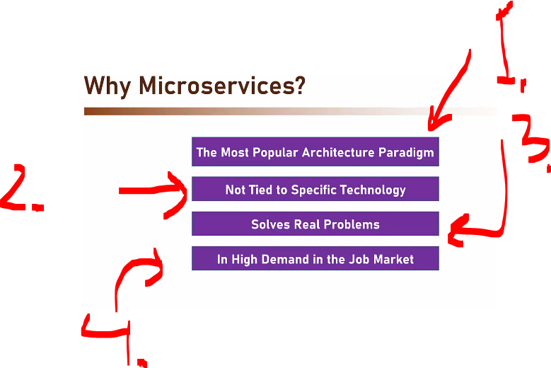
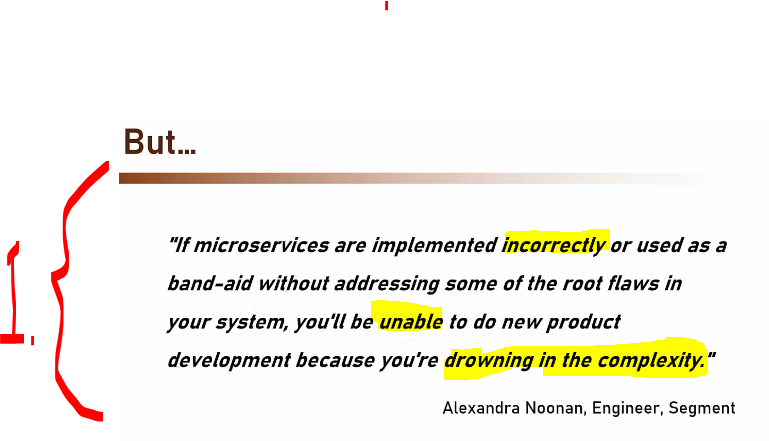
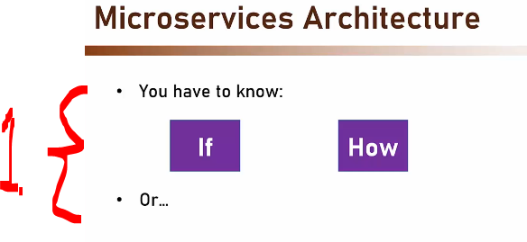
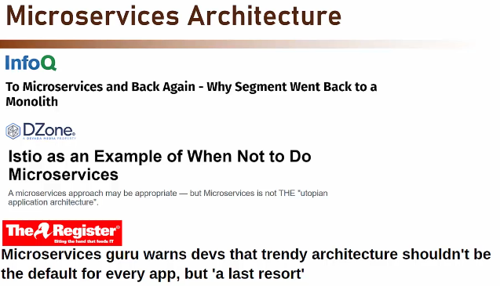
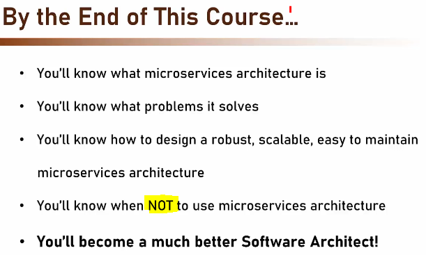
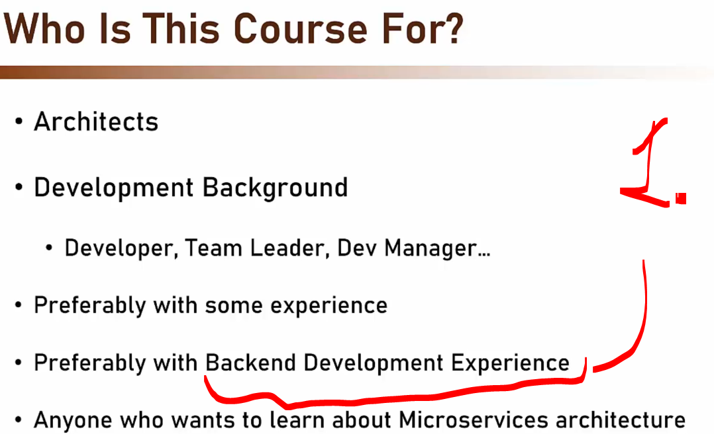
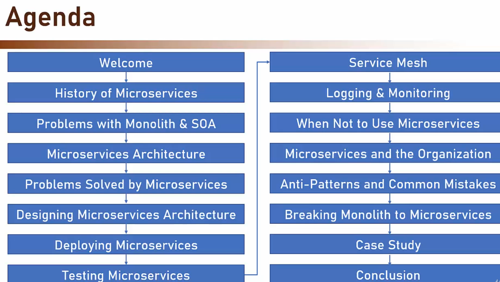

# Section 01: Welcome.

Welcome.

# What I Learned.

# Course Introduction.

    

1. Best course made by **Memi Lavi**!

    

1. This is the most popular **Architecture Paradigm**!
2. These patterns are not tied to any specific technology!
3. It solves very **common problems** in dev teams!
4. Lot of fuzz! 

    

1. **Netflix** was one of the first companies, which who publically announce the to adopt the **microservice**!

    

1. Microservice architecture **is not** the **silver bullet**! Read following quote.

    

1. If moving to the **Microservices Architecture** is wise and how!

    

1. One should be providing real value to the customer!

    

- This guy is super smart! 

# Join The Software Architects Community.

# Who Is This Course For?

    

1. Its preferred to have some **backend** experience!

# An Update for Udemy Students.

- Remember give a review for good course!

# What We Will Talk About in This Course.

    

