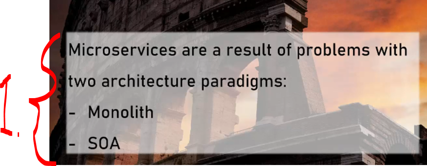
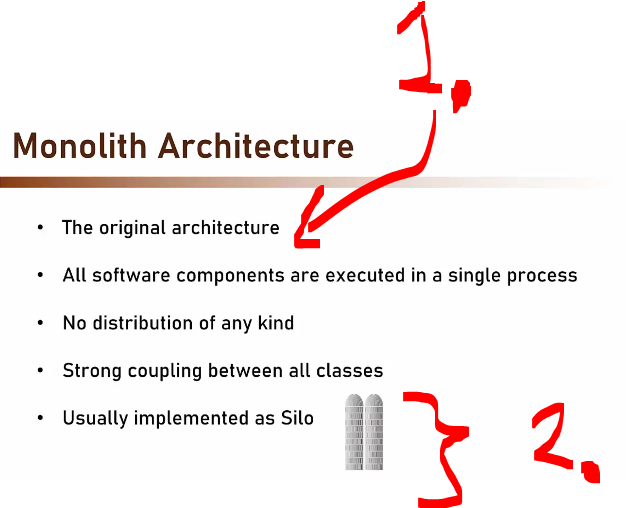
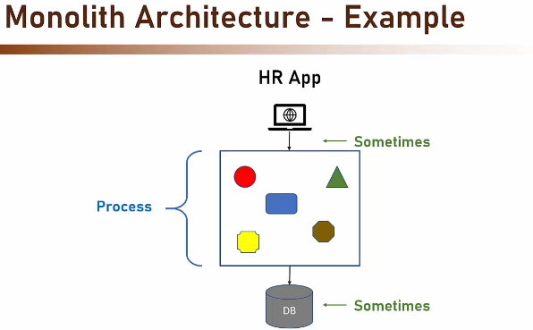
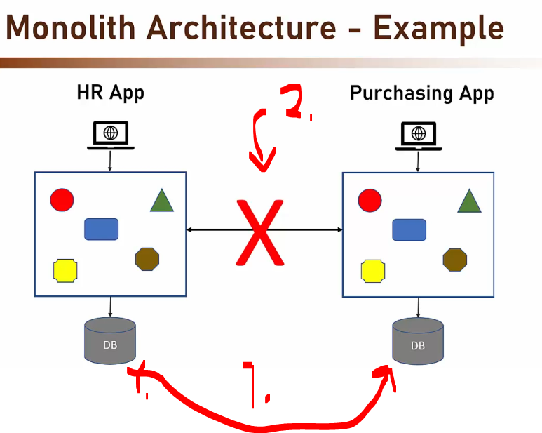
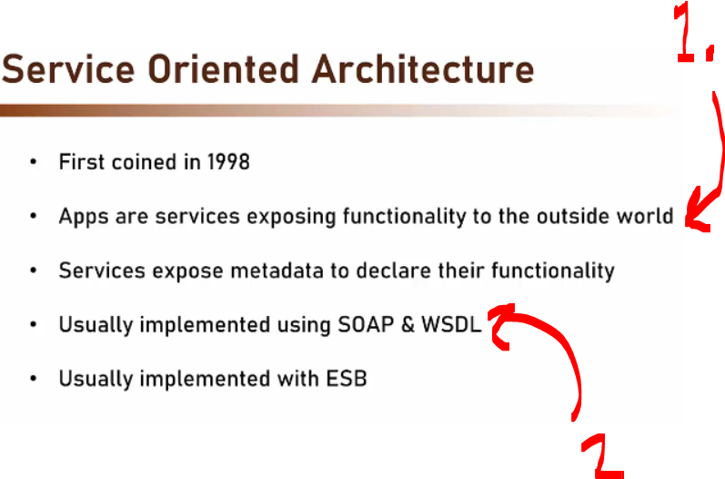
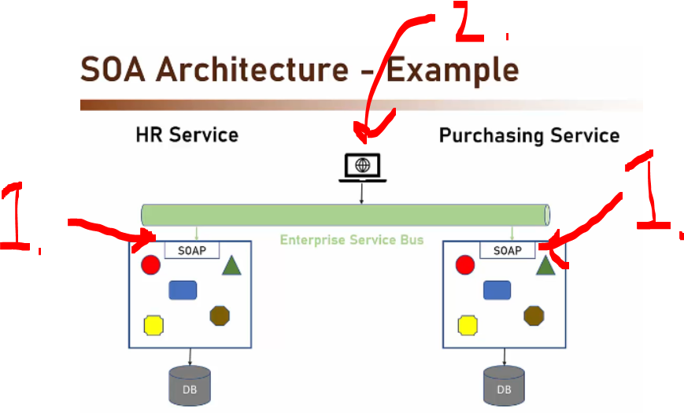
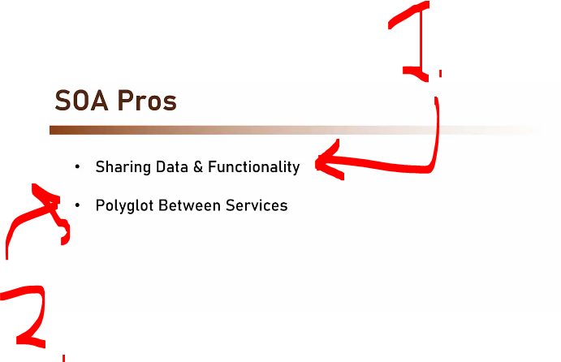

# Section 02: History of the microservices?

# What I Learned.

# Introduction.

    

1. History of Microservices! We will be going, why before this did not work!

    

1. Microservices are result of:
    - Monolith.
    - SOA.

# Monolith.

    

1. Monolith is the father of all architecture. 
2. Monoliths are not sharing, anything with other apps. Meaning, if one want build ecosystem, that's not going to work with **monoliths**!

    

1. Process has **all** the components!
2. Database in other precess usually!
3. Front end in other precess usually!

- We still say this is **monolith**, since the **core** of the app is running inside one process!

    

1. If we have **two** monolith **apps**.
2. Data sharing between **two monolith apps**!
    - These are often silos and does not share done!
        - It can be done, but it's not easy!

    

1. It's much simpler to design!
2. Performance, if designed correctly! 
    - **ESB** routes the communication to right **service**!

    

1. The **SOA** is sharing services to outside!
2. One of feature, why **SOA** was failing was usage of **SOAP**!

    

1. Apps exposes **SOAP** endpoints to provide the **services** to outside!
2. **Client** talks directly to the **ESB** (**E**nterprise **S**ervice **B**uss).

    

1. Allowed **data sharing** between system, first time easy!
    -  Made here the why
2. 

- Todo this one

# Service Oriented Architecture.