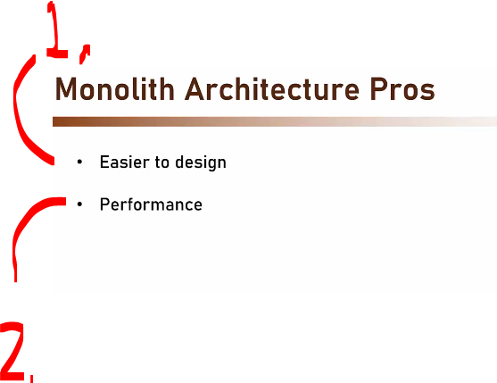
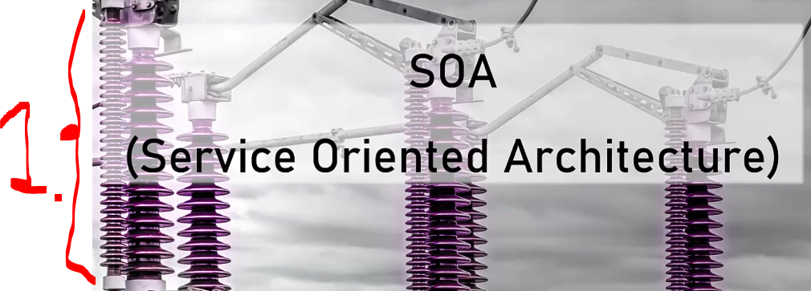

# Section 02: History of the microservices?

# What I Learned.

# Introduction.

    

1. History of Microservices! We will be going, why before this did not work!

    

1. Microservices are result of:
    - Monolith.
    - SOA.

# Monolith.

    

1. We are starting with the **Monolith**!

    

1. Monolith is the father of all architecture. 
2. Monoliths are not sharing anything with other apps. Meaning, if one want build ecosystem, that's not going to work with **monoliths**!
    - No standard no communication to other classes!

- Let's take one example **HR App**!

    

1. Process has **all** the components inside!
2. Database is usually in other process!
3. Front-end is in other process usually!

- We can still say this is **monolith**, since the **core** of the app is running inside one process!
    - Even thought there were **front-end** and **databases** running **separately**!

    

1. If we have **two** monolith **apps**.
2. Data sharing between **two monolith apps** is not working!
    - These two are often **silos** and does not share data!
        - It **can be done**, but it's **not easy**!

    

1. It's much **simpler** to design!
2. Performant, if designed correctly! 

# Service Oriented Architecture.

    

1. We will be looking at **SOA**.

    

1. The **SOA** is sharing services to outside!
    - **SOA** build service as sharing and giving!
2. One of feature why **SOA** was failing was usage of **SOAP**!
3. Good on paper!

    

1. Apps exposes **SOAP** endpoints to provide the **services** to outside!
2. **Client** talks directly to the **ESB** (**E**nterprise **S**ervice **B**uss).
3. **ESB**(**E**nterprise **S**ervice **B**us) routes the communication to right **service**!

    

1. Allowed **data sharing** between system, **first at the time** easy!
    -  Call system developers to meeting!
        - Convince them!
            - Plan and execute to share data!
- Generating the client, which could provided **wanted data** could be done individually, with ease, with right tools!
    - **Visual Studio** had this function!
2. **Polyglot** helps achieve platform independency!
