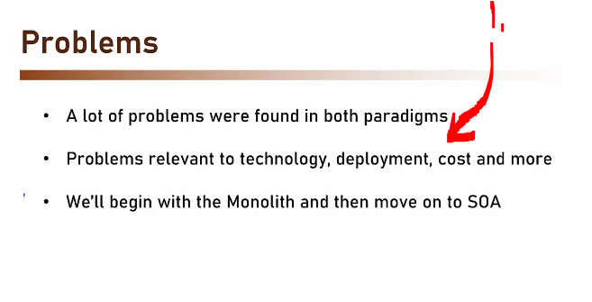
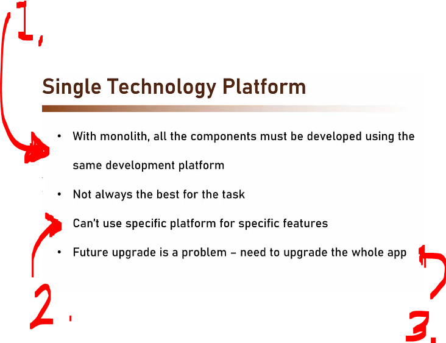
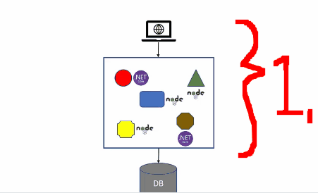
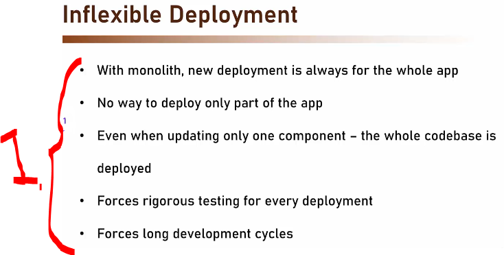
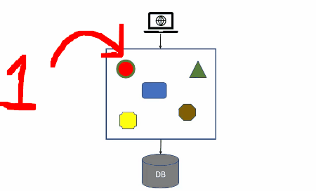
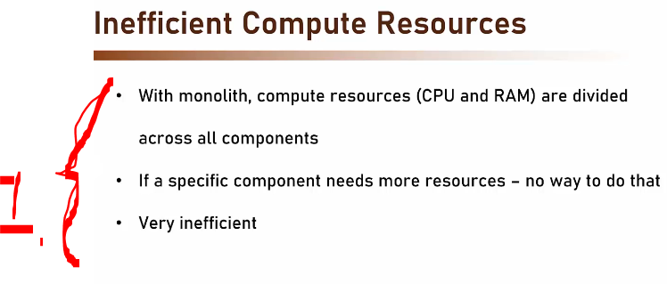
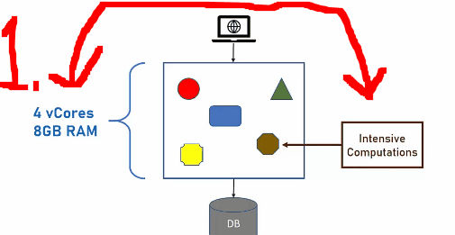

# Section 03: Problems with Monolith & SOA.

# What I Learned.

# Introduction.

    

1. We need to understand problems with these paradigms!

    

1. **SOA** was disappeared, since there were multiple problems!

# Single Technology Platform.

- The **first** problem:

    

1. All the components needs to be developed with one **development platform**
2. Example, we are using `node.js`, and we need to change the requirements!
3. We need to upgrade **Java 8** to **Java 9**, we would need upgrade whole app!

    

1. We cannot have **different services** running **different tech stack** inside monolith architecture!
    - It runs in single process!

# Inflexible Deployment.

- The **second** problem:

    

1. The deployment of app, needs to be done fully
    - Think, one fixes small bug → The full app needs to be tested and deployed!

    

1. We are fixing bug in one **component**.
2. We need go thought **Test**, **Fix**, **Deployment** cycles!
    - All this, because fixed one line of code!

# Inefficient Compute Resources.

- The **third** problem:

    

1. One component is getting **all the resources!**
    - There is no way to let one component get more resources based on need!

    

1. If **one** component is requiring more resources, only possible way is to increase the resources for whole **monolith application**!
    - Notice the change from `4 vCores 8GB RAM` to the `8 vCores 16GB RAM`!
        - **vCores** mean **v**irtual **c**ores! 

# Large and Complex.

- The **fourth** problem:

# Complicated and Expensive ESB.

- The **fifth** problem:

# Lack of Tooling.

- The **sixth** problem:
