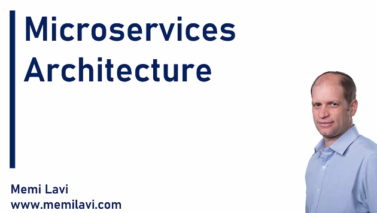

# Section 04: Microservices and the Organization.

# What I Learned.

# Introduction.

    

1. Real thing, microservice architecture!

# Componentization.

# Organized Around Business Capabilities.

# Products not Projects.

# Smart Endpoints and Dumb Pipes.

# Decentralized Governance.

# Decentralized Data Management.

# Infrastructure Automation.

# Design for Failure.

# Evolutionary Design.

# Summary.