# Section 04: Microservices Architecture.

# What I Learned.

# Introduction.

    

1. Real thing, microservice architecture!

    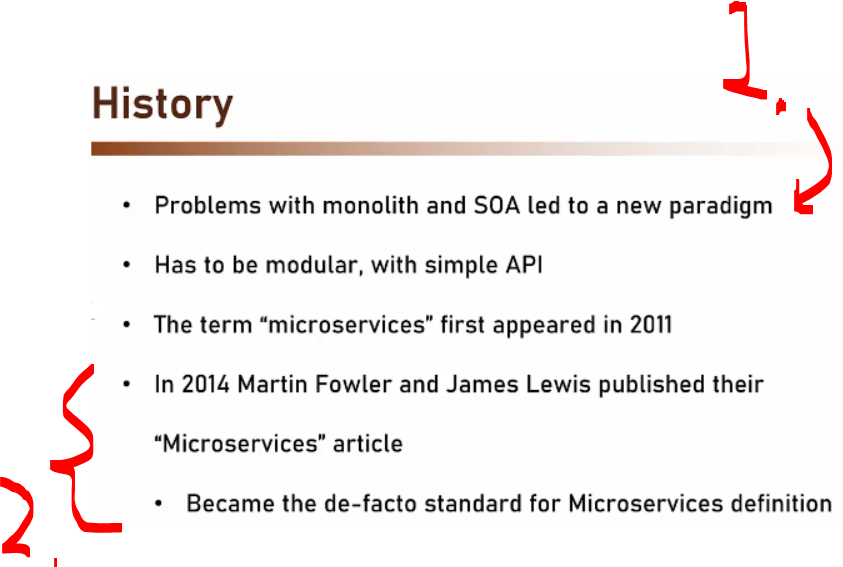

1. **SOA** and **Monolith** showed, we need something new!
2. This came **de-factoto** for Microservices!

    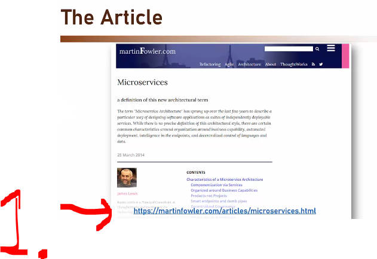

1. These are explaining what microservice architecture should have: `https://martinfowler.com/articles/microservices.html`!

    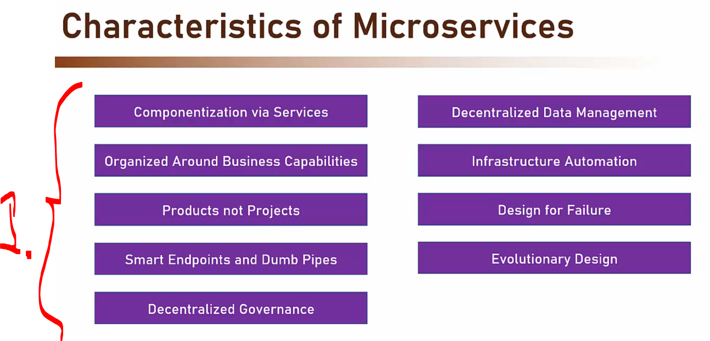

1. **Martin Fowler** definition of good microservice!

# Componentization.

    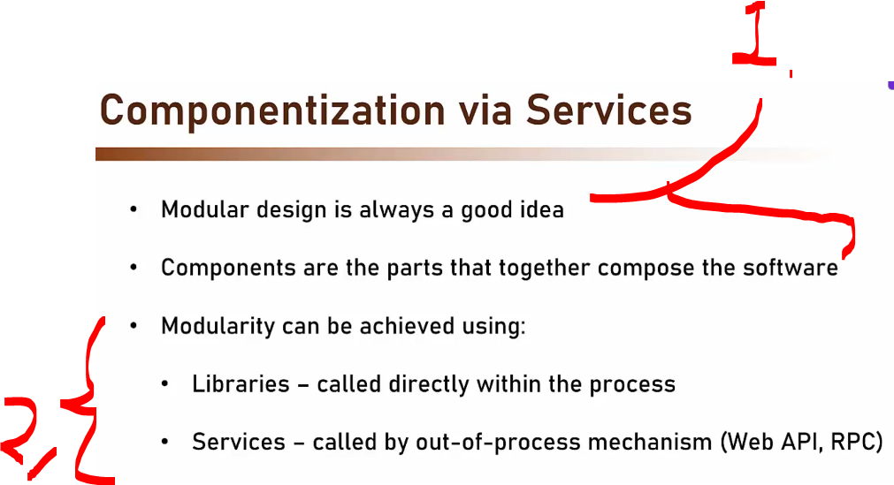

1. The microservice should be **components**.
    - Can have multiple components, each component one should have **one responsibility**! 
2. There are **two** main ways to achieve modularity!
    - **Libraries**, are good for achieving the componentization.
    - **Services**, for achieving componentization, when calling to the external service, such as **REST**, **Web API**, **RPC** for example!

    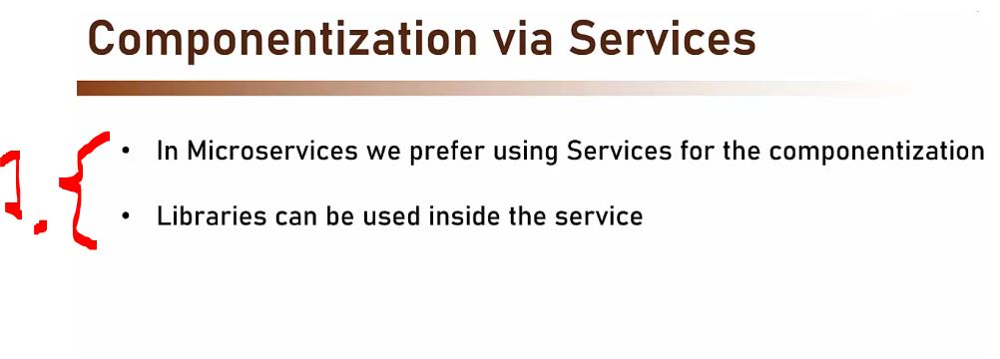

1. Instead of splitting your system into **reusable libraries** (like in a monolith), you split it into **independent services**.

    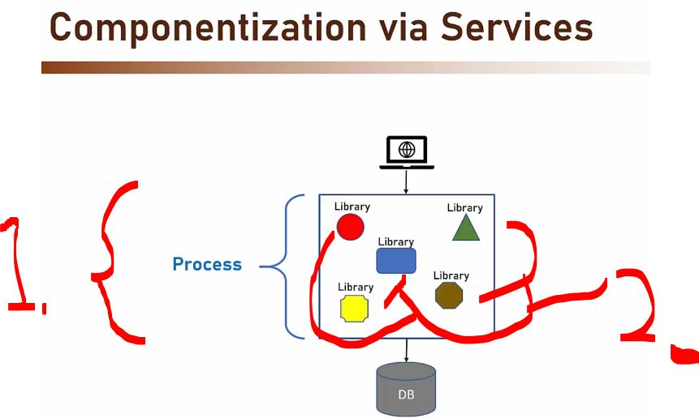

1. **Monolith diagram**!
2. In Monolith, the componentization is happening with the **libraries/modules**.

    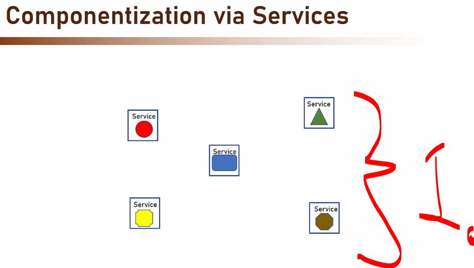

1. In microservices the **caponization** is made with the services!

    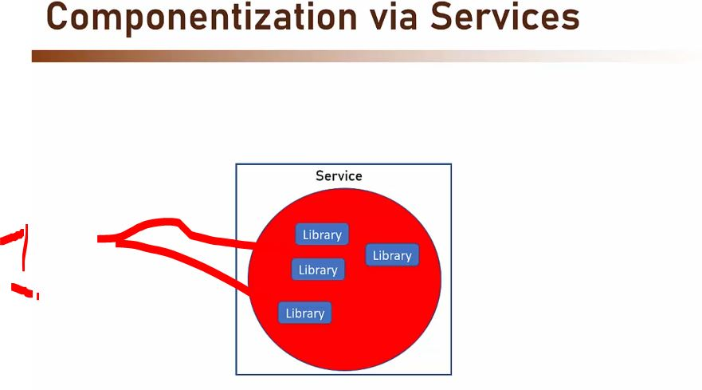

1. Libraries are used in **inner walkings** of the service. Services are used in making modularity!

    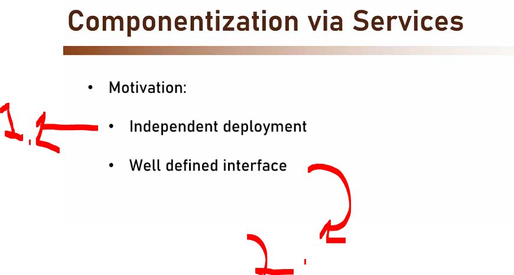

1. **Services** can be deployed separately!
    - Rather than in monolith!
2. Working with **interface**, makes architect to think of the contract more thoroughly, hence better design!

# Organized Around Business Capabilities.

    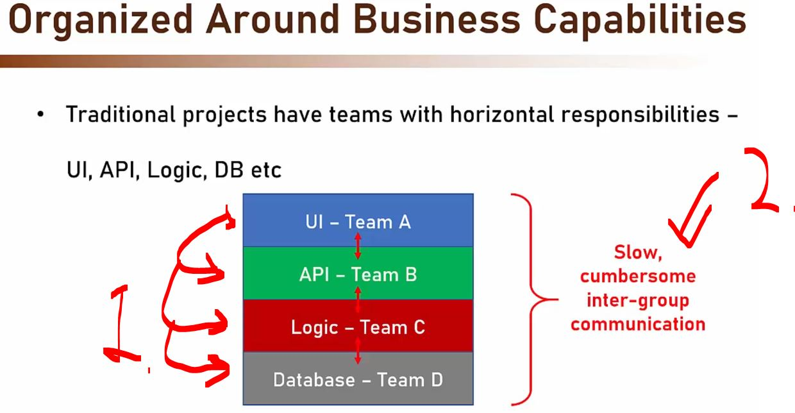

1. **Traditional** teams talk mostly to each other.
    - The **terms** can be derived in such environment!
        - Example **UI team**, could **adapt** the terms using **API terms**

2. Usually these are **slow**, they **don't** share **same variable names** etc ...

- These can affect product's **quality**!

    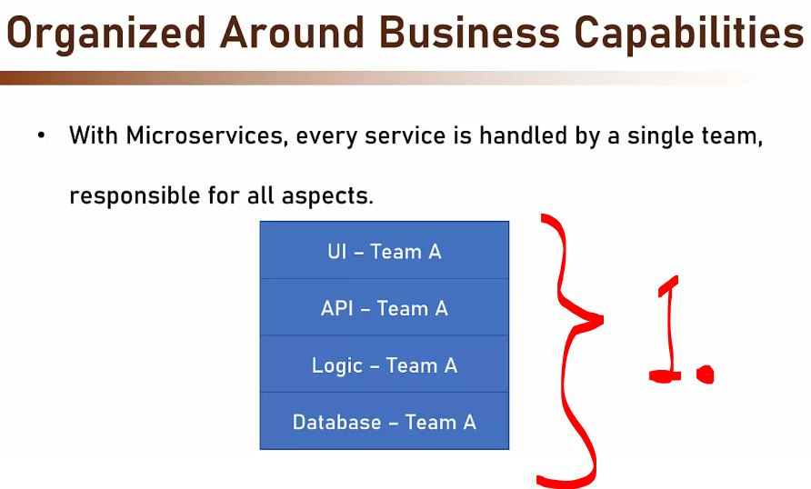

1. The same team develops **all** the areas! Team has **holistic view** field of the service!
    - We don't see inner politics to block the best solution!

    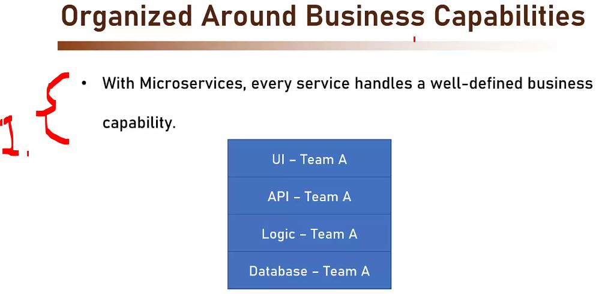

1. How to define the boundaries of the **service**.
    - This is defined by business!

- What is the motivation around business capabilities! 

    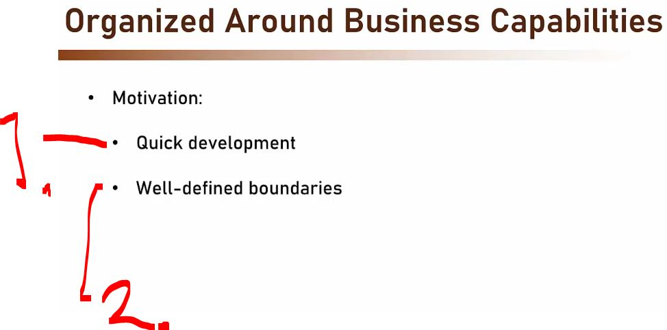

1. It helps quick development of the service!
    - When there **one team** making one service!
2. It will be keep definitions laser focused!

# Products not Projects.

    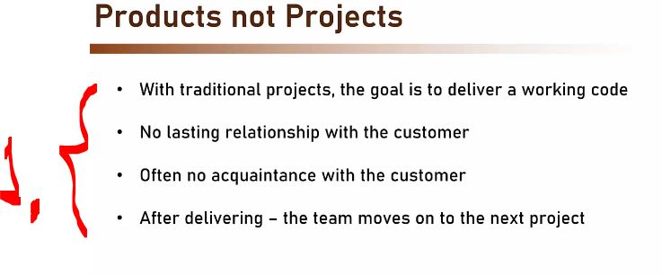

1. **Traditional way**, team usually does not interact in any level with the customer!

    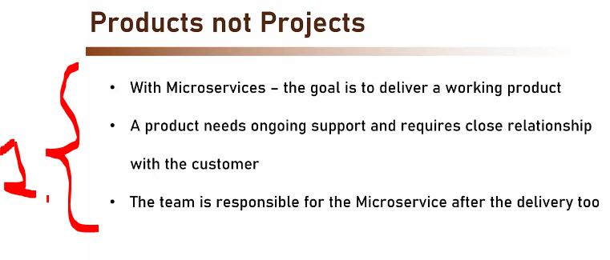

1. With **microservices**, teams own the products! 
    - Customer's is involved it this process! 

    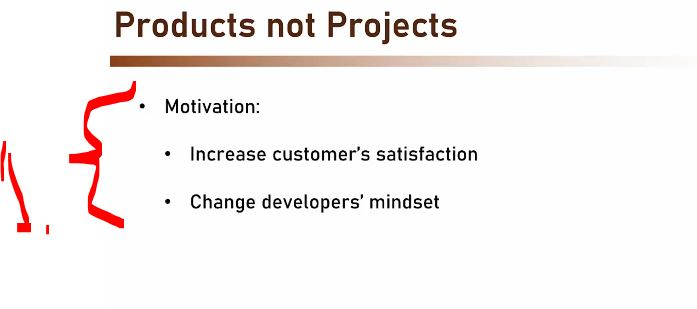

1. Team thinks like customer, this makes customer more satisfied!

# Smart Endpoints and Dumb Pipes.

# Decentralized Governance.

# Decentralized Data Management.

# Infrastructure Automation.

# Design for Failure.

# Evolutionary Design.

# Summary.