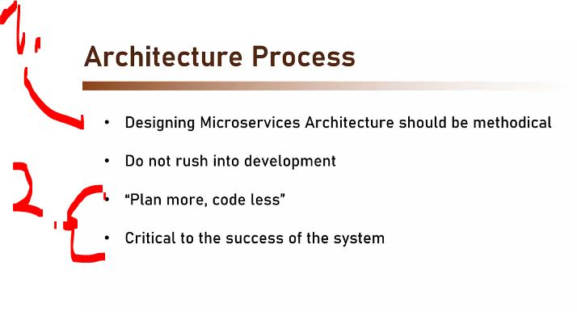
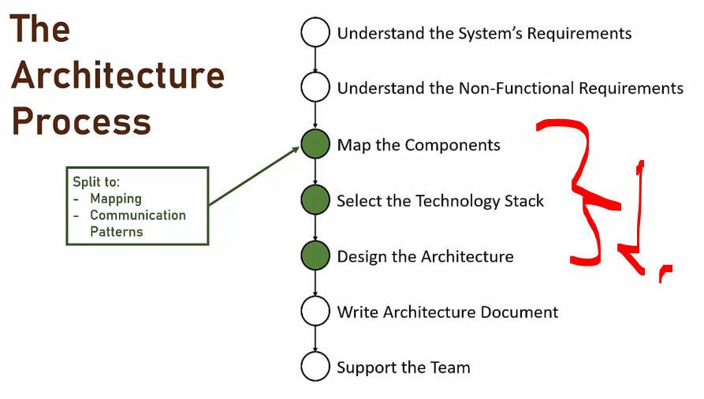
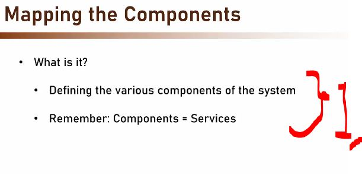
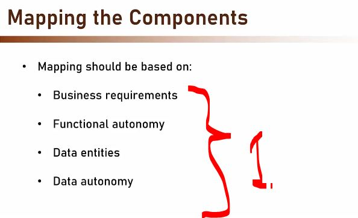
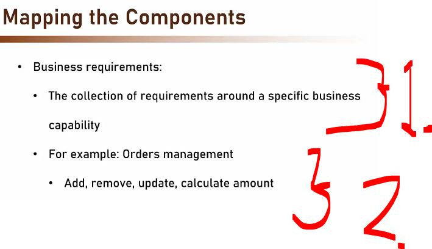
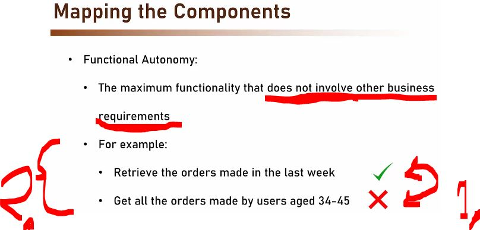

# Section 06: Designing Microservices Architecture.

# What I Learned.

# Introduction.

    

1. We will be designing the microservice form ground to up!

    

1. When designing one should be **methodical** that means careful, organized, and systematic way.
2. Do **not** rush into development, it forces having more planning!
    - Plan more, code less!
    - This makes the **mapping** much more clearer!

    

1. We will be focusing into following steps!

# Mapping the Components.

- We will be looking this **first step**: `Map the Components`.

    

1. What components there in the system. Remember we will be talking about **Services** = **Components**!

    

1. Mapping should be based on:
    - Business requirements.
    - Functional autonomy.
    - Data entities.
    - Data autonomy.

    

1. We will be collecting the **business requirements**.
2. Example, what are required for the **Order management**!
    - There are **operations** for the order. These can be `Add`, `Remove`, `Update` and `Calculate ammount`!

    

1. This means **not** to include functionality that is not involved to the business requirements!
    - ✔️ **Example working:** ✔️ Retrieve the orders made in the last week [Green Checkmark]!
    - ❌ **Example not working:** ❌ Get all the orders made by users aged 34–45 [Red X]!
2. The **trick** is to include overlapping functionality or data as **much** possible!

# Defining Communication Patterns.

# Selecting Technology Stack.

# Design the Architecture.