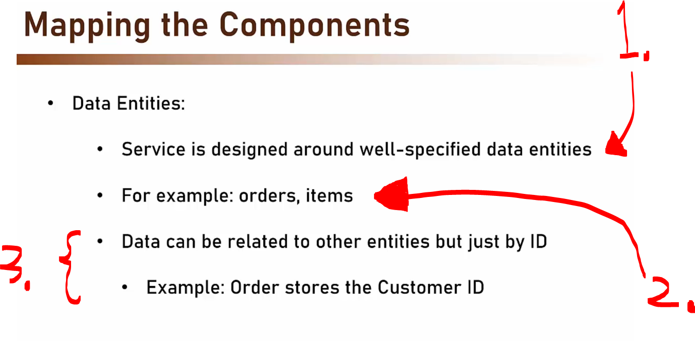
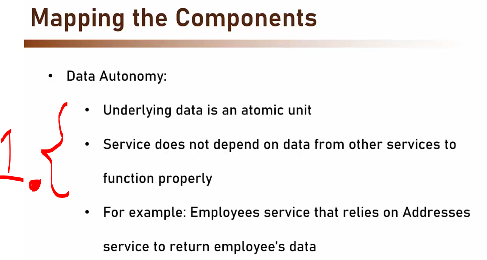
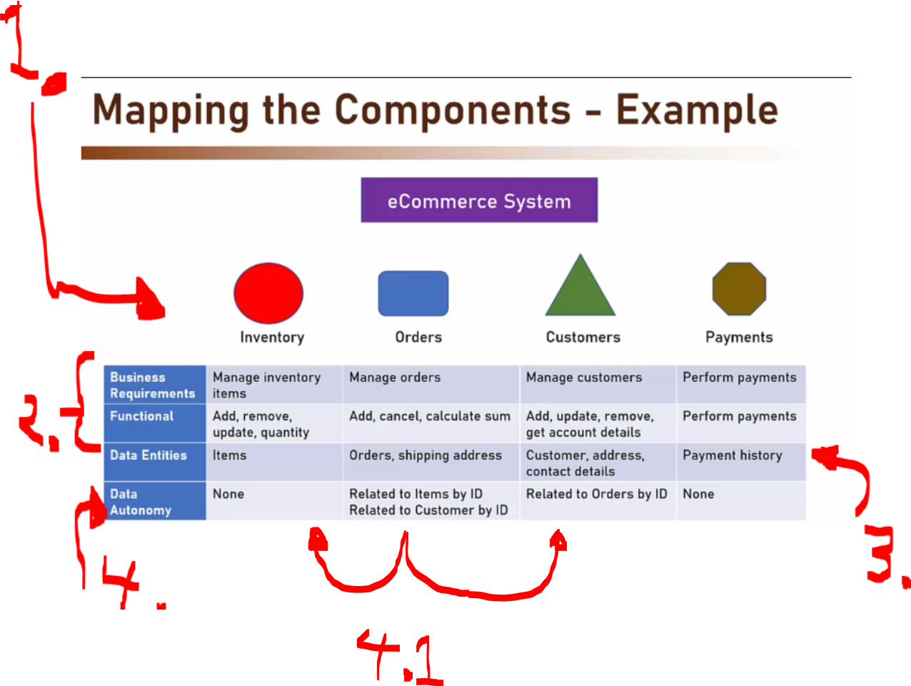
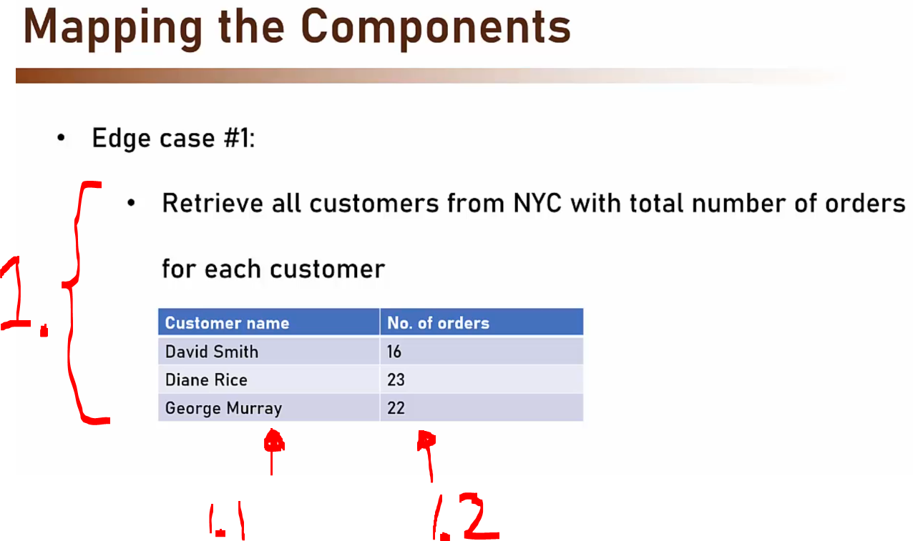
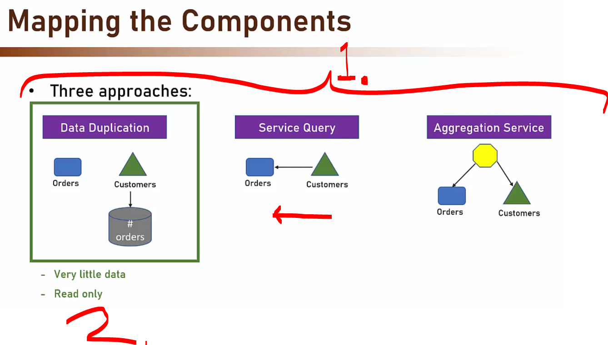
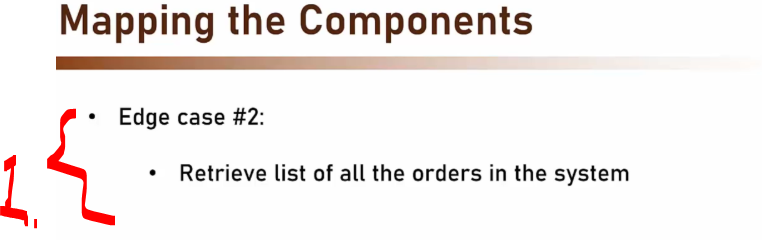
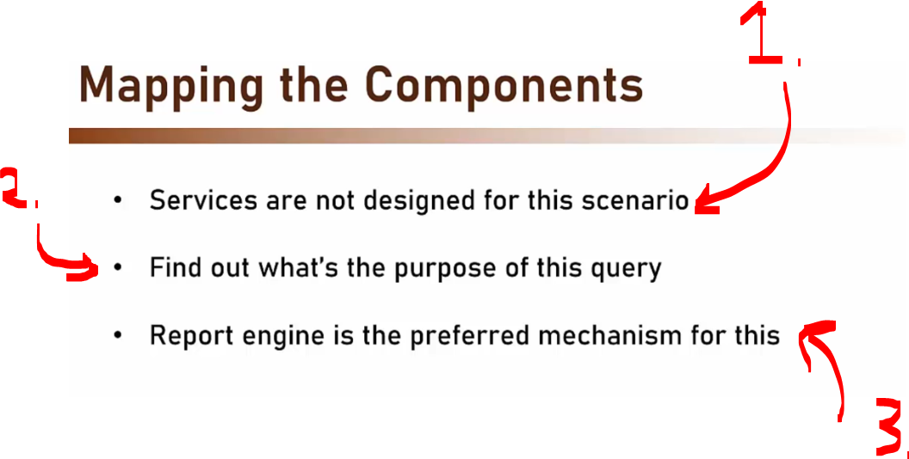
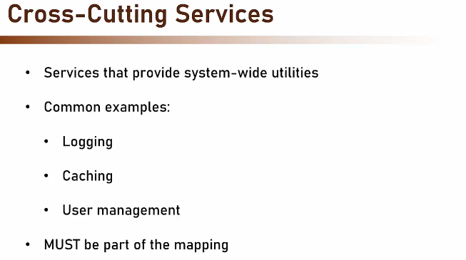

# Section 06: Designing Microservices Architecture.

# What I Learned.

# Introduction.

    

1. We will be designing the microservice form ground to up!

    

1. When designing one should be **methodical** that means careful, organized, and systematic way.
2. Do **not** rush into development, it forces having more planning!
    - Plan more, code less!
    - This makes the **mapping** much more clearer!

    

1. We will be focusing into following steps!

# Mapping the Components.

- We will be looking this **first step**: `Map the Components`.

    

1. What components there in the system? In this step we map the components, that are needed. Example we might have component that handles orders! Remember we will be talking about **Services** = **Components**!
    - We need to make distinguish, since it is service that is outside process!
        - Frequently interacting functionality should usually **remain components** inside the same service
            - If there is client that is frequently used, that should not be service, since there can be **a lot** of network traffic!

- How we decide what are our components:

    

1. Mapping **factors** should be based on:
    - Business requirements.
    - Functional autonomy.
    - Data entities.
    - Data autonomy.

- Let's start from the **business requirements**!

> [!TIP]
> 💡 **Business capabilities** are used as frame for component!
> **Requirements** are the actions that component can take! `Add`, `Remove`, `Update` and `Calculate ammount`! 💡

    

1. We are identifying **business capabilities**, this means to collect the **business requirements**.
2. Next, we will need requirements for the **order management**!
    - There should be **operations** for the order. These can be `Add`, `Remove`, `Update` and `Calculate ammqount`!

    

1. This means **not** to **include functionality** that is **not** involved to the **business requirements**!
    - ✔️ **Example working:** ✔️ *Retrieve the orders made in the last week*! ✔️
    - ❌ **Example not working:** ❌ Get all the orders made by users aged 34–45! ❌
        - This has some **hidden logic**, that has **not connected to orders**!
2. The **trick** is to include overlapping functionality as **little as much** possible!

    

1. We are defining around data!
2. Example `Order` and `Items`, there will be:
    - Service which works for **Orders**.
    - Service which works for **Items**.
3. Entities that are connected to the other entities, these should be connected but **ID**, not the **Entities**!

    

1. Data should **not** depend on the other services' data! 
    - Example there should be not **two** calls, which later one depends on the first caller result to work properly!

- Let's check this with the example:

    

1. Our different services! There is `Inventory`, `Oders`, `Customers` and `Payments`!
2. **Business Requirements** ( High-level business goals or capabilities that a component must support. ): 
    - `Inventory` Manages items inventory items!
    - `Orders` Manages orders!
    - `Customers` Manages customers!
    - `Payments`! Manages payments!

- **Functionality** ( By looking business requirements. ):
    - `Inventory`: `Add`, `Remove`, `Update` and `Quantity`.
    - `Orders`: `Add`, `Cancel`, `Calculate sum`.
    - `Customers`: `Add`, `Update`, `Remove` and `Get account details`.
    - `Payments`: `Performs paymets`.

3. **Data Entities** ( Main pieces of information that are responsible for storing and managing. ): 
    - `Inventory`: Deals **Items** in the inventory!
    - `Orders`: Deals with the **Orders** and **Shipping Address** (notice that this is part of the **Order**, not part of the **Customer** data!)
    - `Customers`: Deals with the **Customer**, **Address**, **Contact details**. Notice the **Shipping Address** is not part of the **Customer**, but the there is can be multiple references to the **Shipping Address** in the Customer! 
    - `Payments`: Deals with the **payment history**! Notice the **Payment History** does not handle **Order History** in the Orders Service.
4. **Data Autonomy** ( To which data outputs the depends! ): 
    - `Inventory`: No related data in other services!
    - `Orders`: Related to Items by ID; Related to Customer by ID!
        - `4.1` **Order items** is related to the **Items** in **Inventory**! **Customer items** in the **Customer** who has order is part of **Customer Service**!
    - `Customers`: Related to Orders by ID! 
    - `Payments`: No related data in other services!

- Lets common problem of edge cases:

    

1. There is following requirement, where we would need two columns `Customer Name` and `No of order`. These would be needed to come from the **two** different service!
    - `1.1` Comes from **Customer Service** and `1.2` comes from the **Orders Service**!
        - This is **extremely common**!

    

1. We have **three approaches**!
    - **Data duplication**!
        - The # of orders is stored in **Orders** database and **Customer** database!
            - When order is **added** or **removed**, the data will go out of synch!
    - **Service Query**!
        - These **two services** are called, when customers **data is retrieved**!
            - This approach **loads network** and **the service**, example if there are **200 customers**, we will be accessing **200 order calls**!
    - **Aggregation Service**!
        - There is one **Aggregation Service** in additional to the two ones!
            - This will have one aggregation service!
            - The data is not mixed in this approach!
                - The **Orders** and the **Customer**.
2. Its instructor personal approach!.
    - It's simple for this case!
        - There is no need for synchronization for data, since there is read only operations!
    - There is very little data!

    

1. Simple case no, just ask Orders service?
    - Problems comes from **Volume**!

    

1. **Services** are **not designed** to **retrieve gigs** of information!
2. What is the business need for query!
    - If in this scenario It's used for reporting! If its showing trends, and it used for showing past data!
3. In this case we should do **report engine**, this approach way we pass the API and query straight to the Db!

    

- These provide common services for services, common examples:
    - Logging.
    - Coaching.
    - User management.

# Defining Communication Patterns.

# Selecting Technology Stack.

# Design the Architecture.