# Section 10: Logging and Monitoring.

# What I Learned.

<div align="center">
    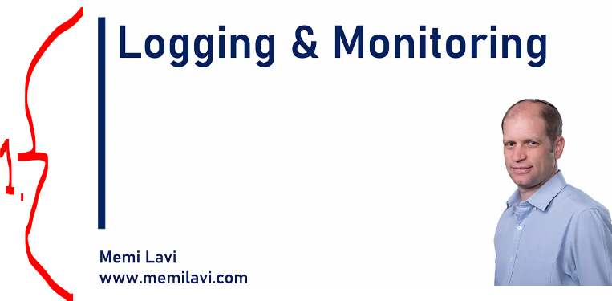
</div>

1. It's super important for logging and monitoring!

<div align="center">
    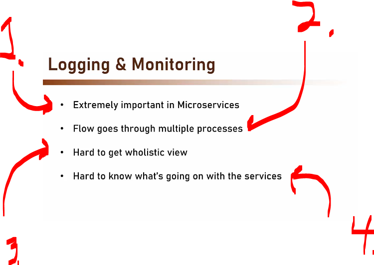
</div>

1. Logging is more important than in **Monolith**.
2. Since the **flow** goes thought **multiple processes**, its even important to have good logging!
    - **Process1** calls → **Process2** calls → **Process3** saves things into database.
3. Since there is multiple calls happening, It's hard to grasp **holistic field**!
4. In total, it's hard to grasp what is happening inside services!
    - It's much **easier** to understand what is happening inside **one** service at the time!

> [!NOTE]
> This is solved by, with **well-designed** logging and monitoring!

# Logging vs Monitoring.

- What is difference between **Logging** and **Monitoring** this is important to understand.

<div align="center">
    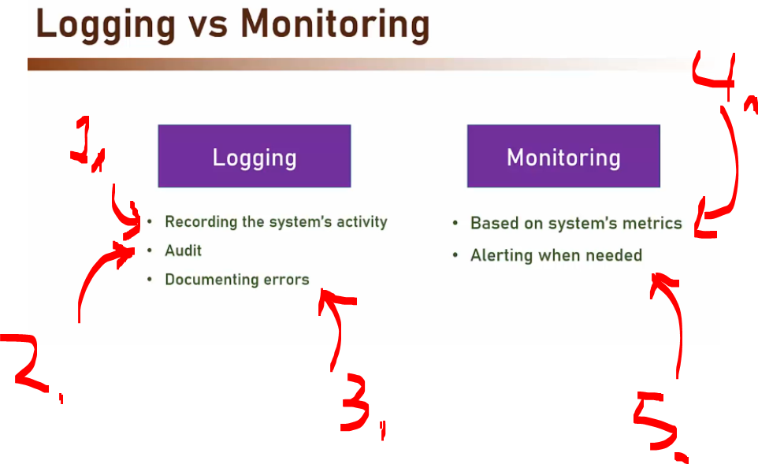
</div>

1. Logging is **recording of system activity**!
    - This is good for analysis system behavior!
2. These can be used for **Audit** reasons.
    - We can track the **user's** behavior!
    - This is important in the banking industry!
3. Logging is for **documenting errors**. **Stack trace**, **Timestamp** ... etc.
4. **Monitoring** is based from the systems' metrics.
    - CPU, Memory Usage etc.
    - Order per day...
5. Alert's can be defined of per configured.
    - Example, user per day goes under certain threshold!

# Implementing Logging.

<div align="center">
    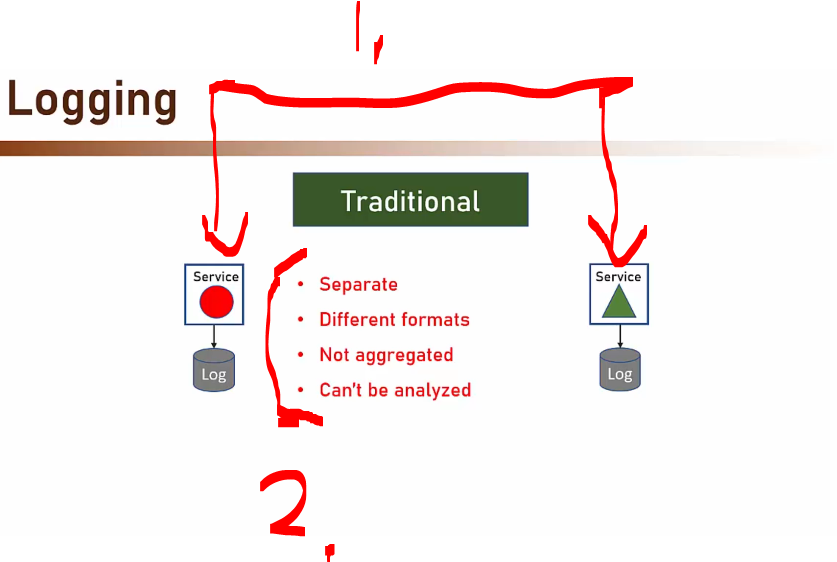
</div>

1. We have own **logging service**, for each infrastructure.
    - They have own **log** file or database.
    - This been **most** important way of implementing the logging **so far**!
2. Some **drawbacks** of using **Traditional** logging:
    - **Separate**, The logs are separate to each other.
        - If we need to **trace the error**, we would need to **get both logs** from the services!
    - **Different formats**, different logging libraries.
        - Different logging libraries, there can be different log format. **JSON** or **Text**.
    - **Not aggregated**, logs are not aggregated!
        - We cannot run queries against these!
            - Like how many database connections there were?
            - How many errors we had last day?
    - **Can't be analyzed**, not in one place.
        - Since logs are **not centralized** these can't be analyzed!

<div align="center">
    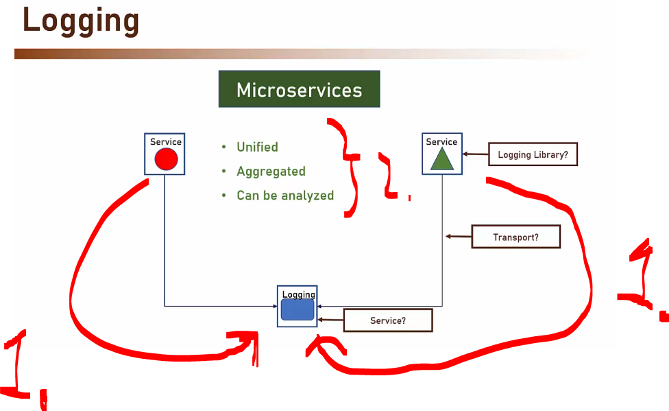
</div>

1. There is **two** service, and there is **third** for centralized logging! 
2. Benefits:
    - **Unified**
        - Logs are unified!
        - They are all stored in one location!
    - **Aggregated**
        - Different **calculation** can be run on them!
    - **Can be analyzed**.
        - We can run analyzes on them!

<div align="center">
    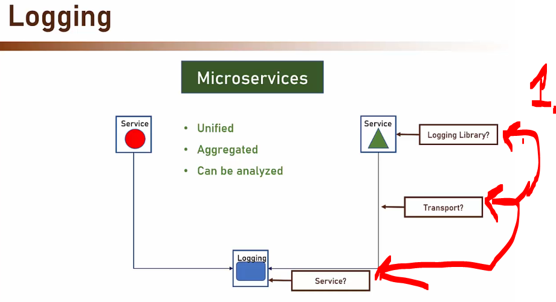
</div>

1. Three different parts to discuss:
    - **Logging Library**.
        - Do have any specific requirements?
    - **Transport**.
        - Logs needs to be transported to the centralized logging service!
    - **Logging Service**.
        - Should we make our own or take some premade one!

<div align="center">
    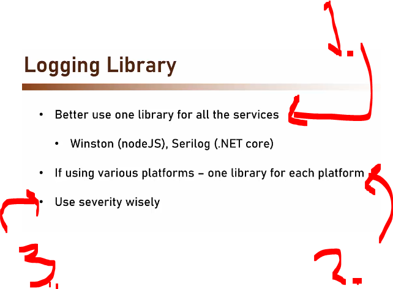
</div>

1. One should be using one **common library** for all services.
2. If there are multiple platforms, use **one common** library per platform!
3. Use **severity** field wisely!
    - Example: 
        - Don't log error as info!
        - Don't log info messages with the debug messages!

> [!TIP]
> In logging, **severity** refers to the importance or seriousness level of a log message.

<div align="center">
    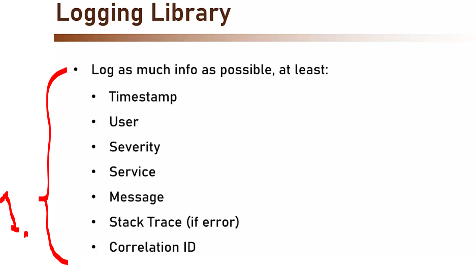
</div>

1. One should log **as much info as possible**!

<div align="center">
    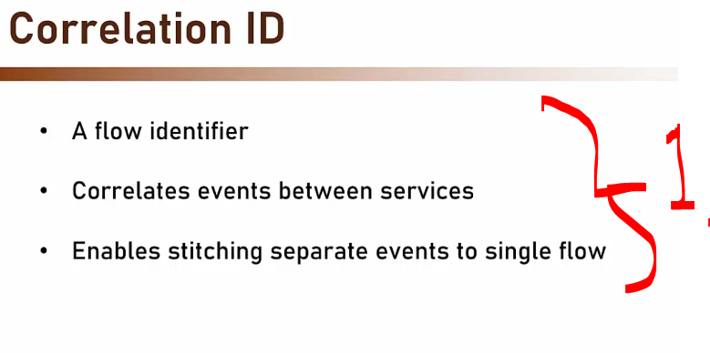
</div>

1. This will identify single flow, which has multiple events.

<div align="center">
    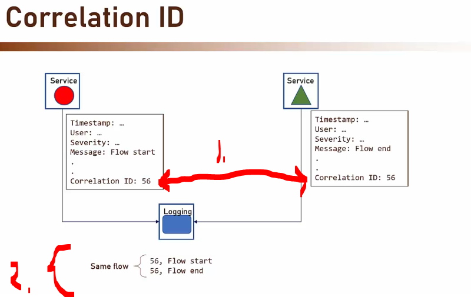
</div>

1. In these two services, there is `Correlation ID: 56`
    - This can be anything as long this is **unique** in the system!
2. Logging service has **two** records. We can identify that these belong to same flow!
    - We can now filter these based on the same flow.

<div align="center">
    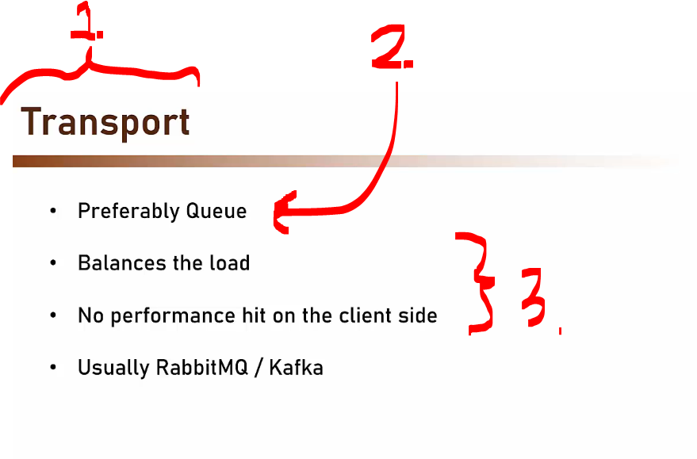
</div>

1. **Transport logging** architecture is also important! 
2. We would prefer using **Queue**, for sending logs.
3. Using **Queue**, balances the load under heavy usage! There is no performance hit on the client side, rather than writing to the file and having performance cost. 

- **Logging service**, that receives and reserves logs from other systems.

<div align="center">
    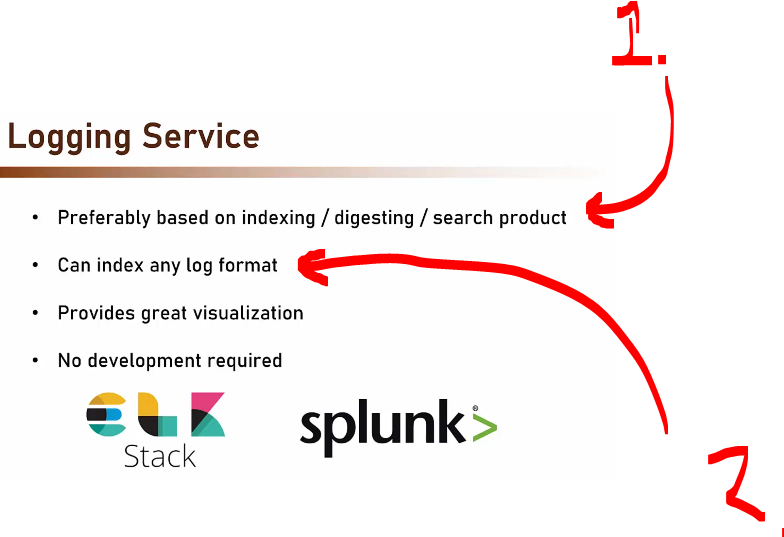
</div>

1. These products are built using large amount of logs and query language.
2. Can index log format, example below:
    ````yaml
    Error indexing file product23 timeout database not reachable
    ````
    - Is transformed to following:
    ````yaml
    {
    "timestamp": "2026-03-14T10:15:32Z",
    "level": "ERROR",
    "component": "indexer",
    "action": "document_index",
    "document_id": "product23",
    "error": "database timeout"
    }
    ````
<div align="center">
    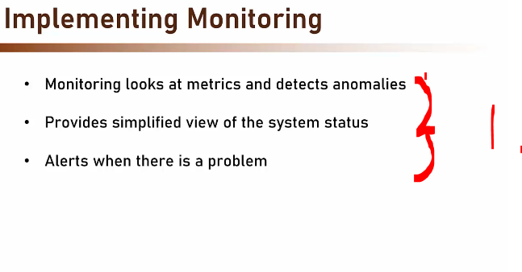
</div>

1. We can check different **anomalies** and set **alert** for certain threshold!

<div align="center">
    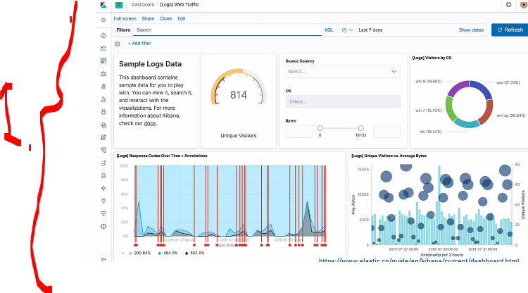
</div>

1. Example of the **monitoring tool** called **Kibana**.

<div align="center">
    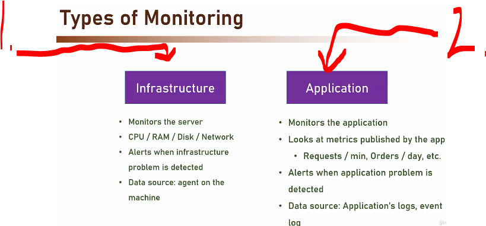
</div>

1. Infrastructure monitoring, we monitor the **server**:
    - This usually means the
    `CPU` / `RAM` / `Disk` / `Network`.
    - **Alerts** when infrastructure - **problem is detected**.
    - **Data source**: agent on the machine.

2. Application Monitoring, monitors the **application**.
    - Looks at metrics published by the app.
        - `Requests / min`, `Orders / day`, etc.
    - **Alerts** when application **problem is detected**.
    - Data source: **Application's logs**, **event log**.

> [!NOTE]  
> Usually the **Application** monitoring more important!

<div align="center">
    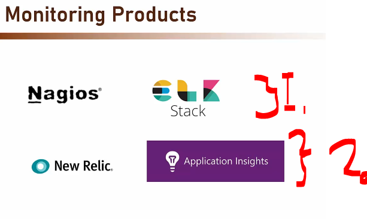
</div>

1. On premise tools!
2. Cloud based tools!

> [!WARNING]  
> Do not make your **own** monitoring tool!


# Implementing Monitoring.