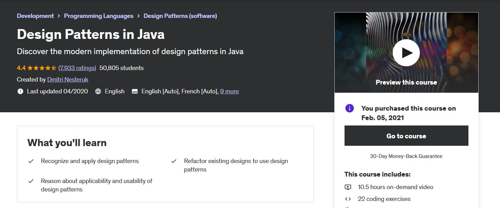

## Software Architecture & Design Patterns 

<!--

   

 -->

Attempt to study and implement different software architecture styles and design patterns here.

# Design Patterns in Java

All course material from **Design Patterns in Java** by from Dmitri Nesteruk 

If the content sparked :fire: your interest, please consider buying the course and start learning :book:

[The Course at Udemy](https://www.udemy.com/course/design-patterns-java/)   

Insert certificate here when completed

**Note: The material provided in this repository is only for helping those who may get stuck at any point of time in the course. It is very advised that no one should just copy the solutions(violation of Honor Code) presented here.**

## Design Patterns in Java

- [x] [Section 01](https://github.com/developersCradle/designg-patterns-and-software-architecture/tree/main/Section%201) - Introduction
- [ ] [Section 02](https://github.com/developersCradle/designg-patterns-and-software-architecture/tree/main/Section%202) - SOLID Design Principles
- [ ] [Section 03](https://github.com/developersCradle/designg-patterns-and-software-architecture/tree/main/Section%203) - Builder
- [ ] [Section 04](#) - Factories
- [ ] [Section 05](#) - Prototype
- [ ] [Section 06](#) - Singleton
- [ ] [Section 07](#) - 
- [ ] [Section 08](#) - 
- [ ] [Section 09](#) - 
- [ ] [Section 10](#) - 
- [x] [Section 11](https://github.com/developersCradle/designg-patterns-and-software-architecture/tree/main/Section%2011) - Façade
- [ ] [Section 12](#) - 
- [ ] [Section 13](#) - 
- [ ] [Section 14](#) - 
- [ ] [Section 15](#) - 
- [ ] [Section 16](#) - 
- [ ] [Section 17](#) - 
- [ ] [Section 18](#) -
- [ ] [Section 19](#) - 
- [ ] [Section 20](#) - 
- [ ] [Section 21](#) - 
- [ ] [Section 22](#) - 
- [ ] [Section 23](#) - 
- [ ] [Section 24](#) - 
- [ ] [Section 25](#) - Visitor
- [ ] [Section 26](#) - Course Summary

- Add more when time comes

## Todo for future

In typescript [ts](https://refactoring.guru/design-patterns/typescript)

In c++ [c++](https://www.udemy.com/course/patterns-cplusplus/)

- todo or use one generalized style

## Software Architecture

- [ ] [Java](#) - Software Architecture in Java
- [ ] [Js](#) - Software Architecture in Js
- [ ] [Ts](#) - Software Architecture in Ts
- [ ] [C++](#) - Software Architecture in C++

 ## Design Patterns

- [ ] [Java](#) - Design Patterns in Java
- [ ] [Js](#) - Design Patterns in Js
- [ ] [Ts](#) - Design Patterns in Ts
- [ ] [C++](#) - Design Patterns in C++
