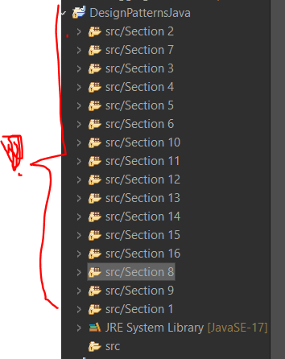
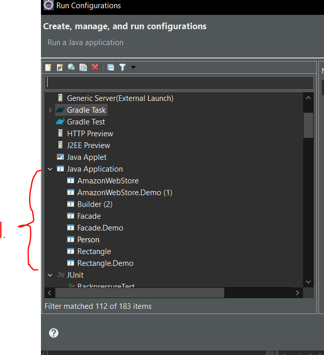
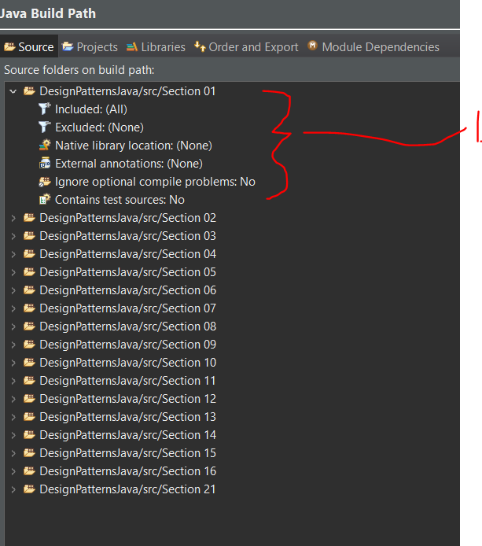
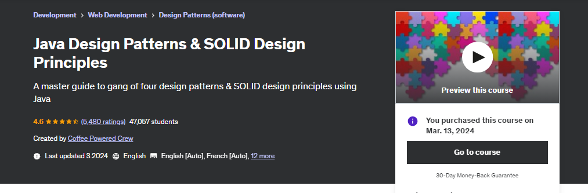

    

> Software Architecture (SOLID) & Design principles, Patterns and Clean Code. Also, the architecture related topics in IT!

   

    

All course material from **Design Patterns in Java** by from Dmitri Nesteruk.

If the content sparked :fire: your interest, please consider buying the course and start learning :book:.

This repository is made with **Eclipse**, therefore it will include configuration files which are related to this IDE this approach will be favored for now. ⚙️

[The Course at Udemy](https://www.udemy.com/course/design-patterns-java/).

<!-- 
Linkedin puts this shit front, when clicking from private mode x(. Need to put this to make jump working every case
?trk=public_profile_see-credential 
-->

   Insert certificate here when completed.

**Note: The material provided in this repository is only for helping those who may get stuck at any point of time in the course. It is very advised that no one should just copy the solutions(violation of Honor Code) presented here.**
0
- When importing folder, use the parent folder `Design Patterns in Java`, in **Eclipse** use `Existing project into workspace` import function.

#### Progress/Curriculum.

- [x] [Section 01](https://github.com/developersCradle/designg-patterns-and-software-architecture/tree/main/Design%20Patterns%20in%20Java/src/Section%2001#section-1-introduction) - Introduction. ✅
- [ ] [Section 02](https://github.com/developersCradle/designg-patterns-and-software-architecture/tree/main/Design%20Patterns%20in%20Java/src/Section%2002#section-2-solid-design-principles) - SOLID Design Principles.
- [ ] [Section 03](https://github.com/developersCradle/designg-patterns-and-software-architecture/tree/main/Design%20Patterns%20in%20Java/src/Section%2003#section-3-builders) - Builder.
- [ ] [Section 04](#) - Factories.
- [ ] [Section 05](#) - Prototype.
- [ ] [Section 06](#) - Singleton.
- [ ] [Section 07](#) - Adapter.
- [ ] [Section 08](#) - Bridge.
- [ ] [Section 09](#) - Composite.
- [ ] [Section 10](#) - 
- [x] [Section 11](https://github.com/developersCradle/designg-patterns-and-software-architecture/tree/main/Design%20Patterns%20in%20Java/src/Section%2011#section-11-fa%C3%A7ade) - Façade. ✅
- [ ] [Section 12](#) - 
- [ ] [Section 13](#) - 
- [ ] [Section 14](#) - 
- [x] [Section 15](https://github.com/developersCradle/designg-patterns-and-software-architecture/tree/main/Design%20Patterns%20in%20Java/src/Section%2015#section-15-command) - Command. ✅
- [ ] [Section 16](#) - 
- [ ] [Section 17](#) - 
- [ ] [Section 18](#) -
- [x] [Section 19](https://github.com/developersCradle/designg-patterns-and-software-architecture/tree/main/Design%20Patterns%20in%20Java/src/Section%2019#section-19-memento) - Memento. ✅
- [ ] [Section 20](#) - Null Object.
- [x] [Section 21](https://github.com/developersCradle/designg-patterns-and-software-architecture/tree/main/Design%20Patterns%20in%20Java/src/Section%2021#section-21-observer) - Observer. ✅
- [ ] [Section 22](#) - State.
- [ ] [Section 23](#) - Strategy.
- [ ] [Section 24](#) - Template.
- [ ] [Section 25](#) - Visitor.
- [ ] [Section 26](#) - Course Summary.

### Additional stuff.

- [ ] Make caption coherent.
- [ ] In typescript [Ts](https://refactoring.guru/design-patterns/typescript).
- [ ] In [C++](https://www.udemy.com/course/patterns-cplusplus/).
- [ ] Read book [Gang Of Four](https://en.wikipedia.org/wiki/Design_Patterns).

 <b>As using IDE  studying tool. Here is the common errors.</b> 

- When adding more chapters, do in this perspective/look.

 

1. If you pull and encounter error. Remember to delete running config sometimes! [Link](https://stackoverflow.com/questions/11235827/eclipse-error-could-not-find-or-load-main-class).

 

1. Following configs are on build paths. If any `main()` function doesn't work, then add the folder in the **Include** folder, this remove `pics` and `.md` from going into `bin` folder.

    

All course material from Clean Code by **Maximilian Schwarzmüller**.

Contains my own notes with some course material to enforce learning experience.

If the content sparked :fire: your interest, please consider buying the course and start learning :book:.

[The course at Udemy](https://www.udemy.com/course/writing-clean-code/). 

[Website of maker](https://academind.com/).

<!-- 
Linkedin puts this shit front, when clicking from private mode x(. Need to put this to make jump working every case
?trk=public_profile_see-credential 
-->

   Insert certificate here when completed

**Note: The material provided in this repository is only for helping those who may get stuck at any point of time in the course. It is very advised that no one should just copy the solutions(violation of Honor Code) presented here.**

#### Progress/Curriculum.

- [x] [Section 01](#) - 

    

All course material from Java Design Patterns & SOLID Design Principles by **Coffee Powered Crew**.

Contains my own notes with some course material to enforce learning experience.

If the content sparked :fire: your interest, please consider buying the course and start learning :book:.

[The course at Udemy](https://www.udemy.com/course/design-patterns-in-java-concepts-hands-on-projects/).

<!-- 
Linkedin puts this shit front, when clicking from private mode x(. Need to put this to make jump working every case
?trk=public_profile_see-credential 
-->

   Insert certificate here when completed

**Note: The material provided in this repository is only for helping those who may get stuck at any point of time in the course. It is very advised that no one should just copy the solutions(violation of Honor Code) presented here.**

## Progress/Curriculum.

- [x] [Section 01](#) - 

    

All course material from Microservices Architecture - The Complete Guide by **Memi Lavi** ©.

Contains my own notes with some course material to enforce learning experience.

[The course at Udemy](https://www.udemy.com/course/microservices-architecture-the-complete-guide/).

[Content maker](https://memilavi.com/).

If the content sparked :fire: your interest, please consider buying the course and start learning :book:.

<!-- 
Linkedin puts this shit front, when clicking from private mode x(. Need to put this to make jump working every case
?trk=public_profile_see-credential 
-->

    Insert certificate here when completed

**Note: The material provided in this repository is only for helping those who may get stuck at any point of time in the course. It is very advised that no one should just copy the solutions(violation of Honor Code) presented here.**

#### Progress/Curriculum.

- [ ] [Section 01](#) - Welcome.
- [ ] [Section 02](#) - History of Microservices.
- [ ] [Section 03](#) - Problems with Monolith & SOA.
- [ ] [Section 04](#) - Microservices Architecture.
- [ ] [Section 05](#) - Problems Solved by Microservices.
- [ ] [Section 06](#) - Designing Microservices Architecture.
- [ ] [Section 07](#) - Deploying Microservices.
- [ ] [Section 08](#) - Testing Microservices.
- [ ] [Section 09](#) - Service Mesh.
- [ ] [Section 10](#) - Logging and Monitoring.
- [ ] [Section 11](#) - When Not to Use Microservices.
- [ ] [Section 12](#) - Microservices and the Organization.
- [ ] [Section 13](#) - Anti-Patterns and Common Mistakes.
- [ ] [Section 14](#) - Breaking Monolith to Microservices.
- [ ] [Section 15](#) - Case study.
- [ ] [Section 16](#) - Conclusion.

#### Additional stuff.

- ADD STUFF HERE.

# Fundamentals of Backend Engineering.

All course material from Fundamentals of Backend Engineering by **Hussein Nasser** ©.

Contains my own notes with some course material to enforce learning experience.

[The course at Udemy](https://www.udemy.com/course/fundamentals-of-backend-communications-and-protocols).

[Courses of the maker](https://courses.husseinnasser.com/).

If the content sparked :fire: your interest, please consider buying the course and start learning :book:.

<!-- 
Linkedin puts this shit front, when clicking from private mode x(. Need to put this to make jump working every case
?trk=public_profile_see-credential 
-->

    Insert certificate here when completed

**Note: The material provided in this repository is only for helping those who may get stuck at any point of time in the course. It is very advised that no one should just copy the solutions(violation of Honor Code) presented here.**

#### Progress/Curriculum.

- [ ] [Section 01](#) - Introduction.
- [ ] [Section 02](#) - Backend Communication Design Patterns.
- [ ] [Section 03](#) - Protocols.
- [ ] [Section 04](#) - Many ways to HTTPS.
- [ ] [Section 05](#) - Backend Execution Patterns.
- [ ] [Section 06](#) - Proxying and Load Balancing.
- [ ] [Section 07](#) - Extras.
- [ ] [Section 08](#) - Bonus Content.

#### Additional stuff.

- Add stuff here.