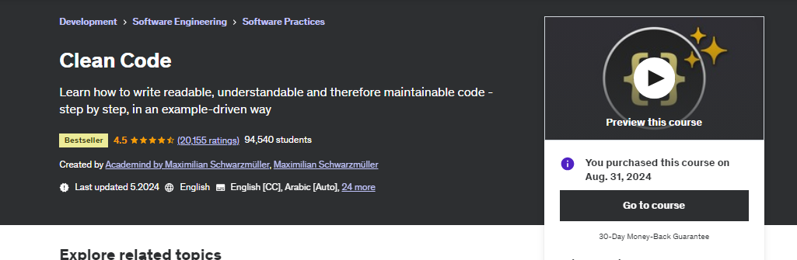
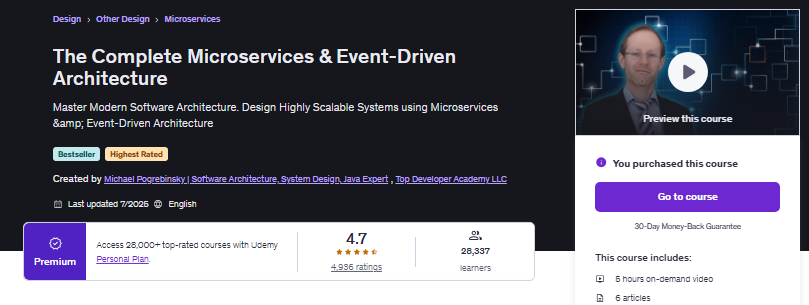
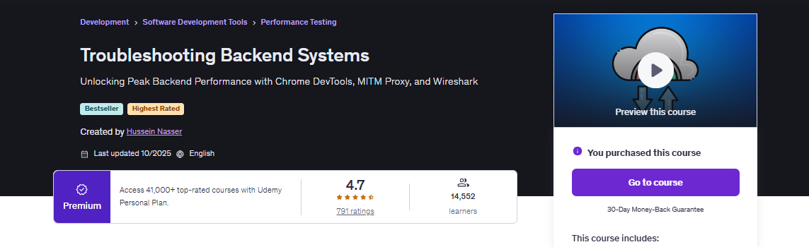
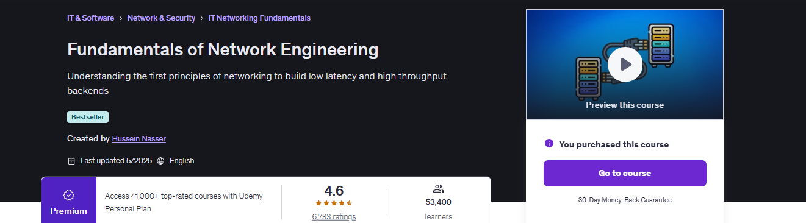

<!-- 
We are using following structure:

    

 

    

-->

    

    
   <text> <b>Software Architecture</b> & <b>Design principles</b>. Other things, which are related to the <b>architecture</b>!</text>

- For these courses one should configure **GIT** for handle projects.
    - `git config --global http.postBuffer 524288000`.
    - `git config --global core.longpaths true`.

    

    

All course material from *Design Patterns in Java* by from **Dmitri Nesteruk**.

> . 🐟   
~ *DevelopersCradle*

Contains my own with my own visual notes ✍️ with some course material to enforce learning experience.

This repository is made with , therefore it will include configuration files which are related to this IDE this approach will be favored for now. ⚙️

[The Course at Udemy](https://www.udemy.com/course/design-patterns-java/).

If the content sparked :fire: your interest, please consider buying the course and start learning :book:.

<!-- 
Linkedin puts this shit front, when clicking from private mode x(. Need to put this to make jump working every case
?trk=public_profile_see-credential 
-->

    Add here the certifcate-

 

**Note: The material provided in this repository is only for helping those who may get stuck at any point of time in the course. It is very advised that no one should just copy the solutions(violation of Honor Code) presented here.**

- When importing folder, use the parent folder `Design Patterns in Java`, in **Eclipse** use `Existing project into workspace` import function.

#### Progress/Curriculum.

- [x] [Section 01](https://github.com/developersCradle/designg-patterns-and-software-architecture/tree/main/Design%20Patterns%20in%20Java/src/Section%2001#section-1-introduction) - Introduction. ✅
- [ ] [Section 02](https://github.com/developersCradle/designg-patterns-and-software-architecture/tree/main/Design%20Patterns%20in%20Java/src/Section%2002#section-2-solid-design-principles) - SOLID Design Principles. ⚠️ In progress! ⚠️
- [x] [Section 03](https://github.com/developersCradle/designg-patterns-and-software-architecture/tree/main/Design%20Patterns%20in%20Java/src/Section%2003#section-3-builders) - Builder. ✅
- [ ] [Section 04](#) - Factories. ⚠️ In progress! ⚠️
- [ ] [Section 05](#) - Prototype. ⚠️ In progress! ⚠️
- [ ] [Section 06](#) - Singleton. ⚠️ In progress! ⚠️
- [ ] [Section 07](#) - Adapter. ⚠️ In progress! ⚠️
- [ ] [Section 08](#) - Bridge. ⚠️ In progress! ⚠️
- [ ] [Section 09](#) - Composite. ⚠️ In progress! ⚠️
- [ ] [Section 10](#) - 
- [x] [Section 11](https://github.com/developersCradle/designg-patterns-and-software-architecture/tree/main/Design%20Patterns%20in%20Java/src/Section%2011#section-11-fa%C3%A7ade) - Façade. ✅
- [ ] [Section 12](#) - ⚠️ In progress! ⚠️
- [ ] [Section 13](#) - ⚠️ In progress! ⚠️
- [ ] [Section 14](#) - ⚠️ In progress! ⚠️
- [x] [Section 15](https://github.com/developersCradle/designg-patterns-and-software-architecture/tree/main/Design%20Patterns%20in%20Java/src/Section%2015#section-15-command) - Command. ✅
- [ ] [Section 16](#) - ⚠️ In progress! ⚠️
- [ ] [Section 17](#) - ⚠️ In progress! ⚠️
- [ ] [Section 18](#) - ⚠️ In progress! ⚠️
- [x] [Section 19](https://github.com/developersCradle/designg-patterns-and-software-architecture/tree/main/Design%20Patterns%20in%20Java/src/Section%2019#section-19-memento) - Memento. ✅
- [ ] [Section 20](#) - Null Object. ⚠️ In progress! ⚠️
- [x] [Section 21](https://github.com/developersCradle/designg-patterns-and-software-architecture/tree/main/Design%20Patterns%20in%20Java/src/Section%2021#section-21-observer) - Observer. ✅
- [ ] [Section 22](#) - State. ⚠️ In progress! ⚠️
- [ ] [Section 23](#) - Strategy. ⚠️ In progress! ⚠️
- [ ] [Section 24](#) - Template. ⚠️ In progress! ⚠️
- [ ] [Section 25](#) - Visitor. ⚠️ In progress! ⚠️
- [ ] [Section 26](#) - Course Summary. ⚠️ In progress! ⚠️

#### Additional stuff.

- [ ] Check the additional [command](https://refactoring.guru/design-patterns/command) pattern!
- [ ] Make caption coherent.
- [ ] In Typescript [TS](https://refactoring.guru/design-patterns/typescript).
- [ ] In [C++](https://www.udemy.com/course/patterns-cplusplus/).
- [ ] Add all the others for the Quizzes and the labs!

#### The Quizzes and Labs.

* **Section 12**:
     * *Coding Exercise*:
        * [Add here](#).
* **Section 13**:
     * *Coding Exercise*:
        * [Add here](#).
* **Section 14**:
     * *Coding Exercise*:
        * [Add here](#).
* **Section 15**:
     * *Coding Exercise*:
        * [Coding Exercise 12: Command Coding Exercise](https://github.com/developersCradle/designg-patterns-and-software-architecture/tree/main/Design%20Patterns%20in%20Java/src/Section%2015#coding-exercise-12-command-coding-exercise).

 <b>As using IDE  studying tool. Here is the common errors.</b> 

- When adding more chapters, do in this perspective/look.

 

1. If you pull and encounter error. Remember to delete running config sometimes! [Link](https://stackoverflow.com/questions/11235827/eclipse-error-could-not-find-or-load-main-class).

 

1. Following configs are on build paths. If any `main()` function doesn't work, then add the folder in the **Include** folder, this remove `pics` and `.md` from going into `bin` folder.

    

    

All course material from *Clean Code* by **Maximilian Schwarzmüller**.

> . 🐟   
~ *DevelopersCradle*

Contains my own with my own visual notes ✍️ with some course material to enforce learning experience.

[The course at Udemy](https://www.udemy.com/course/writing-clean-code/). 

[Website of maker](https://academind.com/).

If the content sparked :fire: your interest, please consider buying the course and start learning :book:.

<!-- 
Linkedin puts this shit front, when clicking from private mode x(. Need to put this to make jump working every case
?trk=public_profile_see-credential 
-->

   Insert certificate here when completed

 

**Note: The material provided in this repository is only for helping those who may get stuck at any point of time in the course. It is very advised that no one should just copy the solutions(violation of Honor Code) presented here.**

#### Progress/Curriculum.

- [ ] [Section 01](#) - Getting Started. ⚠️ In progress! ⚠️
- [ ] [Section 02](#) - Naming - Assigning Names to Variables, Functions, Classes & More. ⚠️ In progress! ⚠️
- [ ] [Section 03](#) - Code Structure, Comments & Formatting. ⚠️ In progress! ⚠️
- [ ] [Section 04](#) - Functions & Methods. ⚠️ In progress! ⚠️
- [ ] [Section 05](#) - Control Structures & Errors. ⚠️ In progress! ⚠️
- [ ] [Section 06](#) - Objects, Classes & Data Containers / Structures. ⚠️ In progress! ⚠️
- [ ] [Section 07](#) - Summary & Checklist. ⚠️ In progress! ⚠️
- [ ] [Section 08](#) - Course Roundup. ⚠️ In progress! ⚠️

#### Additional stuff.

- [ ] some.

    

    

All course material from *Java Design Patterns & SOLID Design Principles* by **Coffee Powered Crew**.

> . 🐟  
~ *DevelopersCradle*

Contains my own with my own visual notes ✍️ with some course material to enforce learning experience.

This repository is made with  with  hotkeys, therefore it will include configuration files which are related to this IDE this approach will be favored for now. ⚙️

[The course at Udemy](https://www.udemy.com/course/design-patterns-in-java-concepts-hands-on-projects/).

If the content sparked :fire: your interest, please consider buying the course and start learning :book:.

<!-- 
Linkedin puts this shit front, when clicking from private mode x(. Need to put this to make jump working every case
?trk=public_profile_see-credential 
-->

   Insert certificate here when completed

 

**Note: The material provided in this repository is only for helping those who may get stuck at any point of time in the course. It is very advised that no one should just copy the solutions(violation of Honor Code) presented here.**

#### Progress/Curriculum.

- [ ] [Section 01](#) - SOLID Design Principles. ⚠️ In progress! ⚠️
- [ ] [Section 02](#) - Introduction. ⚠️ In progress! ⚠️
- [ ] [Section 03](#) - Creational Design Patterns. ⚠️ In progress! ⚠️
- [x] [Section 04](https://github.com/developersCradle/designg-patterns-and-software-architecture/tree/main/Java%20Design%20Patterns%20%26%20SOLID%20Design%20Principles/Section%2004#section-04-builder) - Builder. ✅
- [ ] [Section 05](#) - Simple Factory. ⚠️ In progress! ⚠️
- [ ] [Section 06](#) - Factory Method. ⚠️ In progress! ⚠️
- [ ] [Section 07](#) - Prototype. ⚠️ In progress! ⚠️
- [ ] [Section 08](#) - Abstract Factory. ⚠️ In progress! ⚠️
- [ ] [Section 09](#) - Singleton. ⚠️ In progress! ⚠️
- [ ] [Section 10](#) - Object Pool. ⚠️ In progress! ⚠️
- [ ] [Section 11](#) - Structural Design Patterns. ⚠️ In progress! ⚠️
- [ ] [Section 12](#) - Adapter. ⚠️ In progress! ⚠️
- [ ] [Section 13](#) - Bridge. ⚠️ In progress! ⚠️
- [ ] [Section 14](#) - Decorator. ⚠️ In progress! ⚠️
- [ ] [Section 15](#) - Composite. ⚠️ In progress! ⚠️
- [ ] [Section 16](#) - Facade. ⚠️ In progress! ⚠️
- [ ] [Section 17](#) - Flyweight. ⚠️ In progress! ⚠️
- [ ] [Section 18](#) - Proxy. ⚠️ In progress! ⚠️
- [ ] [Section 19](#) - Behavioral Design Patterns. ⚠️ In progress! ⚠️
- [ ] [Section 20](#) - Chain of Responsibility. ⚠️ In progress! ⚠️
- [ ] [Section 21](#) - Command. ⚠️ In progress! ⚠️
- [ ] [Section 22](#) - Interpreter. ⚠️ In progress! ⚠️
- [ ] [Section 23](#) - Mediator. ⚠️ In progress! ⚠️
- [ ] [Section 24](#) - Iterator. ⚠️ In progress! ⚠️
- [ ] [Section 25](#) - Memento. ⚠️ In progress! ⚠️
- [ ] [Section 26](#) - Observer. ⚠️ In progress! ⚠️
- [ ] [Section 27](#) - State. ⚠️ In progress! ⚠️
- [ ] [Section 28](#) - Strategy. ⚠️ In progress! ⚠️
- [ ] [Section 29](#) - Template Method. ⚠️ In progress! ⚠️
- [ ] [Section 30](#) - Visitor. ⚠️ In progress! ⚠️
- [ ] [Section 31](#) - Null Object. ⚠️ In progress! ⚠️
- [ ] [Section 32](#) - Design Pattern Summary Document. ⚠️ In progress! ⚠️

#### Additional stuff.

- [ ] Finish the **Prototype** pattern first, then finish the **Builder** pattern!

    

    

All course material from *Microservices Architecture - The Complete Guide* by **Memi Lavi** ©.

> When I was creating microservices at 🏛️**Nordea**🏛️, we were tackling today’s challenges using the most up-to-date techniques and architectural approaches. This meant rethinking how services communicate, how systems scale, and how teams can work independently without constantly stepping on each other’s toes. 🐟 
>
> By moving toward a microservices architecture, we could split large systems into smaller, well-defined services. Each service had its own responsibility and could evolve independently, making deployments safer and development faster. 🐟
>
> While exploring microservices architecture further, the course `Microservices Architecture – The Complete Guide` allowed me to see the designed implementations behind many of the patterns that are often suggested in theory. Seeing practical implementations of service boundaries, communication strategies, and deployment patterns helped connect architectural ideas with real-world systems. 🐟   
~ *DevelopersCradle*

Contains my own with my own visual notes ✍️ with some course material to enforce learning experience.

This repository is made with  with  hotkeys, therefore it will include configuration files which are related to this IDE this approach will be favored for now. ⚙️

[The course at Udemy](https://www.udemy.com/course/microservices-architecture-the-complete-guide/).

[Content maker](https://thevar.memilavi.com/).

If the content sparked :fire: your interest, please consider buying the course and start learning :book:.

<!-- 
Linkedin puts this shit front, when clicking from private mode x(. Need to put this to make jump working every case
?trk=public_profile_see-credential 
-->

    

 

**Note: The material provided in this repository is only for helping those who may get stuck at any point of time in the course. It is very advised that no one should just copy the solutions(violation of Honor Code) presented here.**

#### Progress/Curriculum.

- [x] [Section 01](https://github.com/developersCradle/designg-patterns-and-software-architecture/tree/main/Microservices%20Architecture%20-%20The%20Complete%20Guide%20Caption/Section%2001#section-01-welcome) - Welcome. ✔️
- [x] [Section 02](https://github.com/developersCradle/designg-patterns-and-software-architecture/tree/main/Microservices%20Architecture%20-%20The%20Complete%20Guide%20Caption/Section%2002#section-02-history-of-the-microservices) - History of Microservices. ✔️
- [x] [Section 03](https://github.com/developersCradle/designg-patterns-and-software-architecture/tree/main/Microservices%20Architecture%20-%20The%20Complete%20Guide%20Caption/Section%2003#section-03-problems-with-monolith--soa) - Problems with Monolith & SOA. ✔️
- [x] [Section 04](https://github.com/developersCradle/designg-patterns-and-software-architecture/tree/main/Microservices%20Architecture%20-%20The%20Complete%20Guide%20Caption/Section%2004#section-04-microservices-architecture) - Microservices Architecture. ✔️
- [x] [Section 05](https://github.com/developersCradle/designg-patterns-and-software-architecture/tree/main/Microservices%20Architecture%20-%20The%20Complete%20Guide%20Caption/Section%2005#section-05-problems-solved-by-microservices) - Problems Solved by Microservices. ✔️
- [x] [Section 06](https://github.com/developersCradle/designg-patterns-and-software-architecture/tree/main/Microservices%20Architecture%20-%20The%20Complete%20Guide%20Caption/Section%2006#section-06-designing-microservices-architecture) - Designing Microservices Architecture. ✔️
- [x] [Section 07](https://github.com/developersCradle/designg-patterns-and-software-architecture/tree/main/Microservices%20Architecture%20-%20The%20Complete%20Guide%20Caption/Section%2007#section-07-deploying-microservices) - Deploying Microservices. ✔️
- [x] [Section 08](https://github.com/developersCradle/designg-patterns-and-software-architecture/tree/main/Microservices%20Architecture%20-%20The%20Complete%20Guide%20Caption/Section%2008#section-08-testing-microservices) - Testing Microservices. ✔️
- [x] [Section 09](https://github.com/developersCradle/designg-patterns-and-software-architecture/tree/main/Microservices%20Architecture%20-%20The%20Complete%20Guide%20Caption/Section%2009#section-09-service-meshhttps://github.com/developersCradle/designg-patterns-and-software-architecture/tree/main/Microservices%20Architecture%20-%20The%20Complete%20Guide%20Caption/Section%2009#section-09-service-mesh) - Service Mesh. ✔️
- [x] [Section 10](https://github.com/developersCradle/designg-patterns-and-software-architecture/tree/main/Microservices%20Architecture%20-%20The%20Complete%20Guide%20Caption/Section%2010#section-10-logging-and-monitoring) - Logging and Monitoring. ✔️
- [x] [Section 11](https://github.com/developersCradle/designg-patterns-and-software-architecture/tree/main/Microservices%20Architecture%20-%20The%20Complete%20Guide%20Caption/Section%2011#section-11-when-not-to-use-microservices) - When Not to Use Microservices. ✔️
- [x] [Section 12](https://github.com/developersCradle/designg-patterns-and-software-architecture/tree/main/Microservices%20Architecture%20-%20The%20Complete%20Guide%20Caption/Section%2012#section-12-microservices-and-the-organization) - Microservices and the Organization. ✔️
- [x] [Section 13](https://github.com/developersCradle/designg-patterns-and-software-architecture/tree/main/Microservices%20Architecture%20-%20The%20Complete%20Guide%20Caption/Section%2013#section-13-anti-patterns-and-common-mistakes) - Anti-Patterns and Common Mistakes. ✔️
- [x] [Section 14](https://github.com/developersCradle/designg-patterns-and-software-architecture/tree/main/Microservices%20Architecture%20-%20The%20Complete%20Guide%20Caption/Section%2014#section-14-breaking-monolith-to-microservices) - Breaking Monolith to Microservices. ✔️
- [x] [Section 15](https://github.com/developersCradle/designg-patterns-and-software-architecture/tree/main/Microservices%20Architecture%20-%20The%20Complete%20Guide%20Caption/Section%2015#section-15-case-study) - Case study. ✔️
- [x] [Section 16](https://github.com/developersCradle/designg-patterns-and-software-architecture/tree/main/Microservices%20Architecture%20-%20The%20Complete%20Guide%20Caption/Section%2016#section-16-conclusion) - Conclusion. ✔️

#### Additional stuff.

- Go thought the `MDC`!
    - [Link 01](https://medium.com/@pradeepisuru31/understanding-mdc-in-spring-boot-concepts-pitfalls-and-best-practices-f61594ed1efd).
    - [Link 02](https://www.youtube.com/watch?v=Ip7BIptWMg4).
    - [Link 03](https://www.youtube.com/watch?v=DsFsd--vhas).

    

 

    

All course material from *The Complete Microservices & Event-Driven Architecture* by **Michael Pogrebinsky** and **Top Developer Academy LLC** ©.

> 🐟   
> ~ *DevelopersCradle*

Contains my own with my own visual notes ✍️ with some course material to enforce learning experience.

This repository is made with  with  hotkeys, therefore it will include configuration files which are related to this IDE this approach will be favored for now. ⚙️

[The course at Udemy](https://www.udemy.com/course/the-complete-microservices-event-driven-architecture/).

[Courses of the maker](https://topdeveloperacademy.com/).

If the content sparked :fire: your interest, please consider buying the course and start learning :book:.

<!-- 
Linkedin puts this shit front, when clicking from private mode x(. Need to put this to make jump working every case
?trk=public_profile_see-credential 
-->

    Insert certificate here when completed

 

**Note: The material provided in this repository is only for helping those who may get stuck at any point of time in the course. It is very advised that no one should just copy the solutions(violation of Honor Code) presented here.**

#### Progress/Curriculum.

- [x] [Section 01](#) - Introduction. ⚠️ In progress! ⚠️
- [ ] [Section 02](#) - Migration to Microservices Architecture. ⚠️ In progress! ⚠️
- [ ] [Section 03](#) - Microservices - Principles and Best Practices. ⚠️ In progress! ⚠️
- [ ] [Section 04](#) - Event-Driven Architecture. ⚠️ In progress! ⚠️
- [ ] [Section 05](#) - Event-Driven Microservices - Design Patterns. ⚠️ In progress! ⚠️
- [ ] [Section 06](#) - Testing Microservices and Event-Driven Architecture. ⚠️ In progress! ⚠️
- [ ] [Section 07](#) - Observability in Microservices Architecture. ⚠️ In progress! ⚠️
- [ ] [Section 08](#) - Deployment of Microservices and Event-Driven Architecture in Production. ⚠️ In progress! ⚠️
- [ ] [Section 09](#) - Bonus Section. ⚠️ In progress! ⚠️

#### Additional stuff.

- [ ] todo.

    

    

All course material from *Fundamentals of Backend Engineering* by **Hussein Nasser** ©.

> As the day ended, I stood above the glowing flow of requests moving through the backend. 🐟
>
> I didn’t see chaos anymore. 🐟
>
> I saw systems. 🐟
> 
> Protocols shaped communication. 🐟
> Design patterns guided the flow. 🐟
> Execution brought ideas to life. 🐟
> Proxies kept everything stable under pressure. 🐟
>
> What once looked like countless moving parts now felt connected. 🐟
> 
> Every request had a purpose. 🐟
> Every service had a responsibility. 🐟
> Every interaction followed a design. 🐟
>
> And for the first time, it all clicked.
>
> No confusion. No noise. No mystery. 🐟
>
> Just structure. 🐟
> Just design. 🐟
> Just engineering. 🐟   
> ~ *DevelopersCradle*

Contains my own with my own visual notes ✍️ with some course material to enforce learning experience. This course is for **intermediation level**, one can be **expected to have built some projects**! This is for the backend engineers, also this can be for network engineer!

This repository is made with  with  hotkeys, therefore it will include configuration files which are related to this IDE this approach will be favored for now. ⚙️

[The course at Udemy](https://www.udemy.com/course/fundamentals-of-backend-communications-and-protocols).

[Courses of the maker](https://courses.husseinnasser.com/).

If the content sparked :fire: your interest, please consider buying the course and start learning :book:.

<!-- 
Linkedin puts this shit front, when clicking from private mode x(. Need to put this to make jump working every case
?trk=public_profile_see-credential 
-->

    Insert certificate here when completed

 

**Note: The material provided in this repository is only for helping those who may get stuck at any point of time in the course. It is very advised that no one should just copy the solutions(violation of Honor Code) presented here.**

#### Progress/Curriculum.

- [x] [Section 01](https://github.com/developersCradle/designg-patterns-and-software-architecture/tree/main/Fundamentals%20of%20Backend%20Engineering/Section%2001#section-01-introduction) - Introduction. ✅
- [ ] [Section 02](https://github.com/developersCradle/designg-patterns-and-software-architecture/tree/main/Fundamentals%20of%20Backend%20Engineering/Section%2002#section-02-backend-communication-design-patterns) - Backend Communication Design Patterns. ⚠️ In progress! ⚠️
- [ ] [Section 03](https://github.com/developersCradle/designg-patterns-and-software-architecture/blob/main/Fundamentals%20of%20Backend%20Engineering/Section%2003/README.md#section-03-protocols) - Protocols. ⚠️ In progress! ⚠️
- [ ] [Section 04](https://github.com/developersCradle/designg-patterns-and-software-architecture/blob/main/Fundamentals%20of%20Backend%20Engineering/Section%2004/README.md#section-04-many-ways-to-https) - Many ways to HTTPS. ⚠️ In progress! ⚠️
- [ ] [Section 05](https://github.com/developersCradle/designg-patterns-and-software-architecture/blob/main/Fundamentals%20of%20Backend%20Engineering/Section%2005/README.md#section-05-backend-execution-patterns) - Backend Execution Patterns. ⚠️ In progress! ⚠️
- [ ] [Section 06](https://github.com/developersCradle/designg-patterns-and-software-architecture/blob/main/Fundamentals%20of%20Backend%20Engineering/Section%2006/README.md#section-06-proxying-and-load-balancing) - Proxying and Load Balancing. ⚠️ In progress! ⚠️
- [ ] [Section 07](https://github.com/developersCradle/designg-patterns-and-software-architecture/blob/main/Fundamentals%20of%20Backend%20Engineering/Section%2007/README.md#section-07-extras) - Extras. ⚠️ In progress! ⚠️
- [ ] [Section 08](https://github.com/developersCradle/designg-patterns-and-software-architecture/blob/main/Fundamentals%20of%20Backend%20Engineering/Section%2008/README.md#section-08-bonus-content) - Bonus Content. ⚠️ In progress! ⚠️

#### Additional stuff.

- [ ] If in mood implement these in Java.
    - https://medium.com/@varunpandey94.vp/long-polling-using-spring-boot-97fa4f8fb085
- [ ] Check this one, if [time](https://www.youtube.com/watch?v=nEFOni_87Yw).
- [ ] Remove for the `Archive` folder if not needed.
- [ ] [db](https://www.udemy.com/course/fundamentals-of-networking-for-effective-backend-design/?couponCode=KEEPLEARNING).

    

 

    

All course material from *Troubleshooting Backend Systems* by **Hussein Nasser** ©.

> . 🐟   
~ *DevelopersCradle*

Contains my own with my own visual notes ✍️ with some course material to enforce learning experience.

This repository is made with  with  hotkeys, therefore it will include configuration files which are related to this IDE this approach will be favored for now. ⚙️

[The course at Udemy](https://www.udemy.com/course/discovering-backend-bottlenecks-unlocking-peak-performance/).

[Content maker](https://courses.husseinnasser.com/).

If the content sparked :fire: your interest, please consider buying the course and start learning :book:.

<!-- 
Linkedin puts this shit front, when clicking from private mode x(. Need to put this to make jump working every case
?trk=public_profile_see-credential 
-->

    <!--  -->

 

**Note: The material provided in this repository is only for helping those who may get stuck at any point of time in the course. It is very advised that no one should just copy the solutions(violation of Honor Code) presented here.**

#### Progress/Curriculum.

- [ ] [Section 01](https://github.com/developersCradle/designg-patterns-and-software-architecture/tree/main/Troubleshooting%20Backend%20Systems/Section%2001#section-01-introduction) - Introduction. ⚠️ In progress! ⚠️
- [ ] [Section 02](#) - Supplementary Lectures (Fundamentals). ⚠️ In progress! ⚠️
- [ ] [Section 03](#) - Tier 01 Analysis - DevTools. ⚠️ In progress! ⚠️
- [ ] [Section 04](#) - Tier 02 Analysis - MITM Proxy. ⚠️ In progress! ⚠️
- [ ] [Section 05](#) - Tier 03 Analysis - Wireshark. ⚠️ In progress! ⚠️
- [ ] [Section 06](#) - Real-world Performance Analysis of Backend Applications. ⚠️ In progress! ⚠️
- [ ] [Section 07](#) - Course Summary. ⚠️ In progress! ⚠️
- [ ] [Section 08](#) - Answering Your questions. ⚠️ In progress! ⚠️
- [ ] [Section 09](#) - Extras. ⚠️ In progress! ⚠️

#### Additional stuff.

- TOdo

    

 

    

All course material from *Fundamentals of Network Engineering* by **Hussein Nasser** ©.

> . 🐟   
~ *DevelopersCradle*

This repository is made with  with  hotkeys, therefore it will include configuration files which are related to this IDE this approach will be favored for now. ⚙️

Contains my own with my own visual notes ✍️ with some course material to enforce learning experience.

[The course at Udemy](https://www.udemy.com/course/fundamentals-of-networking-for-effective-backend-design/).

[Content maker](https://courses.husseinnasser.com/).

If the content sparked :fire: your interest, please consider buying the course and start learning :book:.

<!-- 
Linkedin puts this shit front, when clicking from private mode x(. Need to put this to make jump working every case
?trk=public_profile_see-credential 
-->

    <!--  -->

 

**Note: The material provided in this repository is only for helping those who may get stuck at any point of time in the course. It is very advised that no one should just copy the solutions(violation of Honor Code) presented here.**

#### Progress/Curriculum.

- [ ] [Section 01](#) - Introduction. ⚠️ In progress! ⚠️
- [ ] [Section 03](#) - Internet Protocol (IP). ⚠️ In progress! ⚠️
- [ ] [Section 04](#) - User Datagram Protocol (UDP). ⚠️ In progress! ⚠️
- [ ] [Section 05](#) - Transmission Control Protocol (TCP). ⚠️ In progress! ⚠️
- [ ] [Section 06](#) - Overview of Popular Networking Protocols. ⚠️ In progress! ⚠️
- [ ] [Section 07](#) - Network Performance. ⚠️ In progress! ⚠️
- [ ] [Section 08](#) - Network Routing. ⚠️ In progress! ⚠️
- [ ] [Section 09](#) - Analyzing Protocols with Wireshark. ⚠️ In progress! ⚠️
- [ ] [Section 10](#) - Answering your Questions. ⚠️ In progress! ⚠️
- [ ] [Section 11](#) - Course Summary. ⚠️ In progress! ⚠️
- [ ] [Section 12](#) - Extras. ⚠️ In progress! ⚠️

#### Additional stuff.

- TOdo

    

    

All course material from *The Complete Regular Expressions(Regex) Course For Beginners* by **George Sonora** ©.

> . 🐟   
~ *DevelopersCradle*

Contains my own with my own visual notes ✍️ with some course material to enforce learning experience.

This repository is made with  with  hotkeys, therefore it will include configuration files which are related to this IDE this approach will be favored for now. ⚙️

[The course at Udemy](https://www.udemy.com/course/microservices-architecture-the-complete-guide/).

[Content maker](https://memilavi.com/).

If the content sparked :fire: your interest, please consider buying the course and start learning :book:.

<!-- 
Linkedin puts this shit front, when clicking from private mode x(. Need to put this to make jump working every case
?trk=public_profile_see-credential 
-->

    <!--  -->

 

**Note: The material provided in this repository is only for helping those who may get stuck at any point of time in the course. It is very advised that no one should just copy the solutions(violation of Honor Code) presented here.**

#### Progress/Curriculum.

- [x] [Section 01](#) - Welcome. ⚠️ In progress! ⚠️

#### Additional stuff.

- TOdo

