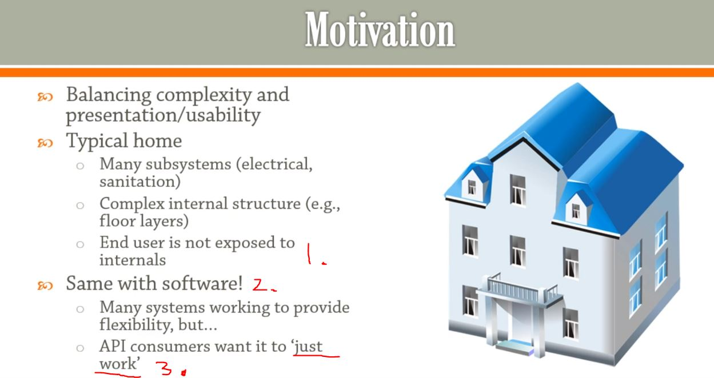

## Section 11: Façade

Façade

# What I Learned

- Exposing several components' through a single interface. **Making convent for end user** 

1. Wiring inside wall is not exposed even if there is some weird cabling or bugs inside.
2. Same with software!
3. Console log has much different stuff, like buffer, memory allocation etc, but we can just call `System.out.println();` and not to worry about details.

### Façade
> Provides a simple, easy to understand/user interface over a large
and sophisticated body of code.

