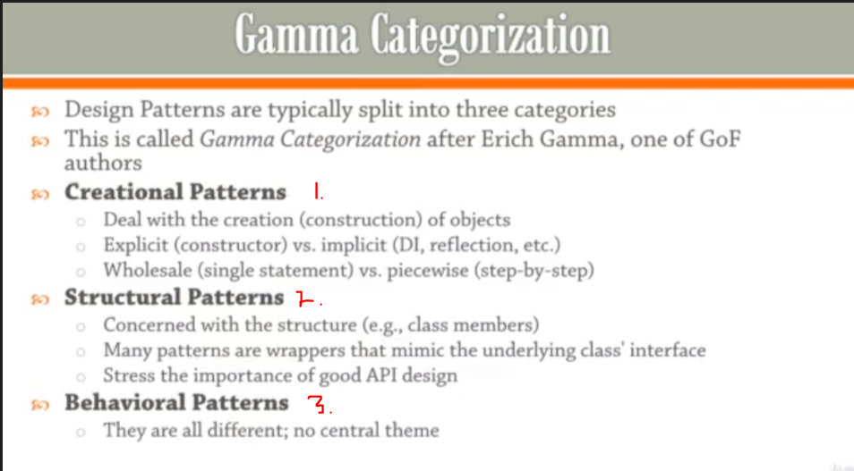
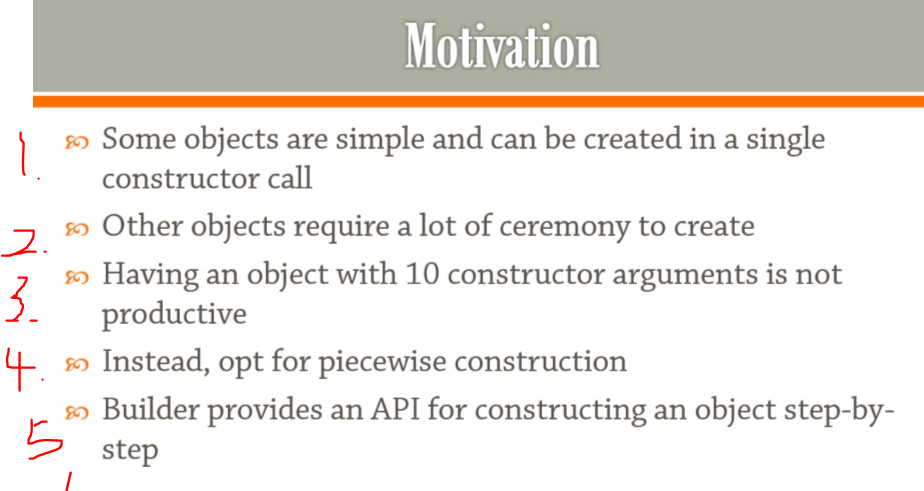
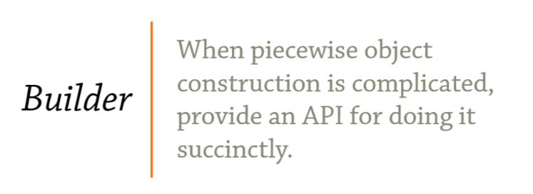

## Section 3: Builders

Builder patterns

# What I Learned




- We are splitting **Design patterns** into three categories
    - This called **Gamma Categorization**
1. **Creational Patterns** 
- They are dealing construction of object!
- Case of creation of object they are done implicitly, behind scenes 
- They are different processes to initialize object, in small steps or in one big

2. Structural Patters
    - Concerns with structures
    - you will see a lot of wrappers
    - Puts extra weight on good API design

3. Behavioral Patterns
    - Solves problem in their unique way
    




1. For simple object you should call single constructor call
2. In other way, like making **"string"** this way can be tedious 
3. Too many arguments, people make mistakes
4. Should focus to make **piecewise** construction
5. Good API should be provided

- This is what builder patter is all about 

<br>



- When piecewise object construction is complicated, you provide an API for doing it more efficiently 


- We are making use of builder to simplify following printing case

```
package BUILDER_11;

public class Builder {

	
	public static void main(String[] args) {
		String hello = "hello"; // String inside paragraph
		System.out.println("<p>" + hello + "</p>");
		
		
		
		
		//Here is how we are going to make concation when we are printing
		String [] words = {"hello", "world"};
		
		System.out.println(
		"<ul>\n" + "<li>" + words[0] // and in the ends we could be using streams
		);
		
		// How to simplify this, BY USING BUILDERS!!
	}
}

```


- `StringBuilder sb = new StringBuilder();` Difference between other builder and **StringBuilder**, in string builder, building happens in picewise(bit by bit)

- This one using StringBuilder

```
package BUILDER_11;

import java.util.Iterator;

public class Builder {

	
	public static void main(String[] args) {
		String hello = "hello"; // String inside paragraph
		System.out.println("<p>" + hello + "</p>");
		
		
		
		String [] words = {"hello", "world"};
		
//		Here is how we are going to make concation when we are printing
//		
//		System.out.println(
//		"<ul>\n" + "<li>" + words[0] // and in the ends we could be using streams
//		);
// 		How to simplify this, BY USING BUILDERS!!

		
		
		
		//This one, using StringBuilder 
		StringBuilder sb = new StringBuilder(); // Difference between other builder and string builder, in string builder, building happens in picewise(bit by bit) 
		sb.append("<ul>\n");
		for (String word : words)
		{
			sb.append(String.format(" <li>%s</li>\n", word));
		}
		sb.append("</ul>");
		System.out.println(sb);
}
}
```

- You can also use ***StringBuilder** for building your own **domain object**

- Now this previous is not following OOP for printing **html**. 

