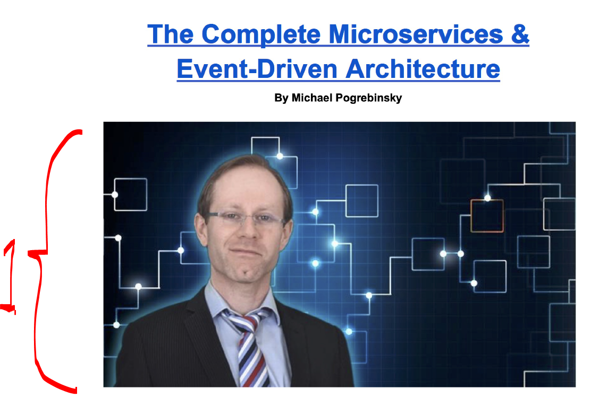
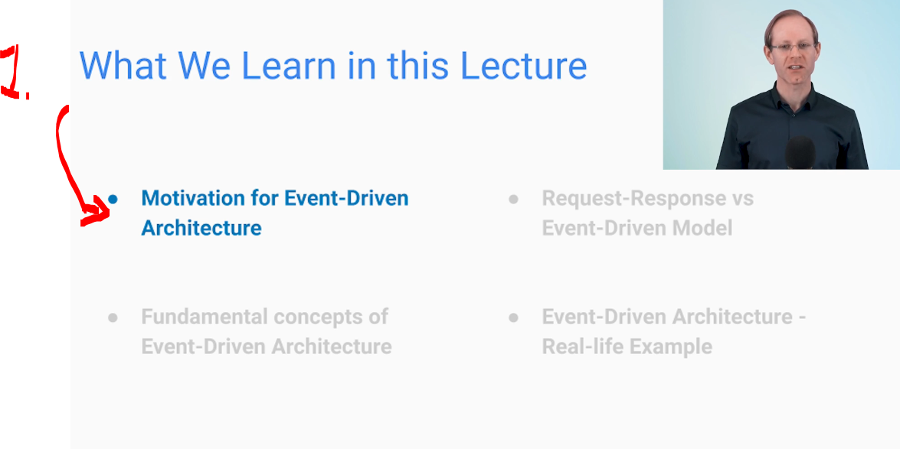
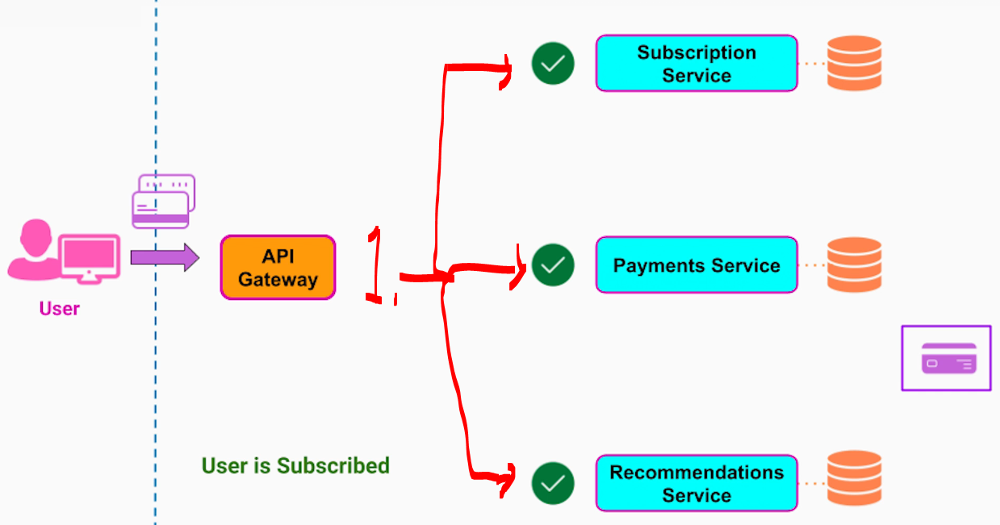

# Section 04: Event-Driven Architecture.

Event-Driven Architecture.

# What I Learned.

# Introduction to Event-Driven Architecture.

    

1. We will be introducing what is the **event-driven architecture**!

    

1. Why we should be using the event-driven architecture?

- After user had used ours service for free, he is ready for pay for service!

    

1. When user is **subscribing** we will need to make the subscription to **each service**!

- There are multiple ways to **identify the subscription**:
    - First:

# Use Cases and Patterns of Event-Driven Architecture.

# Message Delivery Semantics in Event-Driven Architecture.

# Message Broker Technologies - Delivery Guarantees.

# Quiz 3: Introduction to Event-Driven Architecture - Quiz.