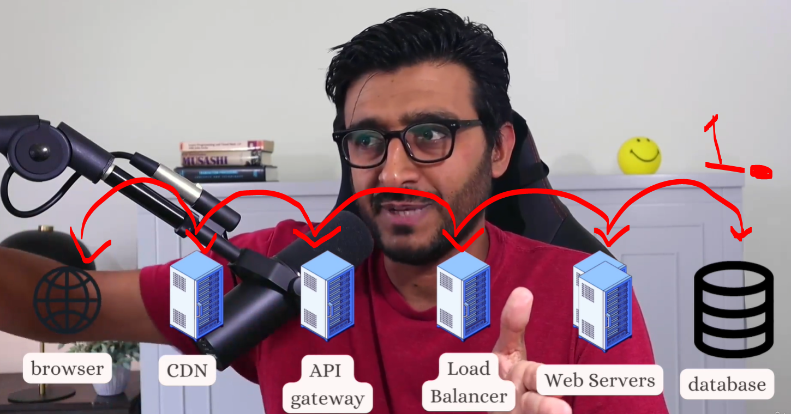
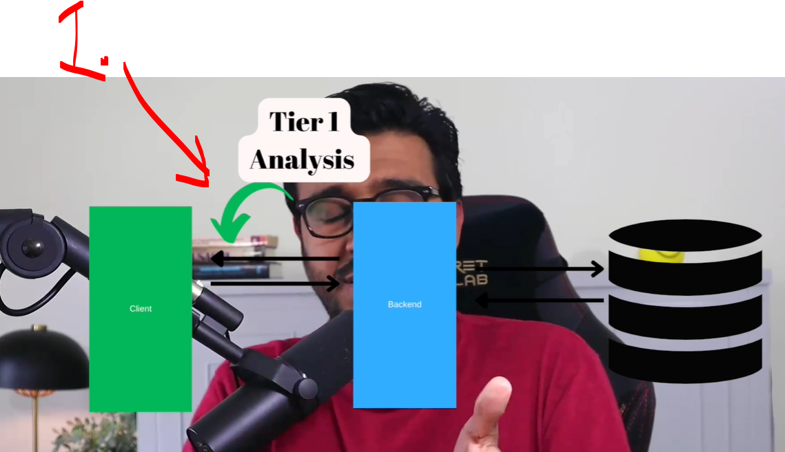
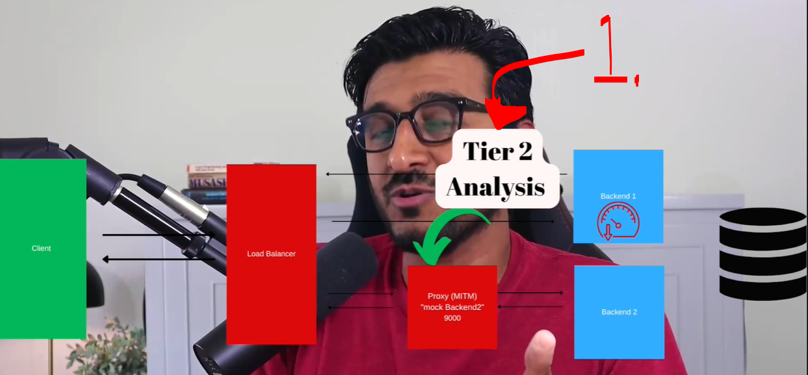
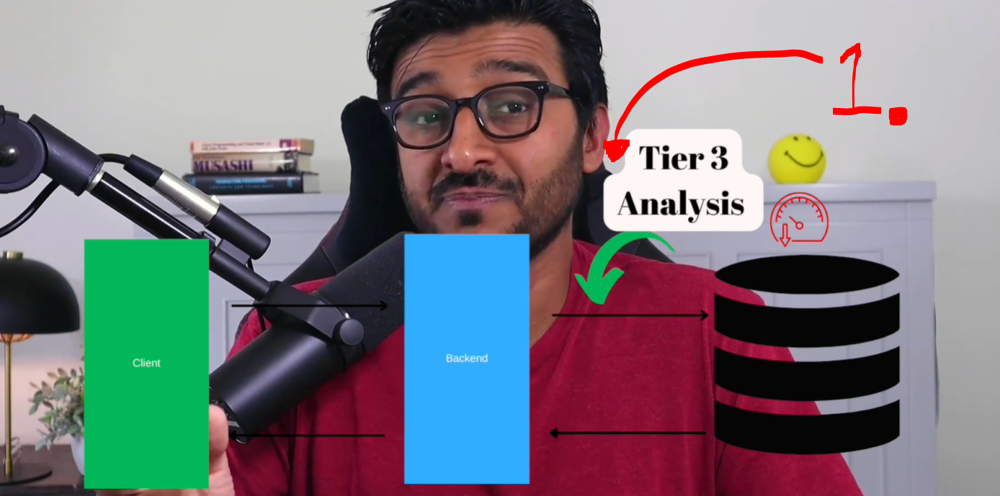
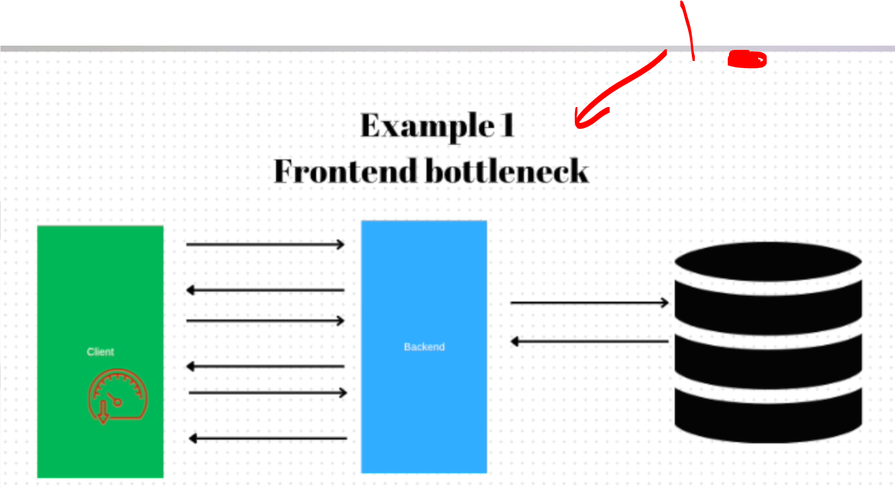
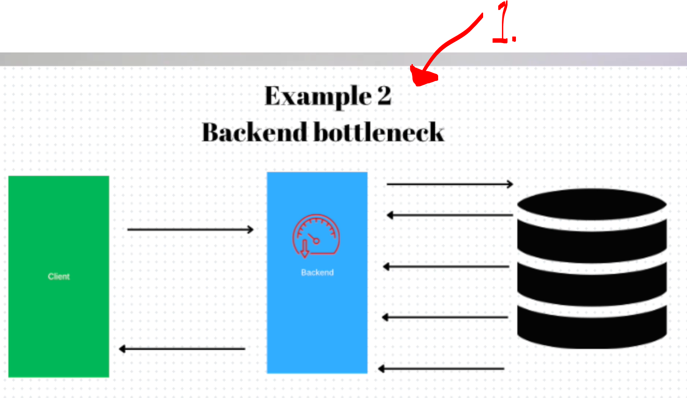
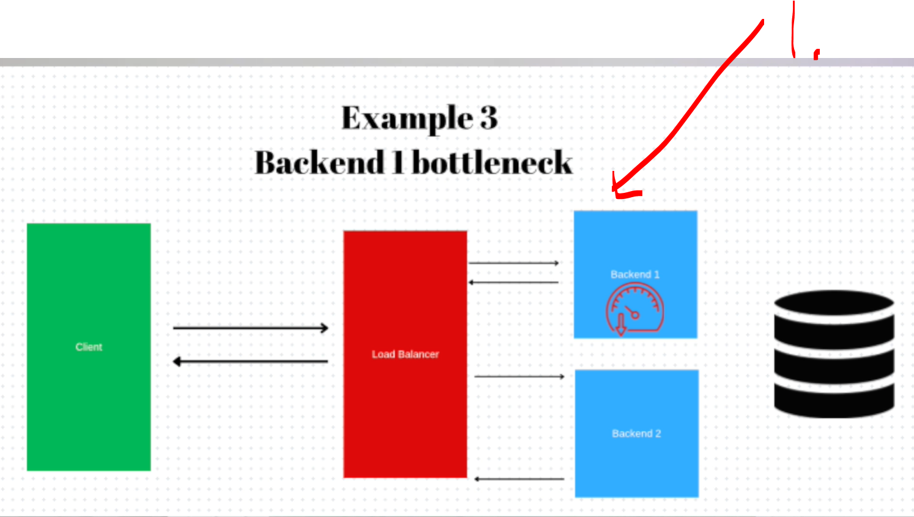
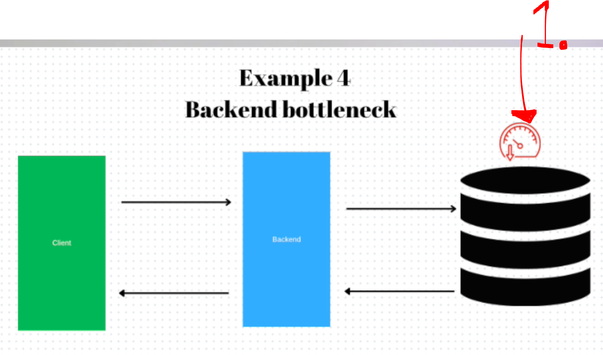
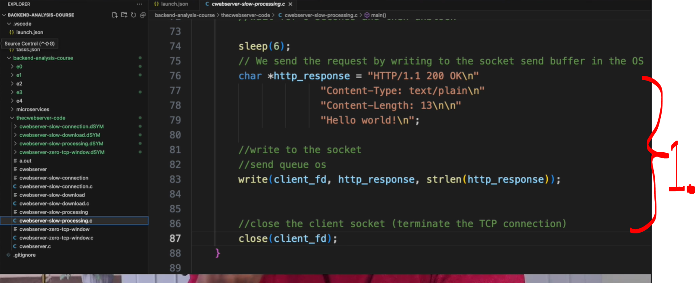

# Section 01: Introduction.

Introduction.

# What I Learned.

# Welcome.

<div align="center">
    
</div>

1. Hussein the instructor!

- This course is for deducing the be problem and identifying this.
    - No need for **source code**!

# Who is this course for?

<div align="center">
    
</div>

1. So who is this course for!

- Backend devs who are full of hopeless!

- For be- fe- roles!

# Course Outline.

- **Tier 1** analysis **first** level analysis
    - Using with the **diff tool**.

<div align="center">
    
</div>

1. There is multi level be layers to be analyzed!

<div align="center">
    
</div>

1. **Tier 1** analysis gives **first level** analysis! Give only what **your client** sends!


<div align="center">
    
</div>

1. **Tier 2** analysis gives **second level** analysis!
    - We put MITM(**M**an **I**n **T**he **M**iddle) or in windows fiddler!
        - We can **intercept** traffic between **client** and **server**!

- **Tier 2** gives benefit of seeing **all clients**!
    - This can be used we are interested in traffic between **two microservices**!
        - **Tracing** is hard topic!
    - We can do at **fundamental** level!

<div align="center">
    
</div>

- **Tier 3** gives full traffic, with **Wire Shark**!
    - We can see **all the protocol**!
        - We will **decrypt** TLS!
    - **Hard to master**, but good skill!

<br>

- We will have example problems:

<div align="center">
    
</div>

1. Bug in **frontend**/**client** side!

<div align="center">
    
</div>

1. Bug in **Backend**!

<div align="center">
    
</div>

1. Bug in backend and one of backend!

<div align="center">
    
</div>

1. Bug in database!
    - We need tier 3 to analyze this!

- We will use `C` for server!
    - **C** won't hide anything from the server!
    - We want to simulate:
        - Slow request!
        - Slow Response!
        - Bad Request!

<div align="center">
    
</div>

1. We can simulate these error states in **C**!

# Socket Programming - Backend C WebServer.

- This will be done with **C**, since it does **NOT** hide!
    - How socket is created?
    - How server being bound to socket?
    - How listening happens?
    - How connection is being accepted?
    - What is meaning is acceptance of connection?
    - How socket is being read?
    - How to read data form connection!

- We will be creating the server in **C**:

````C
#include <stdio.h>
#include <stdlib.h>
#include <string.h>
#include <unistd.h>
#include <sys/socket.h>
#include <netinet/in.h>

//maximum application buffer
#define APP_MAX_BUFFER 1024
#define PORT 8080

int main (){
    //define the server and client file descriptors
    int server_fd, client_fd;
    //define the socket address
    struct sockaddr_in address;
    int address_len = sizeof(address);
    //define the application buffer where we receive the requests
    //data will be moved from receive buffer to here
    char buffer[APP_MAX_BUFFER] = {0};
    // Create socket
    if ((server_fd = socket(AF_INET, SOCK_STREAM, 0)) == 0) {
        perror("Socket failed");
        exit(EXIT_FAILURE);
    }
    // Bind socket 
    address.sin_family = AF_INET; //ipv4
    address.sin_addr.s_addr = INADDR_ANY; // listen 0.0.0.0 interfaces 
    address.sin_port = htons(PORT); 

    if (bind(server_fd, (struct sockaddr *)&address, sizeof(address)) < 0) {
        perror("Bind failed");
        exit(EXIT_FAILURE);
    }

    // Creates the queues 
    // Listen for clients, with 10 backlog (10 connections in accept queue)
    if (listen(server_fd, 10) < 0) {
        perror("Listen failed");
        exit(EXIT_FAILURE);
    }
    
    //[C,C,C,C,C,C,C,C,C,C]
    //we loop forever
    while (1){
        printf("\nWaiting for a connection...\n");

        // Accept a client connection client_fd == connection
        // this blocks
        //if the accept queue is empty, we are stuck here.. 
        if ((client_fd = accept(server_fd, (struct sockaddr *)&address, (socklen_t*)&address_len)) < 0) {
            perror("Accept failed");
            exit(EXIT_FAILURE);
        }

        // read data from the OS receive buffer to the application (buffer)
        //this is essentially reading the HTTP request
        //don't bite more than you chew APP_MAX_BUFFER
        read(client_fd, buffer, APP_MAX_BUFFER);
        printf("%s\n", buffer);

        // We send the request by writing to the socket send buffer in the OS
        char *http_response = "HTTP/1.1 200 OK\n"
                      "Content-Type: text/plain\n"
                      "Content-Length: 13\n\n"
                      "Hello world!\n";

        //write to the socket
        //send queue os
        write(client_fd, http_response, strlen(http_response));

        //close the client socket (terminate the TCP connection)
        close(client_fd);
    }
    return 0;
}
````

- Let's analyze the code:

- We will be defining variables.
    ````C
    //maximum application buffer
    #define APP_MAX_BUFFER 1024
    #define PORT 8080
    ````

> In **Unix/Linux networking**, a **file descriptor** is a small integer returned by system calls such as `socket()` or `accept()`!

- The **File Descriptor** return **socket information**!
    ```C
    // Define the server and client file descriptors.
    int server_fd, client_fd;
    ```
    - Description:
        - `server_fd` — typically stores the file descriptor for the server socket. 
            - There **one** of this!
        - `client_fd` — typically stores the file descriptor for a client connection socket. 
            - There is **many** of this!
- We will be defining the **address**!
    ````C
    // Define the socket address.
    struct sockaddr_in address;
    int address_len = sizeof(address);
    ````
    - `struct sockaddr_in` is a structure used for **IPv4 addresses**. It typically contains:
        - Address family (AF_INET).
        - IP address (e.g., 127.0.0.1).
        - Port number (e.g., 8080).

> **Operating System** copies data from its kernel buffer into your program's buffer.

- We want to copy `APP_MAX_BUFFER` amount of **data size** received from the client to the `buffer`! Clear the buffer and initialize it to `null`!
    ````C
    //define the application buffer where we receive the requests
    //data will be moved from receive buffer to here
    char buffer[APP_MAX_BUFFER] = {0};
    ````

- We will be creating **socket**! 
    ````C
    // Create socket
    if ((server_fd = socket(AF_INET, SOCK_STREAM, 0)) == 0) {
        perror("Socket failed");
        exit(EXIT_FAILURE);
    }
    ````